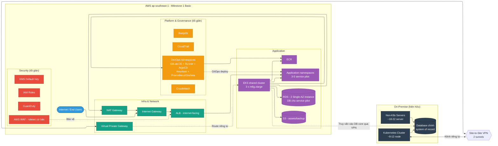
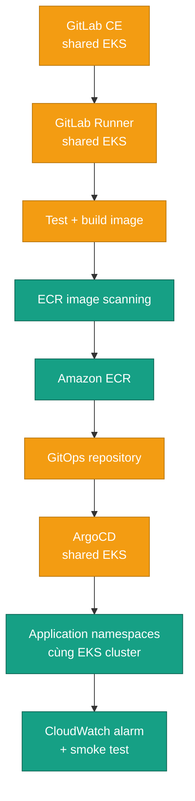
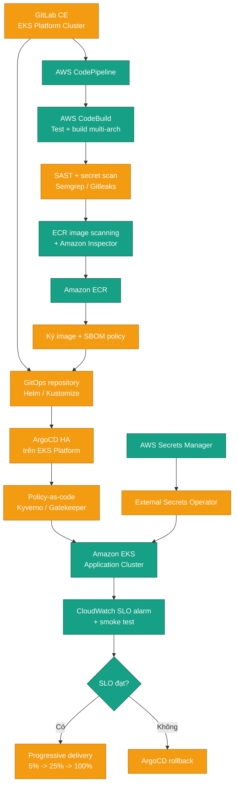
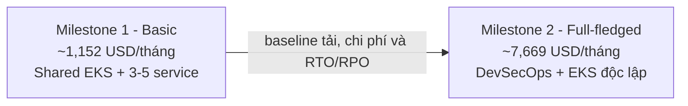
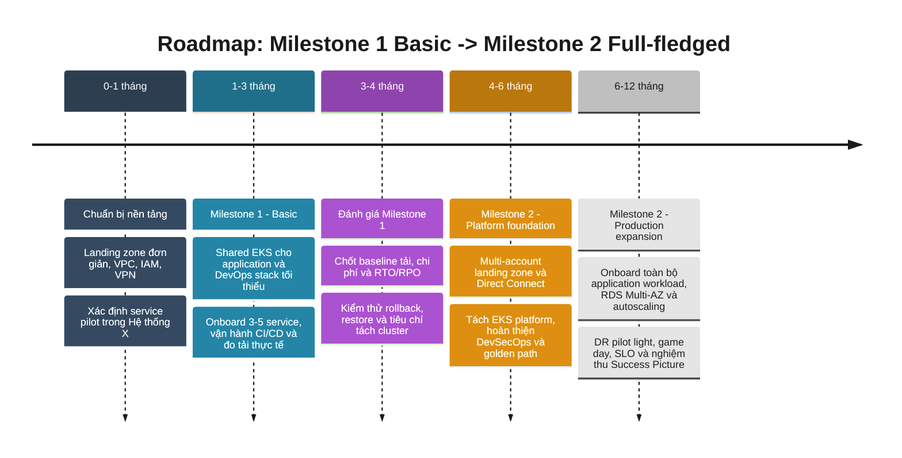

# AWS Adoption dành cho doanh nghiệp vừa và nhỏ

keywords: well-architected framework, AWS adoption, doanh nghiệp vừa và nhỏ, cloud migration, best practices

---

# AWS Cloud Adoption — Đề Xuất Triển Khai Hybrid Cloud

Tài liệu đề xuất mô hình **Hybrid Cloud (AWS Cloud Adoption)** cho hệ thống microservice đa công nghệ hiện đang chạy on-prem (gọi tắt là **Hệ thống X**), kết nối với AWS qua Site-to-Site VPN, khu vực triển khai **ap-southeast-1 (Singapore)**.

## Mục Lục

1. Tóm tắt điều hành
2. Hiện trạng on-prem (giả định)
3. Nguyên tắc thiết kế và hai milestone
4. AWS Service Catalog
5. Kiến trúc AWS đề xuất
6. Dự toán chi phí theo milestone
7. Lộ trình triển khai
8. Rủi ro chính và biện pháp giảm thiểu
9. Success Picture (Definition of Done)
10. Tham chiếu

## 1) Tóm Tắt Điều Hành

- Mục tiêu: xây dựng mô hình **hybrid cloud thử nghiệm** giữa hạ tầng on-prem hiện có và AWS, làm bước đệm cho lộ trình AWS Cloud Adoption toàn diện.
- **Milestone 1 - Basic**: chạy thử 3-5 microservice với chi phí tối ưu; application và DevOps stack tối thiểu dùng chung một cụm EKS nhưng tách namespace, node placement và quyền truy cập. CI/CD phải đủ ổn định để onboard, triển khai và rollback service pilot.
- **Milestone 2 - Full-fledged**: chạy toàn bộ application workload trong phạm vi trên AWS; tách EKS Platform Cluster và EKS Application Cluster, hoàn thiện DevSecOps, HA, DR, governance và golden path để onboard hệ thống mới.
- Kết nối on-premises với AWS qua **Site-to-Site VPN** ở Milestone 1; nâng cấp lên **Direct Connect**, giữ VPN dự phòng ở Milestone 2.
- Ngân sách tham khảo Milestone 1: trần **~4.000 USD/tháng**; estimate tối ưu bên dưới khoảng **~1.165 USD/tháng**.

## 2) Hiện Trạng On-Prem (Giả Định)

| Hạng mục | Giả định |
| :--- | :--- |
| Tổng số server | ~30 server (vật lý/VM) |
| Kubernetes | 1 cụm K8s, ước lượng 8-12 node (mix control-plane + worker) |
| DevOps platform | Chưa có platform dùng chung; sẽ xây bản tối thiểu trên EKS ở Milestone 1 và hoàn thiện trên EKS Platform Cluster độc lập ở Milestone 2 |
| Non-Kubernetes | ~18-22 server chạy service truyền thống, batch job, DB, legacy app |
| Người dùng | ~10,000 user đăng ký |
| DAU (Daily Active User) | ước lượng 1,000-1,500 (10-15% tổng user) |
| Traffic đỉnh (peak) | ước lượng 50-80 request/giây, phân bổ không đều theo khung giờ |
| Dữ liệu | vài chục đến vài trăm GB, tăng dần |
| Ngôn ngữ/công nghệ | Java, Node.js, Golang, Python — kiến trúc microservice hỗn hợp |
| Số lượng microservice | ~20 service |
| Region AWS dự kiến | `ap-southeast-1` (Singapore) |
| Kết nối hybrid | Site-to-Site VPN |
| Phạm vi hybrid thử nghiệm | Chọn một tập con service chạy trên AWS EKS; **DB core (system of record)** giữ nguyên on-prem; **DB riêng của từng microservice** dùng RDS trên AWS (xem mục 4.5) |

> Số liệu trên là giả định lập kế hoạch, cần đối chiếu số liệu thật khi triển khai chính thức. Chưa có yêu cầu compliance/data residency đặc biệt tại thời điểm này; cần rà soát Nghị định 13/2023 trước Milestone 2.

## 3) Nguyên Tắc Thiết Kế Và Cách Tiếp Cận

- **Một tuyến triển khai, hai milestone**: Milestone 1 tạo baseline và năng lực CI/CD tối thiểu; Milestone 2 là trạng thái đích với DevSecOps hoàn chỉnh và platform/application cluster độc lập.
- **Cost-first nhưng vận hành được ở Milestone 1**: ứng dụng và DevOps stack dùng chung EKS; ưu tiên 3-5 service đại diện, một NAT Gateway và RDS Single-AZ, chấp nhận RTO/RPO pilot đã thống nhất.
- **Well-Architected Framework** làm khung tham chiếu xuyên suốt (Operational Excellence, Security, Reliability, Performance Efficiency, Cost Optimization, Sustainability — ưu tiên dịch vụ managed/serverless và instance Graviton (ARM) để giảm cả chi phí lẫn mức tiêu thụ năng lượng trên mỗi đơn vị workload).
- **Loose coupling qua VPN**: service trên AWS gọi ngược on-prem qua kết nối riêng tư, không expose trực tiếp ra Internet cho lưu lượng nội bộ.
- **Không lock-in sớm**: ưu tiên container hóa (EKS) và IaC (Terraform/CloudFormation) để giữ khả năng di chuyển ngược lại on-prem nếu cần.

### 3.1 Phạm vi và tiêu chí hoàn tất

| Milestone | Phạm vi | Mô hình EKS | Tiêu chí hoàn tất |
| :--- | :--- | :--- | :--- |
| **Milestone 1 - Basic** | 3-5 microservice đại diện, database riêng trên RDS, kết nối DB core qua VPN | Một EKS cluster dùng chung; tách namespace/node placement cho application và DevOps | Pipeline build-scan-deploy chạy ổn định; rollback/restore được kiểm thử; có baseline tải, chi phí và RTO/RPO |
| **Milestone 2 - Full-fledged** | Toàn bộ application workload trong phạm vi, production HA, DR và governance | EKS Platform Cluster và EKS Application Cluster độc lập | DevSecOps end-to-end; SLO/DR đạt yêu cầu; golden path cho phép onboard hệ thống mới lặp lại và có kiểm soát |

Tuyến triển khai duy nhất là `Milestone 1 -> Milestone 2`. Mọi quyết định sizing và cam kết chi phí dài hạn ở Milestone 2 phải dựa trên số liệu đo được từ Milestone 1.

### 3.2 Mục tiêu chất lượng của Milestone 2

| Mục tiêu | Thiết kế AWS/DevSecOps đáp ứng |
| :--- | :--- |
| An toàn | Multi-account guardrail, IAM least privilege, KMS, Secrets Manager, WAF, GuardDuty, Security Hub, Inspector, Network Firewall và policy-as-code |
| Ổn định | EKS managed control plane, managed node group, requests/limits, PDB, topology spread, autoscaling và SLO-based alerting |
| Sẵn sàng | Multi-AZ cho EKS/RDS/ElastiCache, VPN dự phòng Direct Connect, backup cross-Region và DR pilot light được diễn tập |
| Dễ mở rộng | Cluster autoscaling, Graviton, RDS right-sizing, MSK cho luồng bất đồng bộ và tách failure domain giữa platform/application |
| Dễ onboard | Service Catalog, IaC module, pipeline template, namespace/IAM/ECR chuẩn, dashboard, alarm, backup policy và runbook theo golden path |

## 4) AWS Service Catalog

Ký hiệu: **●** = sử dụng đầy đủ, **◐** = sử dụng tối giản/giới hạn, **○** = chưa sử dụng.

### 4.1 Lớp Infra & Network

| Dịch vụ | Ý nghĩa / Mô tả | Milestone 1 - Basic | Milestone 2 - Full-fledged | Ghi chú / khuyến nghị |
| :--- | :--- | :---: | :---: | :--- |
| Amazon VPC | Mạng riêng ảo cách ly, nền tảng cho toàn bộ hạ tầng network trên AWS | ● | ● | Nền tảng bắt buộc |
| Internet Gateway | Cổng kết nối VPC ra Internet, bắt buộc để expose ứng dụng công khai | ● | ● | Gắn cho ALB internet-facing phục vụ người dùng cuối |
| Site-to-Site VPN | Kênh mã hóa qua Internet kết nối on-prem với VPC | ● | ◐ (backup path) | Milestone 1: kết nối chính; Milestone 2: dự phòng cho Direct Connect |
| AWS Direct Connect | Kết nối mạng riêng, chuyên dụng từ data center lên AWS, băng thông ổn định | ○ | ● | AWS khuyến nghị cho production traffic ổn định, latency thấp |
| NAT Gateway | Cho phép resource trong subnet private ra Internet (outbound) một chiều | ◐ (1 NAT) | ● (Multi-AZ) | Milestone 1 chấp nhận single point of failure để tối ưu pilot |
| Transit Gateway | Hub trung tâm kết nối nhiều VPC/mạng on-prem qua một điểm | ○ | ● | Dùng khi chuyển sang multi-account ở Milestone 2 |
| Elastic Load Balancing (ALB/NLB) | Phân phối traffic đến nhiều target, chịu lỗi và scale ngang; ALB là cổng expose ứng dụng ra Internet | ● | ● | ALB cho HTTP(S) internet-facing, NLB nếu cần TCP/latency thấp |
| Amazon Route 53 | DNS quản lý domain, định tuyến public/hybrid và health check | ● | ● | DNS public cho tên miền expose ra Internet |
| AWS Global Accelerator | Định tuyến traffic người dùng đến điểm gần nhất qua mạng lõi AWS | ○ | ○ (tùy chọn) | Chỉ cần khi multi-region/latency toàn cầu là ưu tiên |
| VPC Endpoints (Gateway: S3; Interface: ECR, CloudWatch Logs) | Đường riêng tư tới dịch vụ AWS mà không đi qua NAT Gateway/Internet | ◐ (S3 Gateway miễn phí; ECR/CloudWatch Interface tùy chọn) | ● | Giảm chi phí data-processing qua NAT khi EKS pull image ECR và ghi log CloudWatch liên tục |

### 4.2 Lớp Security

| Dịch vụ | Ý nghĩa / Mô tả | Milestone 1 - Basic | Milestone 2 - Full-fledged | Ghi chú / khuyến nghị |
| :--- | :--- | :---: | :---: | :--- |
| AWS IAM (role, policy least-privilege) | Quản lý danh tính và phân quyền truy cập tài nguyên AWS | ● | ● | Bắt buộc, nền tảng AuthZ |
| AWS KMS | Tạo và quản lý khóa mã hóa dữ liệu | ● | ● | Milestone 1: key dùng chung có kiểm soát; Milestone 2: CMK theo domain/service |
| AWS Certificate Manager | Cấp và quản lý chứng chỉ TLS/SSL miễn phí | ● | ● | TLS cho ALB/CloudFront internet-facing |
| AWS Secrets Manager | Lưu trữ và luân chuyển bí mật (mật khẩu, API key) an toàn | ● | ● | Thay thế hardcode secret trong config |
| Amazon GuardDuty | Phát hiện mối đe dọa/hành vi bất thường bằng machine learning | ● | ● | Bật từ Milestone 1 theo security baseline |
| AWS Security Hub | Tổng hợp và ưu tiên hóa cảnh báo bảo mật từ nhiều dịch vụ | ○ | ● | Tổng hợp finding từ GuardDuty/Config/Inspector |
| AWS WAF | Chặn tấn công tầng ứng dụng web (SQLi, XSS, bot) theo OWASP Top 10 | ◐ (ruleset cơ bản) | ● | Milestone 2 bổ sung managed rule, rate limit và tuning theo log |
| AWS Network Firewall | Kiểm soát lưu lượng mạng theo rule tập trung ở tầng VPC | ○ | ● | Kiểm soát lưu lượng VPC-to-VPC/Internet mức sâu hơn |
| AWS Shield (Standard/Advanced) | Bảo vệ chống tấn công DDoS | Standard (free, tự động cho ALB) | Standard, cân nhắc Advanced | Shield Advanced chỉ cần khi rủi ro DDoS cao |
| Amazon Inspector | Tự động quét lỗ hổng bảo mật trên EC2/container image | ○ | ● | Quét lỗ hổng image/EC2 tự động |
| Amazon Macie | Phát hiện dữ liệu nhạy cảm (PII) trong S3 | ○ | ○ (tùy chọn) | Chỉ cần khi có dữ liệu nhạy cảm trong S3 |

### 4.3 Lớp Platform & Governance

| Dịch vụ | Ý nghĩa / Mô tả | Milestone 1 - Basic | Milestone 2 - Full-fledged | Ghi chú / khuyến nghị |
| :--- | :--- | :---: | :---: | :--- |
| AWS Organizations / Control Tower | Quản lý nhiều tài khoản AWS theo chuẩn landing zone tập trung | ○ | ● | Multi-account landing zone — nền tảng governance cấp doanh nghiệp |
| AWS Service Catalog | Chuẩn hóa danh mục sản phẩm hạ tầng cho self-service provisioning | ○ | ● | Chuẩn hóa self-service provisioning theo golden path |
| AWS Config | Ghi nhận và đánh giá compliance cấu hình tài nguyên theo thời gian | ◐ (vài rule cơ bản) | ● (rule đầy đủ + conformance pack) | Compliance-as-code |
| AWS CloudTrail | Ghi log mọi lệnh gọi API để audit và điều tra sự cố | ● | ● (org trail) | Audit log bắt buộc mọi mức |
| Amazon CloudWatch (Logs/Metrics/Alarms) | Thu thập log/metric, dựng dashboard và cảnh báo | ● | ● | Baseline observability |
| Amazon Managed Prometheus/Grafana (AMP/AMG) | Prometheus/Grafana được AWS vận hành, không cần tự quản lý hạ tầng | ○ | ● | Milestone 1 dùng Prometheus/Grafana tối giản trên shared EKS; Milestone 2 chuyển backend sang managed |
| Amazon EKS - Platform Runtime | Nơi chạy DevOps platform và controller | ◐ (dùng chung application EKS) | ● (cluster độc lập) | Milestone 2 tách failure domain và vòng đời nâng cấp khỏi EKS application |
| Amazon OpenSearch Service | Phân tích và lưu trữ log tập trung | ○ | ● | AWS native, giảm gánh nặng vận hành stateful search cluster |
| GitLab CE / Runner / ArgoCD / Keycloak | Source control, CI runner, GitOps và SSO | ◐ (bản tối thiểu trên shared EKS) | ● (HA trên Platform EKS) | Open source; đội dự án chịu trách nhiệm backup, upgrade và incident response |
| AWS CodePipeline / CodeBuild / CodeConnections | Orchestrate pipeline, build và kết nối source | ○ | ● | Milestone 2 dùng khi cần managed build/orchestration và chuẩn hóa multi-account |
| AWS Backup | Tự động hóa chính sách sao lưu/khôi phục tập trung | ◐ (RDS/EFS cơ bản) | ● (cross-region) | Chính sách backup/restore tập trung |
| AWS Budgets / Cost Explorer | Theo dõi, cảnh báo và phân tích chi phí sử dụng | ● | ● | Kiểm soát chi phí ngay từ Milestone 1 |
| AWS Systems Manager | Quản lý vá lỗi, truy cập từ xa an toàn không cần SSH/bastion | ● | ● | Patch, Session Manager (thay SSH/bastion) |
| Savings Plans for Compute | Cam kết mức sử dụng để đổi lấy giá compute thấp hơn | ◐ (đánh giá sau pilot) | ● | Cam kết 1 năm no-upfront cho EC2/Fargate sau khi tải thực tế ổn định, giảm ~20-30% chi phí compute |
| AWS Support Plan | Gói hỗ trợ kỹ thuật từ AWS theo SLA cam kết | Developer/Business | Business/Enterprise | Nâng gói theo SLO và phạm vi production |
| Amazon QuickSight | Dựng dashboard phân tích dữ liệu kinh doanh (BI) | ○ | ○ (tùy chọn) | Chỉ cần khi có nhu cầu BI/dashboard kinh doanh riêng ngoài CloudWatch |

### 4.4 Lớp Application

| Dịch vụ | Ý nghĩa / Mô tả | Milestone 1 - Basic | Milestone 2 - Full-fledged | Ghi chú / khuyến nghị |
| :--- | :--- | :---: | :---: | :--- |
| Amazon EKS | Kubernetes được AWS quản lý, giảm gánh nặng vận hành control plane | ● | ● | Milestone 1 dùng chung cluster; Milestone 2 tách application EKS và platform EKS |
| Amazon ECR | Kho lưu trữ container image riêng tư, tích hợp quét lỗ hổng | ● | ● | Container registry, tích hợp scan image |
| Amazon EC2 (worker node) | Máy chủ ảo, đơn vị compute nền tảng cho worker node EKS | ● | ● | Cân nhắc Graviton (m6g/m7g) để tối ưu chi phí |
| AWS Fargate | Chạy container serverless, không cần quản lý node | ◐ (tùy chọn) | ◐ (workload phù hợp) | Giảm vận hành node cho service ít traffic/burst |
| Amazon RDS | Cơ sở dữ liệu quan hệ được quản lý (backup, patch, failover tự động) | ● (dùng cho DB riêng từng microservice, xem 4.5) | ● (Multi-AZ, tách nhóm theo domain) | DB core vẫn ở on-prem; RDS chỉ phục vụ dữ liệu riêng của microservice trên AWS |
| Amazon ElastiCache | Cache in-memory tăng tốc truy vấn, giảm tải cho RDS | ○ | ● | Cache/session tier khi mở rộng |
| Amazon S3 | Lưu trữ object bền vững, chi phí thấp | ● | ● | Static asset, backup, log archive |
| Amazon EFS | Hệ thống file dùng chung, mount đồng thời nhiều instance/pod | ◐ | ● | Shared storage cho workload cần ReadWriteMany |
| Application Load Balancer + Ingress (ALB Controller/NGINX) | Định tuyến HTTP(S) vào cluster EKS; là cổng chính expose ứng dụng ra Internet | ● | ● | Cấu hình internet-facing, kết hợp Internet Gateway + WAF (xem 4.1/4.2) |
| Amazon API Gateway | Cổng vào tập trung cho REST/WebSocket API, tích hợp auth/throttling | ◐ (tùy chọn, cho API expose ra đối tác) | ● | Quản lý API tập trung khi số microservice public API tăng |
| Amazon MSK (Managed Kafka) | Nền tảng Kafka quản lý cho streaming dữ liệu thời gian thực | ○ | ● | Event streaming giữa các microservice khi kiến trúc event-driven trưởng thành hơn |
| AWS Transfer Family | Truyền file SFTP/FTPS an toàn, tích hợp thẳng với S3 | ○ | ◐ (tùy chọn) | Chỉ cần khi có tích hợp SFTP/FTPS với đối tác |
| Amazon SES | Gửi email giao dịch/thông báo số lượng lớn | ◐ (tùy chọn, chi phí thấp) | ● | Gửi email giao dịch/thông báo hệ thống |
| Amazon CloudFront | CDN phân phối nội dung tĩnh/động gần người dùng, kèm Shield tự động | ○ | ○ (tùy chọn) | Khi cần CDN + bảo vệ biên cho ứng dụng expose ra Internet |

### 4.5 Chiến Lược Database Cho Microservice (RDS)

- Giả định Hệ thống X có **~20 microservice**. **DB core** (dữ liệu lõi, system of record dùng chung) tiếp tục nằm on-prem, không di chuyển.
- Các microservice khi lên AWS áp dụng nguyên tắc **database-per-service**, nhưng để tối ưu chi phí ở quy mô thử nghiệm, nhóm nhiều DB logic (schema/database riêng) trên cùng một RDS instance theo domain/mức độ quan trọng, thay vì tạo 20 instance riêng lẻ.

| Nhóm RDS | Domain / mức độ quan trọng | Số microservice | Milestone 1 - Basic | Milestone 2 - Full-fledged |
| :--- | :--- | :---: | :--- | :--- |
| Group A | Core business - giao dịch (critical) | 4 | 1 DB pilot `db.t4g.large`, Single-AZ | `db.r6g.large`, Multi-AZ |
| Group B | Nghiệp vụ chính (core) | 6 | Chưa provision | `db.r6g.large`, Multi-AZ |
| Group C | Hỗ trợ (supporting) | 6 | 1 DB pilot `db.t4g.medium`, Single-AZ | `db.t4g.large`, Multi-AZ |
| Group D | Phụ trợ/ít traffic (auxiliary) | 4 | Chưa provision | `db.t4g.large`, Multi-AZ |
| **Tổng** | | **20** | **2 RDS instance cho 3-5 service** | **4 RDS deployment Multi-AZ cho toàn bộ service** |

- Mỗi instance dùng PostgreSQL/MySQL theo stack hiện có của từng service, tách biệt bằng schema/database riêng; credential quản lý qua Secrets Manager, kết nối qua IAM DB Auth khi phù hợp.
- Milestone 2: nhóm A/B dùng Multi-AZ và instance lớn hơn; nhóm C/D vẫn Multi-AZ nhưng instance nhỏ hơn.
- Khi traffic thực tế của một service vượt ngưỡng dùng chung, tách instance riêng cho service đó trước — tránh over-provision ngay từ đầu.

## 5) Kiến Trúc AWS Đề Xuất

### 5.1 Milestone 1 - Basic: EKS dùng chung Application và DevOps

### 5.2 Milestone 2 - Full-fledged: DevSecOps và EKS độc lập

```mermaid
%%{ init: { "layout": "elk" } }%%
flowchart LR
  Internet(["Internet / End Users"])

  subgraph OnPrem ["On-Premise"]
    direction TB
    OP_K8s[Kubernetes Cluster]
    OP_NonK8s[Non-K8s Servers]
    OP_DB[(Database chính)]
  end

  DX{{AWS Direct Connect\n+ VPN backup}}

  subgraph LZ ["AWS Landing Zone (Control Tower / Organizations)"]
    direction TB
    subgraph NetF ["Infra & Network"]
      IGWf[Internet Gateway]
      CDN[CloudFront - tùy chọn]
      TGW[Transit Gateway]
      NATm[NAT Gateway Multi-AZ]
      ALBm[ALB / NLB - internet-facing]
      R53[Route 53 - public + hybrid]
    end
    subgraph SecF ["Security"]
      IAMf[IAM + SCP]
      KMSf[KMS - CMK theo domain]
      GDf[GuardDuty]
      SHf[Security Hub]
      WAF[AWS WAF]
      NFW[Network Firewall]
      Insp[Inspector]
    end
    subgraph PlatF ["Platform & Governance"]
      Config[AWS Config + Conformance Pack]
      SC[Service Catalog]
      AMPG[Managed Prometheus/Grafana]
      EKSplat[EKS Platform Cluster\nđộc lập]
      GitLab[GitLab CE]
      Argo[ArgoCD HA]
      Keycloak[Keycloak / SSO]
      CICD[CodePipeline + CodeBuild]
      OS[OpenSearch Service]
      Backup[AWS Backup - cross-region]
      EKSplat --> GitLab
      EKSplat --> Argo
      EKSplat --> Keycloak
      GitLab --> CICD --> Argo
    end
    subgraph AppF ["Application (multi-env)"]
      EKSf[EKS Application Clusters\nprod + stage, autoscaling]
      RDSf[(RDS Multi-AZ - 4 cluster\nDB riêng microservice)]
      ECf[(ElastiCache)]
      S3f[(S3 + lifecycle)]
      EFSf[(EFS Multi-AZ)]
      MSKf[MSK - event streaming]
      APIGWf[API Gateway]
    end
    Internet --> R53 --> CDN --> WAF --> ALBm --> EKSf
    IGWf --- ALBm
    TGW --> NFW --> EKSf
    Argo -.->|GitOps deploy| EKSf
    EKSf -.->|Metrics| AMPG
    EKSf -.->|Logs| OS
    EKSf --> RDSf
    EKSf --> ECf
    EKSf --> MSKf
    APIGWf --> EKSf
  end

  subgraph DR ["DR Region (pilot light)"]
    RDSdr[(RDS Replica)]
    S3dr[(S3 Replication)]
  end

  OP_K8s <--> DX
  DX <--> TGW
  RDSf -.->|Replication| RDSdr
  S3f -.->|Cross-region replication| S3dr

  classDef onprem fill:#2c3e50,stroke:#1a252f,color:#fff;
  classDef dr fill:#7f8c8d,stroke:#666,color:#fff;
  classDef internet fill:#3498db,stroke:#2471a3,color:#fff;
  classDef netlayer fill:#16a085,stroke:#0e6655,color:#fff;
  classDef seclayer fill:#e74c3c,stroke:#a93226,color:#fff;
  classDef platlayer fill:#f39c12,stroke:#b9770e,color:#fff;
  classDef applayer fill:#9b59b6,stroke:#7d3c98,color:#fff;
  class OP_K8s,OP_NonK8s,OP_DB onprem;
  class Internet internet;
  class IGWf,CDN,TGW,NATm,ALBm,R53 netlayer;
  class IAMf,KMSf,GDf,SHf,WAF,NFW,Insp seclayer;
  class Config,SC,AMPG,EKSplat,GitLab,Argo,Keycloak,CICD,OS,Backup platlayer;
  class EKSf,RDSf,ECf,S3f,EFSf,MSKf,APIGWf applayer;
  class RDSdr,S3dr dr;
```

### 5.3 Ghi chú kiến trúc theo lớp

- **Màu sắc nhất quán theo lớp**: Infra & Network (xanh lá đậm), Security (đỏ), Platform & Governance (cam), Application (tím), On-Premise (xám than), Internet (xanh dương), DR (xám nhạt).
- **Đường đi traffic từ Internet**: `Internet → Route 53 → CloudFront (tùy chọn) → WAF → ALB → EKS application`. Internet Gateway là attachment của VPC cho ALB public, không phải thiết bị inspection nối tiếp. Network Firewall nằm trên đường hybrid/egress qua Transit Gateway và inspection VPC.
- **Kết nối Milestone 2**: Direct Connect/VPN backup gắn vào Transit Gateway qua Direct Connect Gateway, cho phép dùng chung kết nối cho nhiều VPC/account.
- **Internet exposure**: Milestone 1 dùng ALB + WAF cơ bản; Milestone 2 bổ sung CloudFront, managed WAF rules và Network Firewall cho hybrid/egress inspection.
- **Infra & Network**: Milestone 1 dùng một VPC, VPN hai tunnel và một NAT; Milestone 2 dùng Direct Connect, Transit Gateway, multi-account và NAT Multi-AZ.
- **Security**: Milestone 1 bật IAM, KMS, GuardDuty, WAF và image scanning; Milestone 2 bổ sung Security Hub, Network Firewall, Inspector, policy-as-code và security gate tự động.
- **Platform & Governance**: Milestone 1 chạy DevOps stack tối thiểu chung EKS; Milestone 2 tách EKS platform, dùng Control Tower, Service Catalog, AMP/AMG, OpenSearch và backup cross-Region.
- **Application**: Milestone 1 chỉ onboard 3-5 service; Milestone 2 đưa toàn bộ application workload trong phạm vi lên EKS, RDS Multi-AZ và DR pilot light.

### 5.4 CI/CD Và Chiến Lược Triển Khai

Milestone 1 dùng GitLab CE/Runner và ArgoCD trên shared EKS để có pipeline chạy thật với chi phí thấp. Milestone 2 tách platform cluster và bổ sung đầy đủ DevSecOps gate, progressive delivery và golden path.

#### Milestone 1 - CI/CD tối thiểu trên shared EKS

#### Milestone 2 - DevSecOps hoàn chỉnh

**Chú giải:** cam = dịch vụ/thành phần tự xây dựng và vận hành, có thể dùng open source; xanh lá = dịch vụ AWS native.

- **SDLC automation**: Milestone 1 dùng GitLab Runner; Milestone 2 chuẩn hóa CodePipeline/CodeBuild cho multi-account, kết hợp SAST, secret scan, ECR/Inspector, ký image và admission policy trước khi ArgoCD deploy.
- **Chiến lược rollout theo tier**:
  - **Milestone 1**: rolling update mặc định của Kubernetes Deployment.
  - **Milestone 2**: blue/green hoặc canary `5% -> 25% -> 100%`, rollback tự động khi CloudWatch alarm hoặc SLO burn-rate vượt ngưỡng.
- **Quản lý cấu hình**: secrets qua Secrets Manager/External Secrets Operator, không hardcode trong manifest hay image; cấu hình môi trường qua ConfigMap/SSM Parameter Store.
- **Golden path onboarding ở Milestone 2**: Service Catalog + IaC module tạo account/VPC, namespace, IAM role, ECR repository, pipeline, dashboard, alarm, backup policy và runbook theo mẫu chuẩn.
- **Testing gate**: unit/integration -> SAST/secret scan -> image scan/SBOM/signing -> staging smoke test -> progressive production rollout.

## 6) Dự Toán Chi Phí

> Lưu ý: các con số dưới đây là **ước tính ở mức lập kế hoạch** (planning-level), dựa trên giả định ở mục 2, giá on-demand khu vực `ap-southeast-1`. Cần xác nhận lại bằng AWS Pricing Calculator/Cost Explorer và sizing thực tế trước khi phê duyệt ngân sách chính thức. Reserved Instance/Savings Plan có thể giảm thêm 20-40% cho phần compute.

### 6.1 Milestone 1 - Basic (trần ngân sách tham khảo: 4.000 USD/tháng)

| Lớp | Hạng mục | Ước tính (USD/tháng) |
| :--- | :--- | ---: |
| Infra & Network | NAT Gateway (1x, chấp nhận single point of failure ở pilot) | 58 |
| Infra & Network | Site-to-Site VPN + data transfer | 76 |
| Infra & Network | Route 53 + data transfer khác | 30 |
| Infra & Network | VPC Endpoints (S3 Gateway miễn phí + ECR/CloudWatch Interface) | 15 |
| **Subtotal Network** | | **~179** |
| Security | GuardDuty | 25 |
| Security | Secrets Manager + KMS | 10 |
| Security | AWS WAF (ruleset cơ bản cho ALB internet-facing) | 26 |
| **Subtotal Security** | | **~61** |
| Platform & Governance | CloudWatch Logs/Metrics | 35 |
| Platform & Governance | AWS Config (rule cơ bản) | 20 |
| Platform & Governance | AWS Backup + ECR | 18 |
| Platform & Governance | EBS/snapshot cho GitLab, ArgoCD và observability tối giản | 40 |
| **Subtotal Governance** | | **~113** |
| Application | EKS Control Plane | 73 |
| Application | EC2 worker node dùng chung (3 x m6g.xlarge, Graviton) | 363 |
| Application | ALB (1x, internet-facing) | 40 |
| Application | RDS - 2 instance Single-AZ cho 3-5 service pilot (xem 4.5) | 198 |
| Application | S3 + EFS | 20 |
| **Subtotal Application** | | **~694** |
| **Tổng chi phí AWS (indicative)** | | **~1,047** |
| AWS Business Support (~10%, tối thiểu 100) | | 105 |
| **Tổng cộng** | | **~1,152** |
| Dư địa so với trần ngân sách 4.000 | | **~2,848 (buffer/contingency/scale-up)** |

DevOps stack Milestone 1 không có dòng compute riêng vì chạy chung ba worker EKS với application pilot. Sizing này cần requests/limits, taint/toleration hoặc node affinity để pipeline build không làm nghẽn workload; nếu đo tải cho thấy tranh chấp tài nguyên, ưu tiên thêm node trước khi onboard service tiếp theo.

### 6.2 Milestone 2 - Full-fledged (Success Picture)

| Lớp | Hạng mục | Ước tính (USD/tháng) |
| :--- | :--- | ---: |
| Infra & Network | Direct Connect (hosted 1Gbps) | 220 |
| Infra & Network | Transit Gateway + attachment | 108 |
| Infra & Network | NAT Gateway Multi-AZ | 116 |
| Infra & Network | VPN backup path | 56 |
| Infra & Network | Data transfer (~3TB) | 270 |
| Infra & Network | Route 53 | 10 |
| Infra & Network | VPC Endpoints (S3 Gateway + ECR/CloudWatch Interface, Multi-AZ) | 30 |
| **Subtotal Network** | | **~810** |
| Security | GuardDuty + Security Hub | 80 |
| Security | AWS WAF | 30 |
| Security | AWS Network Firewall | 400 |
| Security | KMS (CMK theo domain) + Secrets Manager | 27 |
| Security | Inspector + Macie (tùy chọn) | 50 |
| **Subtotal Security** | | **~587** |
| Platform & Governance | Config (org-wide) + CloudTrail | 80 |
| Platform & Governance | Managed Prometheus/Grafana | 125 |
| Platform & Governance | AWS Backup (cross-region) | 50 |
| Platform & Governance | EKS Platform Cluster + 3 worker Graviton + EBS | 450 |
| Platform & Governance | Amazon OpenSearch Service + EBS/snapshot | 450 |
| Platform & Governance | CodePipeline/CodeBuild/CodeConnections | 75 |
| **Subtotal Governance** | | **~1,230** |
| Application | EKS Control Plane (prod + stage) | 146 |
| Application | EC2 worker node (12 x m6g.xlarge, Graviton, mix RI/Savings Plan khuyến nghị) | 1,450 |
| Application | RDS Multi-AZ - 4 cluster cho 20 microservice DB (xem 4.5) | 1,340 |
| Application | ElastiCache Multi-AZ | 274 |
| Application | ALB (multi-env) | 90 |
| Application | S3 + EFS Multi-AZ | 65 |
| Application | DR region (pilot light) | 200 |
| Application | Observability data volume | 150 |
| Application | Amazon MSK (3-broker, event streaming) | 600 |
| Application | API Gateway | 20 |
| Application | Amazon SES | 10 |
| **Subtotal Application** | | **~4,345** |
| **Tổng chi phí AWS (indicative)** | | **~6,972** |
| AWS Business Support (~10%) | | 697 |
| **Tổng cộng** | | **~7,669** |

### 6.3 Lộ trình nâng cấp chi phí

- Chênh lệch chủ yếu đến từ việc tách platform/application cluster, Direct Connect, Network Firewall, RDS Multi-AZ, MSK, DR region và mở rộng từ 3-5 service lên toàn bộ application workload.
- Khuyến nghị: chạy Milestone 1 trong 2-3 tháng để đo tải thực tế trước khi sizing và cam kết chi phí dài hạn cho Milestone 2.
- **Graviton (ARM, m6g)** đã được áp dụng thay x86 (m5) trong cả hai kịch bản ở bảng trên — giảm ~20% chi phí EC2 worker node, đúng khuyến nghị Performance Efficiency/Cost Optimization/Sustainability trong mục 4.4 và 3. Cần xác nhận toolchain build image hỗ trợ multi-arch (arm64) trước khi áp dụng.

### 6.4 Cơ Sở Tính Toán Và Độ Tin Cậy Số Liệu

- **Cơ sở tính toán**: đơn giá on-demand tham khảo cho khu vực `ap-southeast-1`, theo instance family phổ biến (m5/m6g cho EC2, db.t3/db.r5 cho RDS), **chưa áp dụng** Reserved Instance/Savings Plan/Spot — đây là lý do Savings Plans được liệt kê ở mục 4.3 như một bước tối ưu sau khi tải ổn định.
- **Độ tin cậy**: con không có quyền truy cập trực tiếp AWS Price List API hay AWS Pricing Calculator trong phiên làm việc này, nên toàn bộ con số là **ước tính thủ công dựa trên đơn giá công khai điển hình của AWS**, không phải trích xuất real-time. Mức tin cậy phù hợp cho **lập kế hoạch ngân sách sơ bộ (±20-30%)**, chưa phải báo giá chính thức.
- Sai số lớn nhất thường đến từ: data transfer thực tế (phụ thuộc traffic đo được), số lượng NAT/ALB cần dùng, instance type chọn sau load test, và việc có mua Reserved/Savings Plan hay không.
- **Có cần tạo link AWS Pricing Calculator không?** Có, nên tạo — nhưng con không thể tự sinh sẵn một link "Share estimate" hợp lệ vì công cụ đó yêu cầu thao tác trực tiếp trên `https://calculator.aws/` (thêm từng dịch vụ, chọn vùng, lưu estimate) và chỉ xuất ra link chia sẻ sau khi cấu hình xong trên giao diện thật; con không có khả năng vận hành trình duyệt để thao tác việc đó trong phiên này. Đề xuất: đội hạ tầng tự dựng estimate trên AWS Pricing Calculator theo đúng danh sách dịch vụ + instance type trong tài liệu này (mục 4 và 6.1/6.2), sau đó lưu link "Share estimate" vào mục 10 (Tham chiếu) để thay thế bảng ước tính thủ công làm số liệu chính thức.

## 7) Lộ Trình Triển Khai

## 8) Rủi Ro Chính Và Biện Pháp Giảm Thiểu

| Rủi ro | Tác động | Biện pháp giảm thiểu |
| :--- | :--- | :--- |
| Băng thông VPN không đủ khi service AWS gọi ngược DB on-prem | Tăng latency, timeout | Giám sát từ Milestone 1; đặt ngưỡng chuyển sang Direct Connect |
| Chi phí data transfer vượt dự kiến | Vượt ngân sách | Bật AWS Budgets alert theo tuần; theo dõi Cost Explorer theo service |
| Security baseline Milestone 1 bị tối giản quá mức | Bề mặt tấn công lớn hơn | Giữ IAM least privilege, KMS, GuardDuty, WAF, image scan và audit log từ đầu |
| Chọn sai service pilot (quá phụ thuộc DB on-prem) | Không đo được lợi ích thật của hybrid | Ưu tiên chọn service ít trạng thái, latency-tolerant cho pilot |
| Application và DevOps tranh chấp tài nguyên trên shared EKS | Pipeline chậm hoặc ảnh hưởng service pilot | Namespace quota, requests/limits, PriorityClass, node affinity và ngưỡng scale thêm worker |
| Chưa có kinh nghiệm vận hành DevSecOps platform | Pipeline/observability thiếu ổn định | Xây theo từng wave; đào tạo EKS/GitOps, chuẩn hóa runbook, backup/restore và game day |
| EKS platform ảnh hưởng EKS application | Mất công cụ triển khai hoặc tăng blast radius | Tách cluster, node group, account và vòng đời nâng cấp; giữ break-glass deployment có audit |
| Chưa rà soát compliance dữ liệu cá nhân | Rủi ro pháp lý khi mở rộng production | Rà soát Nghị định 13/2023 và quy định ngành trước Milestone 2 |
| RDS Single-AZ ở Milestone 1 không tự failover (xem 4.5) | Downtime khi instance lỗi; mất dữ liệu tối đa bằng chu kỳ backup | Chấp thuận **RPO ≤ 24h**, **RTO ≤ 4h** cho pilot; chuyển nhóm production sang Multi-AZ ở Milestone 2 |

## 9) Success Picture (Definition Of Done)

Milestone 2 được coi là hoàn tất khi:

1. Kết nối on-prem <-> AWS ổn định qua Direct Connect (VPN là backup).
2. Multi-account landing zone (Control Tower) vận hành với governance/tagging/cost allocation rõ ràng.
3. Toàn bộ application workload trong phạm vi chạy trên EKS Application Cluster với autoscaling và RDS Multi-AZ; DevSecOps stack chạy trên EKS Platform Cluster độc lập.
4. Bộ bảo mật đầy đủ: GuardDuty, Security Hub, WAF, Network Firewall, Inspector đang hoạt động và có quy trình xử lý finding.
5. GitLab CE, ArgoCD, SSO và controller OSS chạy HA trên EKS Platform Cluster, có backup/restore và vòng đời nâng cấp riêng.
6. DevSecOps tự động hóa từ source đến production với SAST, secret scan, image scan, SBOM/signing, policy-as-code, progressive delivery và rollback đã kiểm thử.
7. Observability hợp nhất on-premises/AWS qua CloudWatch, AMP/AMG và OpenSearch trên AWS, có dashboard SLO và cảnh báo hành động được.
8. Có DR pilot light ở Region phụ, RTO/RPO được định nghĩa và kiểm thử ít nhất một lần.
9. Golden path có thể tạo hạ tầng, pipeline, IAM, observability, backup và runbook chuẩn để onboard một hệ thống mới mà không thiết kế lại từ đầu.
10. Chi phí vận hành nằm trong ngân sách đã phê duyệt, có báo cáo Cost Explorer định kỳ hàng tháng.

## 10) Tham Chiếu

- [AWS Well-Architected Framework](https://docs.aws.amazon.com/wellarchitected/latest/framework/welcome.html)
- [AWS Hybrid Cloud Architectures](https://aws.amazon.com/hybrid/)
- [AWS Direct Connect](https://aws.amazon.com/directconnect/)
- [AWS Site-to-Site VPN](https://aws.amazon.com/vpn/site-to-site-vpn/)
- [AWS Control Tower](https://aws.amazon.com/controltower/)
- [Amazon EKS Best Practices Guide](https://aws.github.io/aws-eks-best-practices/)
- [AWS Pricing Calculator](https://calculator.aws/)
- [Nghị định 13/2023/NĐ-CP về bảo vệ dữ liệu cá nhân](https://vanban.chinhphu.vn/)