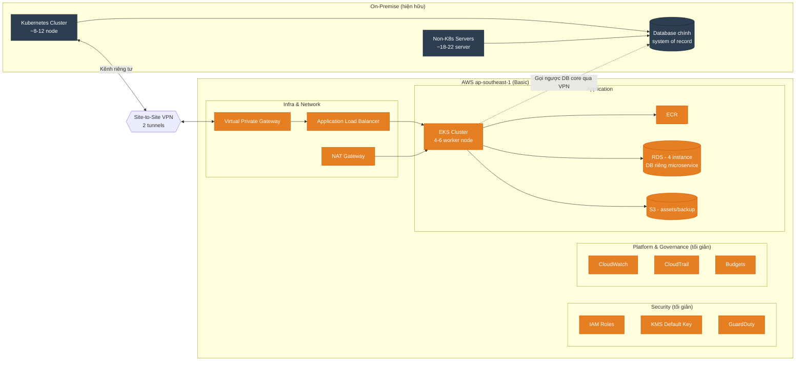
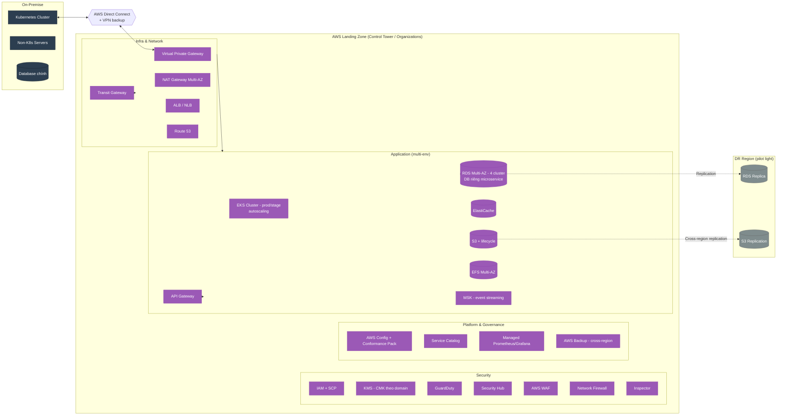
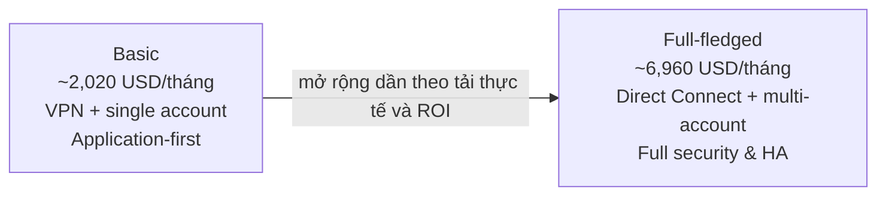
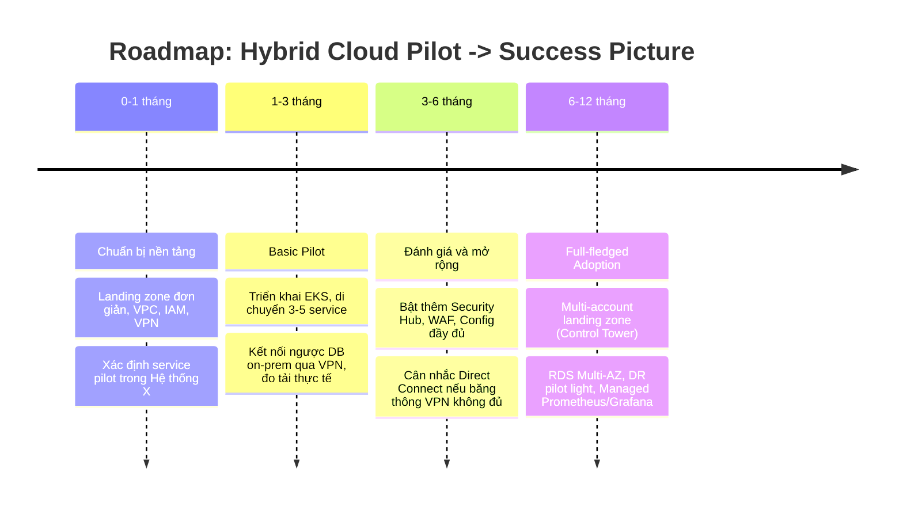

# AWS Adoption dành cho doanh nghiệp vừa và nhỏ

keywords: well-architected framework, AWS adoption, doanh nghiệp vừa và nhỏ, cloud migration, best practices

---

# AWS Cloud Adoption — Đề Xuất Triển Khai Hybrid Cloud

Tài liệu đề xuất mô hình **Hybrid Cloud (AWS Cloud Adoption)** cho hệ thống microservice đa công nghệ hiện đang chạy on-prem (gọi tắt là **Hệ thống X**), kết nối với AWS qua Site-to-Site VPN, khu vực triển khai **ap-southeast-1 (Singapore)**.

## Mục Lục

1. Tóm tắt điều hành
2. Hiện trạng on-prem (giả định)
3. Nguyên tắc thiết kế và cách tiếp cận
4. AWS Service Catalog
5. Kiến trúc AWS đề xuất
6. Dự toán chi phí (Basic vs Full-fledged)
7. Lộ trình triển khai
8. Rủi ro chính và biện pháp giảm thiểu
9. Success Picture (Definition of Done)
10. Tham chiếu

## 1) Tóm Tắt Điều Hành

- Mục tiêu: xây dựng mô hình **hybrid cloud thử nghiệm** giữa hạ tầng on-prem hiện có và AWS, làm bước đệm cho lộ trình AWS Cloud Adoption toàn diện.
- Cách tiếp cận: một kiến trúc thống nhất, chia hai mức đầu tư — **Basic** (tối giản Network/Security/Governance, đầu tư vào Application để có hệ thống chạy thật) và **Full-fledged** (success picture đầy đủ các dịch vụ trọng yếu ở mọi lớp).
- Kết nối on-prem <-> AWS: **Site-to-Site VPN** ở giai đoạn Basic; nâng cấp lên **Direct Connect** ở Full-fledged khi cần băng thông ổn định hơn.
- Ngân sách tham khảo Basic: **~4,000 USD/tháng** (ước tính thực tế thấp hơn, còn dư địa cho contingency/support).

## 2) Hiện Trạng On-Prem (Giả Định)

| Hạng mục | Giả định |
| :--- | :--- |
| Tổng số server | ~30 server (vật lý/VM) |
| Kubernetes | 1 cụm K8s, ước lượng 8-12 node (mix control-plane + worker) |
| Non-Kubernetes | ~18-22 server chạy service truyền thống, batch job, DB, legacy app |
| Người dùng | ~10,000 user đăng ký |
| DAU (Daily Active User) | ước lượng 1,000-1,500 (10-15% tổng user) |
| Traffic đỉnh (peak) | ước lượng 50-80 request/giây, phân bổ không đều theo khung giờ |
| Dữ liệu | vài chục đến vài trăm GB, tăng dần |
| Ngôn ngữ/công nghệ | Java, Node.js, Golang, Python — kiến trúc microservice hỗn hợp |
| Số lượng microservice | ~20 service |
| Region AWS dự kiến | `ap-southeast-1` (Singapore) |
| Kết nối hybrid | Site-to-Site VPN |
| Phạm vi hybrid thử nghiệm | Chọn một tập con service chạy trên AWS EKS; **DB core (system of record)** giữ nguyên on-prem; **DB riêng của từng microservice** dùng RDS trên AWS (xem mục 4.5) |

> Số liệu trên là giả định lập kế hoạch, cần đối chiếu số liệu thật khi triển khai chính thức. Chưa có yêu cầu compliance/data residency đặc biệt tại thời điểm này — cần rà soát Nghị định 13/2023 khi mở rộng phạm vi dữ liệu ở Full-fledged.

## 3) Nguyên Tắc Thiết Kế Và Cách Tiếp Cận

- **Một kiến trúc, hai mức đầu tư**: Basic và Full-fledged dùng chung một khung kiến trúc 4 lớp, khác nhau ở mức độ HA/automation/số dịch vụ managed — giúp nâng cấp dần thay vì làm lại.
- **Application-first cho Basic**: các lớp Network/Security/Governance chỉ ở mức đủ an toàn tối thiểu; ngân sách ưu tiên cho compute/application để có hệ thống chạy thật, đo lường được.
- **Well-Architected Framework** làm khung tham chiếu xuyên suốt (Operational Excellence, Security, Reliability, Performance Efficiency, Cost Optimization, Sustainability).
- **Loose coupling qua VPN**: service trên AWS gọi ngược on-prem qua kết nối riêng tư, không expose trực tiếp ra Internet cho lưu lượng nội bộ.
- **Không lock-in sớm**: ưu tiên container hóa (EKS) và IaC (Terraform/CloudFormation) để giữ khả năng di chuyển ngược lại on-prem nếu cần.

## 4) AWS Service Catalog

Ký hiệu: **●** = dùng trong Basic, **◐** = dùng một phần/đơn giản hóa, **○** = chỉ dùng ở Full-fledged.

### 4.1 Lớp Infra & Network

| Dịch vụ | Basic | Full-fledged | Ghi chú / khuyến nghị |
| :--- | :---: | :---: | :--- |
| Amazon VPC | ● | ● | Nền tảng bắt buộc |
| Site-to-Site VPN | ● | ◐ (backup path) | Basic: kết nối chính. Full: giữ làm kênh dự phòng cho Direct Connect |
| AWS Direct Connect | ○ | ● | AWS khuyến nghị cho production traffic ổn định, latency thấp |
| NAT Gateway | ● (1-2 AZ) | ● (Multi-AZ) | Basic dùng 1-2 để cân bằng chi phí/HA |
| Transit Gateway | ○ | ● | Cần khi có nhiều VPC/account (Full-fledged multi-account) |
| Elastic Load Balancing (ALB/NLB) | ● | ● | ALB cho HTTP(S), NLB nếu cần TCP/latency thấp |
| Amazon Route 53 | ● | ● | DNS + health check, hybrid routing |
| AWS Global Accelerator | ○ | ○ (tùy chọn) | Chỉ cần khi multi-region/latency toàn cầu là ưu tiên |

### 4.2 Lớp Security

| Dịch vụ | Basic | Full-fledged | Ghi chú / khuyến nghị |
| :--- | :---: | :---: | :--- |
| AWS IAM (role, policy least-privilege) | ● | ● | Bắt buộc, nền tảng AuthZ |
| AWS KMS | ● | ● | Basic: key mặc định; Full: CMK riêng theo domain/service |
| AWS Certificate Manager | ● | ● | TLS miễn phí cho ALB/CloudFront |
| AWS Secrets Manager | ● | ● | Thay thế hardcode secret trong config |
| Amazon GuardDuty | ● | ● | Chi phí thấp, nên bật ngay từ Basic (AWS khuyến nghị baseline) |
| AWS Security Hub | ○ | ● | Tổng hợp finding từ GuardDuty/Config/Inspector |
| AWS WAF | ○ | ● | Bảo vệ ALB/CloudFront khỏi OWASP Top 10 |
| AWS Network Firewall | ○ | ● | Kiểm soát lưu lượng VPC-to-VPC/Internet mức sâu hơn |
| AWS Shield (Standard/Advanced) | Standard (free) | Standard, cân nhắc Advanced | Shield Advanced chỉ cần khi rủi ro DDoS cao |
| Amazon Inspector | ○ | ● | Quét lỗ hổng image/EC2 tự động |
| Amazon Macie | ○ | ○ (tùy chọn) | Chỉ cần khi có dữ liệu nhạy cảm trong S3 |

### 4.3 Lớp Platform & Governance

| Dịch vụ | Basic | Full-fledged | Ghi chú / khuyến nghị |
| :--- | :---: | :---: | :--- |
| AWS Organizations / Control Tower | ○ | ● | Multi-account landing zone — nền tảng governance cấp doanh nghiệp |
| AWS Service Catalog | ○ | ● | Chuẩn hóa self-service provisioning theo golden path |
| AWS Config | ◐ (vài rule cơ bản) | ● (rule đầy đủ + conformance pack) | Compliance-as-code |
| AWS CloudTrail | ● | ● (org trail) | Audit log bắt buộc mọi mức |
| Amazon CloudWatch (Logs/Metrics/Alarms) | ● | ● | Baseline observability |
| Amazon Managed Prometheus/Grafana (AMP/AMG) | ○ | ● | Khớp stack Prometheus/Grafana hiện có on-prem, khuyến nghị cộng đồng |
| AWS Backup | ◐ (RDS/EFS cơ bản) | ● (cross-region) | Chính sách backup/restore tập trung |
| AWS Budgets / Cost Explorer | ● | ● | Kiểm soát chi phí ngay từ Basic |
| AWS Systems Manager | ● | ● | Patch, Session Manager (thay SSH/bastion) |
| Savings Plans for Compute | ◐ (đánh giá sau pilot) | ● | Cam kết 1 năm no-upfront cho EC2/Fargate sau khi tải thực tế ổn định, giảm ~20-30% chi phí compute |
| AWS Support Plan | Developer/Business | Business/Enterprise | Basic dùng Business tối thiểu để có case bảo mật ưu tiên; Full-fledged nâng theo SLA cần thiết |
| Amazon QuickSight | ○ | ○ (tùy chọn) | Chỉ cần khi có nhu cầu BI/dashboard kinh doanh riêng ngoài CloudWatch |

### 4.4 Lớp Application

| Dịch vụ | Basic | Full-fledged | Ghi chú / khuyến nghị |
| :--- | :---: | :---: | :--- |
| Amazon EKS | ● | ● | Khớp kinh nghiệm K8s on-prem hiện có, dễ vận hành song song |
| Amazon ECR | ● | ● | Container registry, tích hợp scan image |
| Amazon EC2 (worker node) | ● | ● | Cân nhắc Graviton (m6g/m7g) để tối ưu chi phí |
| AWS Fargate | ◐ (tùy chọn) | ◐ (workload phù hợp) | Giảm vận hành node cho service ít traffic/burst |
| Amazon RDS | ● (dùng cho DB riêng từng microservice, xem 4.5) | ● (Multi-AZ, tách nhóm theo domain) | DB core vẫn ở on-prem; RDS chỉ phục vụ dữ liệu riêng của microservice trên AWS |
| Amazon ElastiCache | ○ | ● | Cache/session tier khi mở rộng |
| Amazon S3 | ● | ● | Static asset, backup, log archive |
| Amazon EFS | ◐ | ● | Shared storage cho workload cần ReadWriteMany |
| Application Load Balancer + Ingress (ALB Controller/NGINX) | ● | ● | Ingress cho EKS |
| Amazon API Gateway | ◐ (tùy chọn, cho API expose ra đối tác) | ● | Quản lý API tập trung khi số microservice public API tăng |
| Amazon MSK (Managed Kafka) | ○ | ● | Event streaming giữa các microservice khi kiến trúc event-driven trưởng thành hơn |
| AWS Transfer Family | ○ | ◐ (tùy chọn) | Chỉ cần khi có tích hợp SFTP/FTPS với đối tác |
| Amazon SES | ◐ (tùy chọn, chi phí thấp) | ● | Gửi email giao dịch/thông báo hệ thống |
| Amazon CloudFront | ○ | ○ (tùy chọn) | Khi cần CDN cho static asset/API cache toàn cầu |

### 4.5 Chiến Lược Database Cho Microservice (RDS)

- Giả định Hệ thống X có **~20 microservice**. **DB core** (dữ liệu lõi, system of record dùng chung) tiếp tục nằm on-prem, không di chuyển.
- Các microservice khi lên AWS áp dụng nguyên tắc **database-per-service**, nhưng để tối ưu chi phí ở quy mô thử nghiệm, nhóm nhiều DB logic (schema/database riêng) trên cùng một RDS instance theo domain/mức độ quan trọng, thay vì tạo 20 instance riêng lẻ.

| Nhóm RDS | Domain / mức độ quan trọng | Số microservice | Basic (Single-AZ) | Full-fledged (Multi-AZ) |
| :--- | :--- | :---: | :--- | :--- |
| Group A | Core business - giao dịch (critical) | 4 | db.t3.large | db.r5.large |
| Group B | Nghiệp vụ chính (core) | 6 | db.t3.large | db.r5.large |
| Group C | Hỗ trợ (supporting) | 6 | db.t3.medium | db.t3.large |
| Group D | Phụ trợ/ít traffic (auxiliary) | 4 | db.t3.medium | db.t3.large |
| **Tổng** | | **20** | **4 RDS instance** | **4 RDS cluster Multi-AZ** |

- Mỗi instance dùng PostgreSQL/MySQL theo stack hiện có của từng service, tách biệt bằng schema/database riêng; credential quản lý qua Secrets Manager, kết nối qua IAM DB Auth khi phù hợp.
- Full-fledged: nhóm A/B nâng cấp Multi-AZ + instance lớn hơn do chịu tải giao dịch cao hơn; nhóm C/D vẫn Multi-AZ nhưng instance nhỏ hơn.
- Khi traffic thực tế của một service vượt ngưỡng dùng chung, tách instance riêng cho service đó trước — tránh over-provision ngay từ đầu.

## 5) Kiến Trúc AWS Đề Xuất

### 5.1 Kiến trúc tổng thể hybrid (Basic)

### 5.2 Kiến trúc tổng thể hybrid (Full-fledged — Success Picture)

### 5.3 Ghi chú kiến trúc theo lớp

- **Infra & Network**: Basic dùng 1 VPC đơn giản, VPN 2 tunnel, NAT 1-2 AZ. Full-fledged chuyển sang Direct Connect (giữ VPN làm backup), Transit Gateway khi có nhiều VPC/account.
- **Security**: Basic bật các dịch vụ chi phí thấp nhưng hiệu quả cao (IAM, KMS, GuardDuty). Full-fledged bổ sung WAF, Network Firewall, Security Hub, Inspector để đạt baseline production.
- **Platform & Governance**: Basic dùng single-account, CloudWatch/CloudTrail cơ bản. Full-fledged chuyển sang multi-account (Control Tower), Config conformance pack, Managed Prometheus/Grafana để khớp stack quan sát on-prem hiện có.
- **Application**: Lớp được đầu tư nhiều nhất ở Basic — EKS làm nền, giữ nguyên mô hình container hóa đã quen thuộc. Full-fledged mở rộng RDS Multi-AZ, ElastiCache, multi-environment, DR pilot light.

## 6) Dự Toán Chi Phí

> Lưu ý: các con số dưới đây là **ước tính ở mức lập kế hoạch** (planning-level), dựa trên giả định ở mục 2, giá on-demand khu vực `ap-southeast-1`. Cần xác nhận lại bằng AWS Pricing Calculator/Cost Explorer và sizing thực tế trước khi phê duyệt ngân sách chính thức. Reserved Instance/Savings Plan có thể giảm thêm 20-40% cho phần compute.

### 6.1 Kịch bản Basic (ngân sách tham khảo: 4,000 USD/tháng)

| Lớp | Hạng mục | Ước tính (USD/tháng) |
| :--- | :--- | ---: |
| Infra & Network | NAT Gateway (2x, HA) | 116 |
| Infra & Network | Site-to-Site VPN + data transfer | 76 |
| Infra & Network | Route 53 + data transfer khác | 30 |
| **Subtotal Network** | | **~222** |
| Security | GuardDuty | 25 |
| Security | Secrets Manager + KMS | 10 |
| **Subtotal Security** | | **~35** |
| Platform & Governance | CloudWatch Logs/Metrics | 35 |
| Platform & Governance | AWS Config (rule cơ bản) | 20 |
| Platform & Governance | AWS Backup + ECR | 18 |
| **Subtotal Governance** | | **~73** |
| Application | EKS Control Plane | 73 |
| Application | EC2 worker node (6 x m5.xlarge) | 906 |
| Application | ALB (1-2) | 60 |
| Application | RDS - 4 instance Single-AZ cho 20 microservice DB (xem 4.5) | 396 |
| Application | ElastiCache (cache.t3.medium) | 50 |
| Application | S3 + EFS | 20 |
| **Subtotal Application** | | **~1,505** |
| **Tổng chi phí AWS (indicative)** | | **~1,835** |
| AWS Business Support (~10%, tối thiểu 100) | | 184 |
| **Tổng cộng** | | **~2,019** |
| Dư địa so với ngân sách 4,000 | | **~1,981 (buffer/contingency/scale-up)** |

### 6.2 Kịch bản Full-fledged (Success Picture)

| Lớp | Hạng mục | Ước tính (USD/tháng) |
| :--- | :--- | ---: |
| Infra & Network | Direct Connect (hosted 1Gbps) | 220 |
| Infra & Network | Transit Gateway + attachment | 108 |
| Infra & Network | NAT Gateway Multi-AZ | 116 |
| Infra & Network | VPN backup path | 56 |
| Infra & Network | Data transfer (~3TB) | 270 |
| Infra & Network | Route 53 | 10 |
| **Subtotal Network** | | **~780** |
| Security | GuardDuty + Security Hub | 80 |
| Security | AWS WAF | 30 |
| Security | AWS Network Firewall | 400 |
| Security | KMS (CMK theo domain) + Secrets Manager | 27 |
| Security | Inspector + Macie (tùy chọn) | 50 |
| **Subtotal Security** | | **~587** |
| Platform & Governance | Config (org-wide) + CloudTrail | 80 |
| Platform & Governance | Managed Prometheus/Grafana | 125 |
| Platform & Governance | AWS Backup (cross-region) | 50 |
| **Subtotal Governance** | | **~255** |
| Application | EKS Control Plane (prod + stage) | 146 |
| Application | EC2 worker node (12 x m5.xlarge, mix RI/Savings Plan khuyến nghị) | 1,812 |
| Application | RDS Multi-AZ - 4 cluster cho 20 microservice DB (xem 4.5) | 1,340 |
| Application | ElastiCache Multi-AZ | 274 |
| Application | ALB (multi-env) | 90 |
| Application | S3 + EFS Multi-AZ | 65 |
| Application | DR region (pilot light) | 200 |
| Application | Observability data volume | 150 |
| Application | Amazon MSK (3-broker, event streaming) | 600 |
| Application | API Gateway | 20 |
| Application | Amazon SES | 10 |
| **Subtotal Application** | | **~4,707** |
| **Tổng chi phí AWS (indicative)** | | **~6,329** |
| AWS Business Support (~10%) | | 633 |
| **Tổng cộng** | | **~6,962** |

### 6.3 So sánh và lộ trình nâng cấp chi phí

- Chênh lệch chủ yếu đến từ: Direct Connect, Network Firewall, RDS Multi-AZ (20 microservice DB), MSK, số lượng worker node, và DR region.
- Khuyến nghị: chạy Basic 2-3 tháng để đo tải thực tế (traffic, CPU/memory, chi phí data transfer) trước khi quyết định thời điểm và mức độ nâng cấp sang Full-fledged, tránh đầu tư dư thừa.

### 6.4 Cơ Sở Tính Toán Và Độ Tin Cậy Số Liệu

- **Cơ sở tính toán**: đơn giá on-demand tham khảo cho khu vực `ap-southeast-1`, theo instance family phổ biến (m5/m6g cho EC2, db.t3/db.r5 cho RDS), **chưa áp dụng** Reserved Instance/Savings Plan/Spot — đây là lý do Savings Plans được liệt kê ở mục 4.3 như một bước tối ưu sau khi tải ổn định.
- **Độ tin cậy**: con không có quyền truy cập trực tiếp AWS Price List API hay AWS Pricing Calculator trong phiên làm việc này, nên toàn bộ con số là **ước tính thủ công dựa trên đơn giá công khai điển hình của AWS**, không phải trích xuất real-time. Mức tin cậy phù hợp cho **lập kế hoạch ngân sách sơ bộ (±20-30%)**, chưa phải báo giá chính thức.
- Sai số lớn nhất thường đến từ: data transfer thực tế (phụ thuộc traffic đo được), số lượng NAT/ALB cần dùng, instance type chọn sau load test, và việc có mua Reserved/Savings Plan hay không.
- **Có cần tạo link AWS Pricing Calculator không?** Có, nên tạo — nhưng con không thể tự sinh sẵn một link "Share estimate" hợp lệ vì công cụ đó yêu cầu thao tác trực tiếp trên `https://calculator.aws/` (thêm từng dịch vụ, chọn vùng, lưu estimate) và chỉ xuất ra link chia sẻ sau khi cấu hình xong trên giao diện thật; con không có khả năng vận hành trình duyệt để thao tác việc đó trong phiên này. Đề xuất: đội hạ tầng tự dựng estimate trên AWS Pricing Calculator theo đúng danh sách dịch vụ + instance type trong tài liệu này (mục 4 và 6.1/6.2), sau đó lưu link "Share estimate" vào mục 10 (Tham chiếu) để thay thế bảng ước tính thủ công làm số liệu chính thức.

## 7) Lộ Trình Triển Khai

## 8) Rủi Ro Chính Và Biện Pháp Giảm Thiểu

| Rủi ro | Tác động | Biện pháp giảm thiểu |
| :--- | :--- | :--- |
| Băng thông VPN không đủ khi service AWS gọi ngược DB on-prem | Tăng latency, timeout | Giám sát băng thông từ đầu Basic; có ngưỡng chuyển sang Direct Connect |
| Chi phí data transfer vượt dự kiến | Vượt ngân sách | Bật AWS Budgets alert theo tuần; theo dõi Cost Explorer theo service |
| Thiếu Security Hub/WAF ở Basic | Bề mặt tấn công lớn hơn | Vẫn bật GuardDuty + IAM least-privilege từ đầu; giới hạn public exposure của ALB |
| Chọn sai service pilot (quá phụ thuộc DB on-prem) | Không đo được lợi ích thật của hybrid | Ưu tiên chọn service ít trạng thái, latency-tolerant cho pilot |
| Thiếu kỹ năng vận hành multi-cloud | Chậm tiến độ, sự cố vận hành | Tận dụng kinh nghiệm K8s/observability on-prem sẵn có (Prometheus/Grafana/EFK), map 1-1 sang AWS tương đương (AMP/AMG) |
| Chưa rà soát compliance dữ liệu cá nhân | Rủi ro pháp lý khi lên Full-fledged | Rà soát Nghị định 13/2023 và quy định ngành trước khi mở rộng phạm vi dữ liệu |

## 9) Success Picture (Definition Of Done)

Mô hình hybrid cloud được coi là đạt Full-fledged khi:

1. Kết nối on-prem <-> AWS ổn định qua Direct Connect (VPN là backup).
2. Multi-account landing zone (Control Tower) vận hành với governance/tagging/cost allocation rõ ràng.
3. Toàn bộ service pilot và mở rộng chạy trên EKS với autoscaling, RDS Multi-AZ cho dữ liệu production.
4. Bộ bảo mật đầy đủ: GuardDuty, Security Hub, WAF, Network Firewall, Inspector đang hoạt động và có quy trình xử lý finding.
5. Observability hợp nhất on-prem/AWS qua Managed Prometheus/Grafana, cùng dashboard với stack hiện có.
6. Có DR pilot light ở region phụ, RTO/RPO được định nghĩa và kiểm thử ít nhất 1 lần.
7. Chi phí vận hành nằm trong ngân sách đã phê duyệt, có báo cáo Cost Explorer định kỳ hàng tháng.

## 10) Tham Chiếu

- [AWS Well-Architected Framework](https://docs.aws.amazon.com/wellarchitected/latest/framework/welcome.html)
- [AWS Hybrid Cloud Architectures](https://aws.amazon.com/hybrid/)
- [AWS Direct Connect](https://aws.amazon.com/directconnect/)
- [AWS Site-to-Site VPN](https://aws.amazon.com/vpn/site-to-site-vpn/)
- [AWS Control Tower](https://aws.amazon.com/controltower/)
- [Amazon EKS Best Practices Guide](https://aws.github.io/aws-eks-best-practices/)
- [AWS Pricing Calculator](https://calculator.aws/)
- [Nghị định 13/2023/NĐ-CP về bảo vệ dữ liệu cá nhân](https://vanban.chinhphu.vn/)