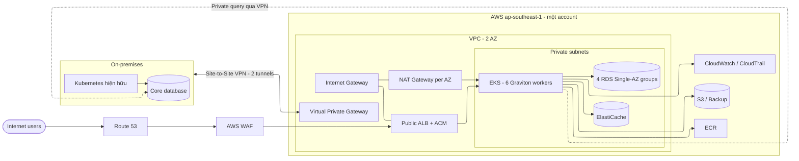

# Option 1 - Basic Hybrid Cloud Pilot

[Quay lại tài liệu định hướng](readme.md)

## 1. Mục tiêu và phạm vi

Option Basic tạo một nền tảng AWS đủ an toàn để chạy workload thật, đo hiệu năng và kiểm chứng mô hình hybrid trước khi đầu tư landing zone, Direct Connect và platform tooling đầy đủ.

- Pilot 3-5 microservice stateless hoặc ít phụ thuộc database lõi.
- Một AWS account và một VPC tại `ap-southeast-1`.
- Amazon EKS chạy workload; database lõi tiếp tục ở on-premises.
- Site-to-Site VPN hai tunnel là kết nối hybrid chính.
- Rolling update là chiến lược triển khai mặc định.
- Capacity/cost bên dưới giữ dư địa onboarding tối đa khoảng 20 microservice; thực chi có thể thấp hơn nếu pilot chỉ cấp tài nguyên cho 3-5 service.

## 2. AWS Service Catalog

### 2.1 Infrastructure & Network

| Dịch vụ | Vai trò | Thiết kế Basic |
| :--- | :--- | :--- |
| Amazon VPC | Mạng riêng cho workload | Public subnet cho ALB/NAT; private subnet cho EKS/RDS trên 2 AZ |
| Internet Gateway | Kết nối public ingress | Chỉ ALB internet-facing và NAT có route phù hợp |
| Site-to-Site VPN | Kết nối AWS với on-premises | Hai tunnel tới Virtual Private Gateway |
| NAT Gateway | Outbound cho private workload | 2 NAT để tránh phụ thuộc một AZ; có thể giảm còn 1 nếu chấp nhận downtime |
| Route 53 | Public DNS | Alias record tới ALB |
| Application Load Balancer | HTTPS ingress | Tích hợp AWS Load Balancer Controller và ACM |
| VPC Endpoints | Truy cập dịch vụ AWS riêng tư | S3 Gateway; cân nhắc ECR và CloudWatch interface endpoint |

### 2.2 Security

| Dịch vụ | Vai trò | Thiết kế Basic |
| :--- | :--- | :--- |
| IAM | Xác thực và phân quyền | Least privilege; EKS Pod Identity/IRSA cho workload |
| KMS | Mã hóa | Mã hóa EBS, RDS, EKS secrets và S3 |
| ACM | Chứng chỉ TLS | TLS termination tại ALB |
| Secrets Manager | Quản lý secret | Không lưu credential trong image hoặc manifest |
| AWS WAF | Bảo vệ HTTP(S) | Managed rules cơ bản, gắn với ALB |
| GuardDuty | Threat detection | Bật cho account ngay từ đầu |
| Shield Standard | DDoS baseline | Tự động áp dụng cho ALB/Route 53 |

### 2.3 Platform & Governance

| Dịch vụ | Vai trò | Thiết kế Basic |
| :--- | :--- | :--- |
| CloudTrail | Audit API | Multi-Region trail, log lưu S3 |
| CloudWatch | Log, metric và alarm | Dashboard tối thiểu cho EKS, ALB, VPN và RDS |
| AWS Config | Kiểm tra cấu hình | Một số managed rule trọng yếu |
| AWS Backup | Backup tập trung | RDS/EFS hằng ngày; kiểm thử restore |
| AWS Budgets/Cost Explorer | Quản trị chi phí | Alert theo ngưỡng tháng và forecast |
| Systems Manager | Truy cập và vận hành | Session Manager; không mở SSH công khai |
| ECR image scanning | Kiểm tra image | Scan khi push; chặn image critical theo pipeline policy |

### 2.4 Application

| Dịch vụ | Vai trò | Thiết kế Basic |
| :--- | :--- | :--- |
| Amazon EKS | Kubernetes control plane | Managed control plane; worker node trải trên 2 AZ |
| Amazon EC2 | EKS worker | 6 `m6g.xlarge` Graviton, điều chỉnh sau load test |
| Amazon ECR | Container registry | Repository riêng theo service, lifecycle policy |
| Amazon RDS | Database microservice | 4 instance Single-AZ; database/schema riêng theo service |
| Amazon ElastiCache | Cache/session | Một node nhỏ, không HA |
| Amazon S3 | Object/backup/log archive | Versioning và lifecycle |
| Amazon EFS | Shared file | Chỉ dùng cho workload thực sự cần ReadWriteMany |

## 3. Kiến trúc đề xuất

Public traffic đi theo `Route 53 -> WAF tại ALB -> ALB -> EKS`. Internet Gateway là attachment của VPC, không phải một thiết bị inspection nối tiếp. Traffic hybrid đi riêng qua VPN và route table private.

## 4. Database và Kubernetes

| Nhóm RDS | Phạm vi | Sizing tham khảo |
| :--- | :--- | :--- |
| A | 4 service giao dịch quan trọng | `db.t3.large`, Single-AZ |
| B | 6 service nghiệp vụ chính | `db.t3.large`, Single-AZ |
| C | 6 service hỗ trợ | `db.t3.medium`, Single-AZ |
| D | 4 service ít traffic | `db.t3.medium`, Single-AZ |

- Mỗi service sở hữu database/schema và credential riêng; không truy cập schema của service khác.
- Basic chấp nhận mục tiêu tham khảo **RPO <= 24 giờ, RTO <= 4 giờ** cho RDS Single-AZ; workload không chấp nhận mục tiêu này phải dùng Multi-AZ ngay.
- EKS bắt buộc có requests/limits, liveness/readiness probe, PodDisruptionBudget, topology spread và HPA cho service phù hợp.
- Dùng NetworkPolicy default-deny theo namespace; kiểm thử quyền bằng `kubectl auth can-i` và kiểm thử kết nối từ test pod.
- Trước mỗi lần nâng cấp cluster phải kiểm tra add-on/CNI/CSI compatibility, backup dữ liệu và diễn tập rollback.

## 5. CI/CD và vận hành

Luồng tối thiểu: `Git -> unit/integration test -> build multi-arch image -> scan -> ECR -> cập nhật manifest -> rolling deployment -> smoke test`.

- Có thể dùng GitLab CI/GitHub Actions hiện hữu hoặc pipeline tạm thời; Option 1 không dựng một platform DevOps mới.
- Secret lấy từ Secrets Manager qua External Secrets Operator hoặc CSI driver.
- Alarm tối thiểu: VPN tunnel down, ALB 5xx/latency, pod unavailable, node pressure, RDS CPU/storage/connections và ngân sách forecast.
- Thực hiện game day mất một worker node, VPN tunnel và restore RDS trước khi kết luận pilot.

## 6. Dự toán chi phí

| Lớp | Hạng mục | USD/tháng |
| :--- | :--- | ---: |
| Network | 2 NAT Gateway, VPN, Route 53/data transfer, VPC endpoints | 237 |
| Security | GuardDuty, Secrets Manager/KMS, WAF | 61 |
| Governance | CloudWatch, Config, Backup và ECR | 73 |
| Application | EKS control plane | 73 |
| Application | 6 x `m6g.xlarge` worker | 725 |
| Application | ALB | 60 |
| Application | 4 RDS Single-AZ groups | 396 |
| Application | ElastiCache | 50 |
| Application | S3 và EFS | 20 |
| **AWS usage subtotal** | | **1.695** |
| AWS Business Support, ước tính 10% | | 170 |
| **Tổng tham khảo** | | **~1.865** |

Sai số dự kiến ±20-30%. Chi phí chưa gồm thuế, nhân sự, license ngoài AWS và migration one-time. Nếu chỉ triển khai 3-5 service, cần tạo estimate nhỏ hơn thay vì cấp trước toàn bộ 4 nhóm RDS và 6 worker.

## 7. Điều kiện chuyển sang option khác

- Chuyển sang [Option 2](reuse-on-prem-platform.md) khi platform on-premises vượt qua đánh giá HA, capacity, security và SLA.
- Chuyển sang [Option 3](build-platform-on-aws.md) khi không có platform phù hợp, hoặc sự phụ thuộc control plane vào on-premises vi phạm SLO.
- Nâng Direct Connect khi VPN không đạt ngưỡng latency, jitter, throughput hoặc độ ổn định đã thống nhất.
