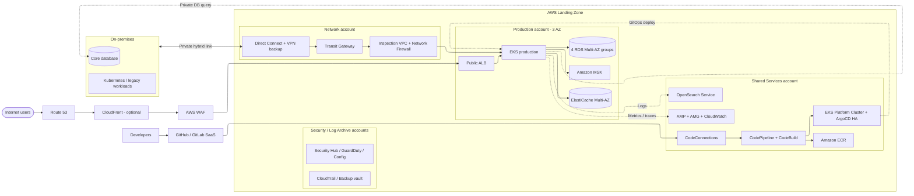

# Option 3 - Xây mới Platform trên AWS

[Quay lại tài liệu định hướng](readme.md)

## 1. Mục tiêu và chiến lược

Option này dành cho doanh nghiệp chưa có DevOps platform production-ready hoặc muốn AWS có failure domain độc lập. Thiết kế khuyến nghị là **managed-first kết hợp GitOps**:

- Source code dùng GitHub/GitLab SaaS hoặc Git provider đã được phê duyệt; license nằm ngoài estimate AWS.
- CodeConnections + CodePipeline/CodeBuild thực hiện CI, hoặc runner self-host nếu có yêu cầu đặc biệt.
- ArgoCD HA chạy trong một EKS cluster tại Shared Services account.
- Amazon Managed Service for Prometheus (AMP), Amazon Managed Grafana (AMG), CloudWatch và Amazon OpenSearch Service cung cấp observability.
- IAM Identity Center phục vụ workforce access vào AWS. Nếu ứng dụng bắt buộc cần IdP kiểu Keycloak, triển khai Keycloak HA như hạng mục tùy chọn, không coi Cognito là thay thế mặc định cho workforce SSO.

## 2. AWS Service Catalog

### 2.1 Infrastructure & Network

| Dịch vụ | Vai trò | Thiết kế Option 3 |
| :--- | :--- | :--- |
| Organizations/Control Tower | Landing zone | Security, Log Archive, Network, Shared Services, Non-prod và Prod accounts |
| Amazon VPC | Mạng cô lập | Hub-spoke qua Transit Gateway, đa AZ |
| Direct Connect + VPN | Hybrid connectivity | DX chính, VPN dự phòng |
| Transit Gateway | Network hub | Route domain tách prod/non-prod/shared |
| Network Firewall | Inspection | Inspection VPC cho hybrid/egress traffic |
| Route 53 Resolver | Hybrid DNS | Forwarding rule có logging |
| CloudFront + WAF + ALB | Public ingress | WAF gắn CloudFront hoặc ALB; Shield Standard mặc định |
| NAT Gateway/VPC Endpoints | Outbound/private API | Endpoint ưu tiên cho ECR, S3, CloudWatch, SSM |

### 2.2 Security

| Dịch vụ | Vai trò | Thiết kế Option 3 |
| :--- | :--- | :--- |
| IAM Identity Center | Workforce access | Permission set, MFA và federation với corporate IdP nếu có |
| IAM/EKS Pod Identity | Workload identity | Không dùng static AWS key trong pod/pipeline |
| KMS + Secrets Manager | Mã hóa/secret | CMK theo domain, rotation và resource policy |
| GuardDuty/Security Hub | Detection và posture | Delegated administrator, finding routing |
| Inspector/ECR scan | Vulnerability | Scan image và EC2; deployment gate theo severity |
| WAF/Shield Standard | Public protection | Managed rule, rate limit và DDoS baseline |
| Config/CloudTrail | Compliance/audit | Organization-wide, lưu log bất biến ở Log Archive |

### 2.3 Platform & Governance

| Dịch vụ | Vai trò | Thiết kế Option 3 |
| :--- | :--- | :--- |
| EKS Shared Services | Platform runtime | ArgoCD HA và controller cần thiết, tách application cluster |
| ArgoCD | Continuous delivery | GitOps đa cluster/account, project/RBAC tối thiểu |
| CodeConnections | Kết nối Git | Kết nối GitHub/GitLab với pipeline mà không tự vận hành Git server |
| CodePipeline/CodeBuild | CI orchestration/build | Build, test, scan, sign và cập nhật GitOps repository |
| AMP/AMG | Metric/dashboard | Managed Prometheus backend và Grafana workspace |
| CloudWatch/ADOT | Log, metric, trace | Collector chuẩn OpenTelemetry và alarm theo SLO |
| OpenSearch Service | Log analytics | 3 data node tham khảo, EBS gp3 và snapshot |
| AWS Backup | Backup tập trung | Cross-account/cross-Region policy |
| Service Catalog | Golden path | EKS namespace, RDS, pipeline và observability onboarding |
| Budgets/Cost Explorer | FinOps | Cost allocation tag và anomaly alert |

### 2.4 Application

| Dịch vụ | Vai trò | Thiết kế Option 3 |
| :--- | :--- | :--- |
| Amazon EKS | Application runtime | Prod/non-prod cluster riêng, đa AZ |
| EC2 Graviton | Worker | Managed node group; autoscaling và right-sizing |
| Amazon ECR | Registry | Immutable image, scan, lifecycle và replication khi cần |
| Amazon RDS | Database microservice | 4 nhóm Multi-AZ |
| ElastiCache | Cache/session | Multi-AZ |
| S3/EFS | Object/shared storage | Lifecycle, encryption và backup |
| Amazon MSK | Event streaming | Chỉ bật khi có use case event-driven được xác nhận |
| API Gateway/SES | API/email | Theo nhu cầu tích hợp |

## 3. Kiến trúc đề xuất

Public ingress và hybrid inspection là hai đường độc lập. Network Firewall xử lý traffic qua inspection VPC; CloudFront/WAF/ALB xử lý public HTTP(S) ở edge và application layer.

## 4. Platform và Kubernetes

- **Tách platform cluster**: ArgoCD không chia sẻ failure domain với application production cluster; dùng ba AZ, PodDisruptionBudget và anti-affinity.
- **Không tự host toàn bộ theo mặc định**: GitLab, OpenSearch và Keycloak đều stateful và làm tăng đáng kể gánh nặng backup, upgrade, storage và incident response.
- **GitOps security**: ArgoCD project giới hạn repository/destination; admin access qua SSO và break-glass; secret không lưu dạng rõ trong Git.
- **Supply chain**: build image multi-arch, SBOM, vulnerability gate, ký image và admission policy trước khi deploy.
- **Observability**: ADOT/Prometheus collector gửi metric tới AMP; Fluent Bit/OpenTelemetry gửi log tới CloudWatch/OpenSearch; retention theo loại dữ liệu.
- **Cluster operation**: managed node group, topology spread, PDB, requests/limits, HPA, NetworkPolicy, CSI snapshot và version-skew policy.
- **Progressive delivery**: canary hoặc blue/green với rollback tự động dựa trên SLO.

## 5. Database và DR

| Nhóm RDS | Phạm vi | Sizing tham khảo |
| :--- | :--- | :--- |
| A | 4 service giao dịch quan trọng | `db.r5.large`, Multi-AZ |
| B | 6 service nghiệp vụ chính | `db.r5.large`, Multi-AZ |
| C | 6 service hỗ trợ | `db.t3.large`, Multi-AZ |
| D | 4 service ít traffic | `db.t3.large`, Multi-AZ |

- Database-per-service được duy trì về ownership dù nhiều database/schema có thể dùng chung instance trong giai đoạn đầu.
- Tách instance khi một service gây noisy neighbor, cần engine/version khác hoặc có RTO/RPO riêng.
- DR pilot light và backup cross-Region phải được kiểm thử; Multi-AZ chỉ xử lý lỗi trong Region, không phải chiến lược DR hoàn chỉnh.

## 6. Dự toán chi phí

| Lớp | Hạng mục | USD/tháng |
| :--- | :--- | ---: |
| Network | Direct Connect, TGW, NAT, VPN, data transfer, DNS/endpoints | 810 |
| Security | GuardDuty, Security Hub, WAF, Network Firewall, KMS, Inspector | 587 |
| Governance | Config/CloudTrail và AWS Backup | 130 |
| Application | 2 EKS application control planes và 12 worker Graviton | 1.596 |
| Application | 4 RDS Multi-AZ groups | 1.340 |
| Application | ElastiCache, ALB, S3/EFS | 429 |
| Application | DR pilot light | 200 |
| Application | MSK, API Gateway và SES | 630 |
| Platform | AMP/AMG và observability ingestion | 275 |
| Platform | EKS Shared Services + 3 platform worker + EBS | 450 |
| Platform | OpenSearch Service 3 data node + EBS/snapshot | 450 |
| Platform | CodePipeline/CodeBuild/CodeConnections usage | 75 |
| **AWS usage subtotal** | | **6.972** |
| AWS Business Support, ước tính 10% | | 697 |
| **Tổng tham khảo** | | **~7.670** |

Chi phí chưa gồm GitHub/GitLab SaaS license và Keycloak tùy chọn. Nếu bắt buộc self-host Keycloak HA, dự trù thêm **150-300 USD/tháng** cho compute, database, load balancer, backup và log trước support. OpenSearch và observability có sai số lớn theo ingestion/retention; phải đo GB/ngày và số active series trước phê duyệt.

## 7. Rủi ro và tiêu chí chọn

| Rủi ro | Kiểm soát bắt buộc |
| :--- | :--- |
| Chi phí platform cao hơn dự kiến | Budget/anomaly alert, retention tiering, right-size sau 60-90 ngày |
| Thiếu kỹ năng vận hành nhiều cluster | Runbook, đào tạo EKS, game day và ownership 24/7 |
| ArgoCD trở thành deployment bottleneck | HA, sharding khi cần, backup cấu hình và break-glass deployment |
| OpenSearch/metric cardinality tăng mạnh | Quota, sampling, index lifecycle và cardinality review |
| Phụ thuộc SaaS source provider | Export/backup repository, CodeConnections least privilege và exit plan |

Option 3 có chi phí cao hơn [Option 2](reuse-on-prem-platform.md), nhưng tách failure domain, giảm traffic điều khiển qua hybrid link và không phụ thuộc mức trưởng thành của platform on-premises.
