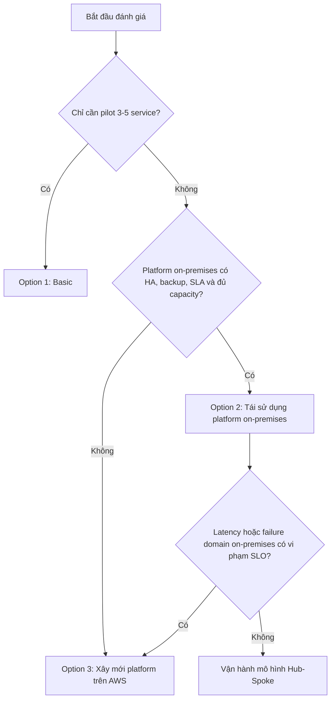

# AWS Cloud Adoption cho doanh nghiệp vừa và nhỏ

Tài liệu này đề xuất lộ trình **hybrid cloud trên AWS** cho một hệ thống microservice đang vận hành on-premises. Nội dung được tổ chức theo một tài liệu định hướng và ba phương án triển khai độc lập để đội dự án có thể lựa chọn theo hiện trạng DevOps thực tế.

## 1. Mục tiêu

- Tạo một vùng mở rộng trên AWS mà không buộc di chuyển toàn bộ hệ thống trong một lần.
- Chạy workload container trên Amazon EKS, giữ database lõi (system of record) tại on-premises trong giai đoạn đầu.
- Chuẩn hóa network, security, governance, CI/CD, observability và vận hành Kubernetes theo AWS Well-Architected Framework.
- Có chi phí tham khảo cho từng phương án trước khi lập estimate chính thức trên AWS Pricing Calculator.

## 2. Giả định lập kế hoạch

| Hạng mục | Giả định |
| :--- | :--- |
| Hạ tầng hiện tại | Khoảng 30 server vật lý/VM |
| Kubernetes on-premises | 1 cluster, khoảng 8-12 node |
| Ứng dụng ngoài Kubernetes | Khoảng 18-22 server |
| Quy mô người dùng | Khoảng 10.000 user đăng ký; 1.000-1.500 DAU |
| Traffic đỉnh | Khoảng 50-80 request/giây |
| Ứng dụng | Khoảng 20 microservice, đa công nghệ |
| Dữ liệu | Vài chục đến vài trăm GB và tăng dần |
| AWS Region | `ap-southeast-1` (Singapore) |
| Database lõi | Tiếp tục đặt on-premises ở giai đoạn hybrid |
| Database microservice trên AWS | RDS, tách database/schema theo service và nhóm instance theo domain |
| Compliance | Chưa chốt; phải rà soát Nghị định 13/2023/NĐ-CP và quy định ngành |

Các số liệu trên chỉ dùng để so sánh phương án. Trước khi phê duyệt cần đo CPU, memory, IOPS, dung lượng log/metric, lưu lượng liên vùng, RTO/RPO và tăng trưởng trong ít nhất 2-4 tuần.

## 3. Cách tiếp cận

Kiến trúc được phân thành bốn lớp thống nhất:

1. **Infrastructure & Network**: VPC, kết nối hybrid, DNS, load balancing và private endpoint.
2. **Security**: IAM, mã hóa, secrets, threat detection, WAF và kiểm soát cấu hình.
3. **Platform & Governance**: landing zone, audit, backup, observability, CI/CD và quản trị chi phí.
4. **Application**: EKS, ECR, RDS, cache, object/file storage và các dịch vụ tích hợp.

Các nguyên tắc xuyên suốt:

- **Application-first, migrate incrementally**: chọn 3-5 service ít phụ thuộc và chịu được latency để pilot trước.
- **Private hybrid traffic**: service trên AWS truy cập database lõi qua VPN hoặc Direct Connect, không mở database ra Internet.
- **Managed where it matters**: ưu tiên dịch vụ managed khi chi phí vận hành tự host lớn hơn phần chênh lệch dịch vụ.
- **GitOps và IaC**: hạ tầng, policy và manifest đều có phiên bản, review và khả năng rollback.
- **Kubernetes production hygiene**: topology spread/anti-affinity, PodDisruptionBudget, requests/limits, autoscaling, NetworkPolicy, backup/restore và diễn tập nâng cấp.
- **Cost governance from day one**: tagging, AWS Budgets, Cost Explorer và chỉ mua Savings Plans sau khi baseline đã ổn định.

## 4. Phân tích hiện trạng trước khi chọn option

Quyết định quan trọng nhất không phải là có dùng EKS hay không, mà là **platform tooling hiện tại đã tồn tại và đủ năng lực phục vụ thêm AWS hay chưa**. Cần xác minh:

- Git repository và CI runner hiện đặt ở đâu, có HA/backup và đủ băng thông hay không.
- ArgoCD có thể quản lý remote EKS cluster và trust boundary có được chấp nhận hay không.
- IdP/SSO hiện tại có hỗ trợ OIDC/SAML và có SLA phù hợp cho production hay không.
- Prometheus/Grafana/OpenSearch hiện tại còn đủ retention, ingestion và năng lực xử lý dữ liệu từ AWS hay không.
- Đội vận hành có trực 24/7, runbook, quy trình incident, kỹ năng EKS và khả năng tự vận hành stateful platform hay không.
- RTO/RPO, data residency, SLA, ngân sách và thời điểm cần Direct Connect.

## 5. Ba phương án

| Phương án | Phù hợp khi | Kết nối | Platform tooling | Chi phí tham khảo |
| :--- | :--- | :--- | :--- | ---: |
| [Option 1 - Basic](basic.md) | Cần pilot nhanh, phạm vi nhỏ, chưa cần platform đầy đủ | Site-to-Site VPN | AWS baseline và CI tối giản | **~1.865 USD/tháng** |
| [Option 2 - Tái sử dụng platform on-premises](reuse-on-prem-platform.md) | GitLab, ArgoCD, SSO và observability on-premises đã production-ready | Direct Connect + VPN dự phòng | On-premises làm hub, AWS là spoke | **~6.294 USD/tháng** |
| [Option 3 - Xây mới platform trên AWS](build-platform-on-aws.md) | Không có platform dùng lại hoặc muốn tách failure domain khỏi on-premises | Direct Connect + VPN dự phòng | Shared Services account trên AWS | **~7.670 USD/tháng** |

Chi phí là estimate mức lập kế hoạch, độ chính xác mục tiêu **±20-30%**, chưa gồm thuế, phí đối tác Direct Connect, license Git SaaS/Enterprise, nhân sự vận hành và migration one-time.

## 6. Cây quyết định

## 7. Lộ trình khuyến nghị

1. **Discovery, 2-4 tuần**: thu thập metric, dependency map, RTO/RPO, compliance và đánh giá platform hiện hữu.
2. **Foundation, 3-6 tuần**: account, IAM, VPC, VPN, logging, budgets, IaC và security baseline.
3. **Pilot, 6-10 tuần**: triển khai Option 1 với 3-5 service, load test và diễn tập rollback/restore.
4. **Decision gate**: dùng số liệu thật để chọn Option 2 hoặc Option 3; không mặc định platform on-premises đã tồn tại.
5. **Production expansion, 3-9 tháng**: Direct Connect, multi-account, Multi-AZ, DR và progressive delivery.

## 8. Điều kiện phê duyệt

- Dependency và latency tới database lõi đã được đo bằng thử nghiệm thực tế.
- RTO/RPO và SLO được chủ hệ thống chấp thuận.
- Security review xác nhận trust boundary, IAM, encryption và public ingress.
- Capacity model bao gồm compute, database, log, metric và data transfer.
- AWS Pricing Calculator và báo giá Direct Connect từ đối tác đã thay thế estimate sơ bộ.
- Có owner, runbook, cảnh báo hành động được và kế hoạch rollback cho từng workload.

## 9. Tham chiếu

- [AWS Well-Architected Framework](https://docs.aws.amazon.com/wellarchitected/latest/framework/welcome.html)
- [AWS Hybrid Cloud](https://aws.amazon.com/hybrid/)
- [Amazon EKS Best Practices Guide](https://aws.github.io/aws-eks-best-practices/)
- [AWS Direct Connect](https://aws.amazon.com/directconnect/)
- [AWS Pricing Calculator](https://calculator.aws/)
- [Nghị định 13/2023/NĐ-CP](https://vanban.chinhphu.vn/)
