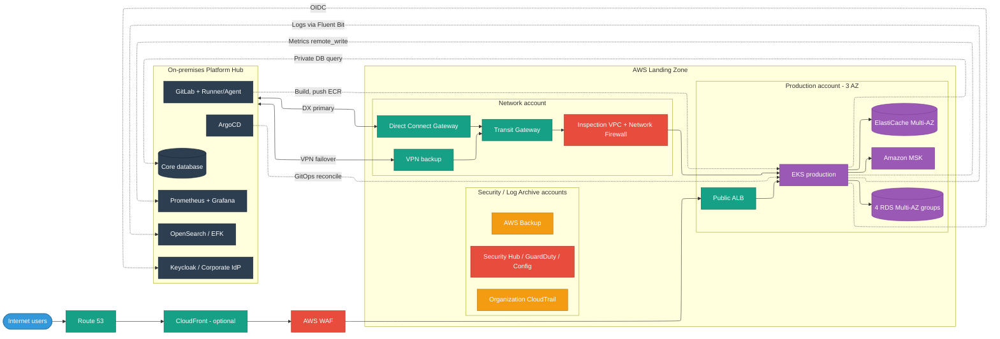
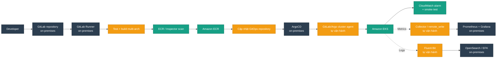
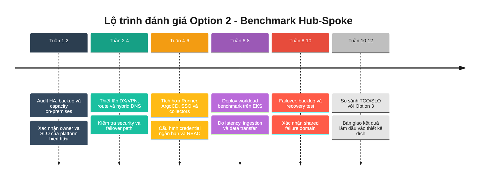

# Option 2 - Tái sử dụng Platform On-Premises

[Quay lại tài liệu định hướng](readme.md)

## 1. Mục tiêu và điều kiện áp dụng

Option này dùng mô hình **Hub-Spoke**: GitLab, ArgoCD, IdP/SSO, Prometheus/Grafana và OpenSearch/EFK tại on-premises là hub; AWS EKS là cluster đích và vùng compute mở rộng. Trong lộ trình tổng thể, đây là **phương án so sánh có giá trị** để định lượng lợi ích tái sử dụng, TCO và rủi ro phụ thuộc on-premises, không phải trạng thái đích thay cho Option 3.

Chỉ chọn khi platform on-premises đã có:

- HA, backup/restore được kiểm thử và owner vận hành rõ ràng.
- Capacity đủ nhận thêm metric, log và pipeline từ AWS.
- SLO phù hợp với production; mất kết nối on-premises không làm ứng dụng đang chạy trên AWS dừng phục vụ.
- Kết nối Direct Connect chính và VPN dự phòng đã kiểm thử failover.

## 2. AWS Service Catalog

### 2.1 Infrastructure & Network

| Dịch vụ | Vai trò | Thiết kế Option 2 |
| :--- | :--- | :--- |
| Organizations/Control Tower | Landing zone | Account Network, Security, Shared, Non-prod và Prod |
| Amazon VPC | Mạng theo môi trường | Transit Gateway hub, spoke VPC đa AZ |
| Direct Connect + DX Gateway | Kết nối hybrid chính | Hosted 1 Gbps tham khảo; xác nhận với đối tác |
| Site-to-Site VPN | Kết nối dự phòng | Gắn Transit Gateway, BGP route ưu tiên DX |
| Transit Gateway | Hub network | Kết nối VPC, DX và VPN |
| Network Firewall | Inspection hybrid/egress | Đặt trong inspection VPC với symmetric routing |
| NAT Gateway | Outbound | Một NAT mỗi AZ cho workload cần Internet |
| Route 53 Resolver | Hybrid DNS | Inbound/outbound endpoint và forwarding rule |
| CloudFront + ALB | Public ingress | CloudFront tùy nhu cầu CDN; ALB đa AZ |
| VPC Endpoints | Private AWS API | S3, ECR, CloudWatch và Systems Manager |

### 2.2 Security

| Dịch vụ | Vai trò | Thiết kế Option 2 |
| :--- | :--- | :--- |
| IAM Identity Center/IAM/SCP | Workforce và guardrail | Federation với IdP hiện hữu; least privilege |
| KMS + Secrets Manager | Mã hóa và secret | CMK theo domain; rotation theo mức độ nhạy cảm |
| WAF + Shield Standard | Bảo vệ public ingress | WAF gắn CloudFront hoặc ALB, không gắn hai lần nếu không cần |
| GuardDuty + Security Hub | Threat detection | Delegated administrator tại Security account |
| Inspector | Vulnerability management | ECR/EC2 scan và finding tập trung |
| AWS Config | Compliance | Organization rules/conformance pack |
| CloudTrail | Audit | Organization trail lưu tại Log Archive account |

### 2.3 Platform & Governance

| Dịch vụ/công cụ | Vai trò | Thiết kế Option 2 |
| :--- | :--- | :--- |
| GitLab on-premises | Source và CI | Runner/Agent có route riêng tới AWS API/EKS |
| ArgoCD on-premises | GitOps hub | Quản lý EKS bằng cluster credential ngắn hạn và RBAC giới hạn |
| Keycloak/IdP on-premises | SSO | OIDC/SAML cho công cụ; thiết kế cached session và break-glass |
| Prometheus/Grafana on-premises | Metric/dashboard | Agent/collector trên EKS remote-write về on-premises |
| OpenSearch/EFK on-premises | Log analytics | Fluent Bit gửi log theo buffer/retry qua private link |
| AWS Backup | Backup AWS workload | Central policy, cross-account/cross-Region theo RPO |
| Budgets/Cost Explorer | FinOps | Tag bắt buộc và budget theo account/application |
| AWS Service Catalog | Golden path | Sản phẩm VPC/EKS/RDS đã chuẩn hóa |

### 2.4 Application

| Dịch vụ | Vai trò | Thiết kế Option 2 |
| :--- | :--- | :--- |
| Amazon EKS | Runtime | Prod và non-prod tách cluster/account |
| EC2 Graviton | Worker | 12 `m6g.xlarge`, autoscaling và Savings Plans sau baseline |
| Amazon ECR | Registry | Cross-account policy, immutable tag và lifecycle |
| Amazon RDS | Database microservice | 4 nhóm Multi-AZ |
| ElastiCache | Cache/session | Multi-AZ với automatic failover |
| S3/EFS | Object/shared file | Multi-AZ, lifecycle và backup |
| Amazon MSK | Event streaming | 3 broker khi có yêu cầu event-driven thực tế |
| API Gateway/SES | API và email | Theo nhu cầu tích hợp |

## 3. Kiến trúc đề xuất

Network Firewall kiểm tra traffic hybrid/egress qua inspection VPC. Nó không nằm trước CloudFront trong public ingress; WAF được liên kết với CloudFront hoặc ALB tại lớp ứng dụng.

Quy ước màu kiến trúc dùng thống nhất trong cả ba option: **Infrastructure & Network** xanh lá đậm, **Security** đỏ, **Platform & Governance** cam, **Application** tím, **On-premises** xám than, **Internet** xanh dương và **DR** xám nhạt.

## 4. Tích hợp platform và vận hành Kubernetes

- **ArgoCD**: dùng project, destination allow-list và service account riêng cho từng cluster; không cấp `cluster-admin` thường trực.
- **GitLab**: build image multi-architecture, scan, ký image, push ECR và cập nhật GitOps repository. Runner không giữ AWS access key dài hạn; dùng OIDC/role assumption khi khả thi.
- **Observability**: collector trên EKS phải có disk/memory buffer, retry, backpressure và quota để đứt DX không làm đầy node.
- **SSO**: chuẩn bị local break-glass account cho sự cố IdP/kết nối; audit mọi lần sử dụng.
- **Kubernetes**: cluster đa AZ, managed node group, PDB, topology spread, HPA/Karpenter hoặc Cluster Autoscaler, default-deny NetworkPolicy và CSI snapshot cho stateful workload.
- **Triển khai**: canary `5% -> 25% -> 100%` hoặc blue/green; rollback tự động dựa trên SLO/CloudWatch alarm.
- **Failure test**: mất DX, mất VPN, mất ArgoCD hub, metric/log backlog và mất một AZ phải được diễn tập riêng.

## 5. CI/CD và vận hành

**Chú giải CI/CD:** xám than = dịch vụ/công cụ đã có sẵn ở on-premises; cam = thành phần mới do đội tự xây dựng và vận hành, có thể dùng open source; xanh lá = dịch vụ AWS native.

- Pipeline dùng OIDC/role assumption và credential ngắn hạn; không lưu AWS access key cố định trong GitLab.
- ArgoCD áp dụng project, destination allow-list và service account riêng cho từng cluster; không cấp `cluster-admin` thường trực.
- Canary `5% -> 25% -> 100%` hoặc blue/green phải rollback tự động khi SLO/CloudWatch alarm vượt ngưỡng.
- Collector và Fluent Bit cần buffer, retry, backpressure và quota để mất DX/VPN không làm đầy node.
- Diễn tập mất Direct Connect, VPN failover, ArgoCD hub, backlog log/metric và một Availability Zone.

## 6. Database và DR

| Nhóm RDS | Phạm vi | Sizing tham khảo |
| :--- | :--- | :--- |
| A | 4 service giao dịch quan trọng | `db.r5.large`, Multi-AZ |
| B | 6 service nghiệp vụ chính | `db.r5.large`, Multi-AZ |
| C | 6 service hỗ trợ | `db.t3.large`, Multi-AZ |
| D | 4 service ít traffic | `db.t3.large`, Multi-AZ |

- Mục tiêu production phải được chốt theo service; Multi-AZ không thay thế backup hay DR cross-Region.
- Estimate bao gồm DR pilot light khoảng 200 USD/tháng, nhưng replication topology và runbook phải thiết kế sau khi có RTO/RPO thật.
- Database lõi on-premises vẫn là dependency; không gọi đồng bộ qua hybrid link trên đường xử lý nhạy latency nếu có thể dùng cache, async event hoặc local read model.

## 7. Dự toán chi phí

| Lớp | Hạng mục | USD/tháng |
| :--- | :--- | ---: |
| Network | Direct Connect, TGW, NAT, VPN, data transfer, DNS/endpoints | 810 |
| Security | GuardDuty, Security Hub, WAF, Network Firewall, KMS, Inspector | 587 |
| Governance | Config/CloudTrail và AWS Backup | 130 |
| Application | 2 EKS control planes và 12 worker Graviton | 1.596 |
| Application | 4 RDS Multi-AZ groups | 1.340 |
| Application | ElastiCache, ALB, S3/EFS | 429 |
| Application | DR pilot light | 200 |
| Application | MSK, API Gateway và SES | 630 |
| **AWS usage subtotal** | | **5.722** |
| AWS Business Support, ước tính 10% | | 572 |
| **Tổng tham khảo** | | **~6.294** |

Estimate không tính lại Prometheus/Grafana/OpenSearch/ArgoCD/GitLab vì Option 2 tái sử dụng on-premises. Lưu lượng metric/log/pipeline nằm trong giả định data transfer khoảng 3 TB/tháng; nếu vượt mức này phải cập nhật lại chi phí và capacity DX. Phí cổng/last-mile Direct Connect từ đối tác có thể nằm ngoài hóa đơn AWS.

## 8. Lộ trình đánh giá Option 2

Option 2 chỉ cần triển khai PoC giới hạn nếu doanh nghiệp muốn kiểm chứng con số so sánh trước khi hoàn thiện Option 3.

## 9. Rủi ro và tiêu chí đánh giá

| Rủi ro | Kiểm soát bắt buộc |
| :--- | :--- |
| On-premises trở thành shared failure domain | HA, break-glass, buffer cục bộ và ứng dụng không phụ thuộc platform khi đang chạy |
| DX/VPN gián đoạn | BGP failover test, route monitoring và runbook |
| Log/metric làm nghẽn link | Sampling, retention, compression, quota và local buffer |
| Credential quản lý remote cluster quá rộng | Short-lived token, RBAC tối thiểu, audit và rotation |
| Platform hiện hữu thiếu capacity | Load test ingestion/pipeline trước khi production |

Dù platform vượt qua các điều kiện trên, kết quả Option 2 vẫn được dùng làm benchmark TCO/SLO và đầu vào tối ưu cho [Option 3 - Xây mới platform trên AWS](build-platform-on-aws.md), là trạng thái đích của lộ trình.
