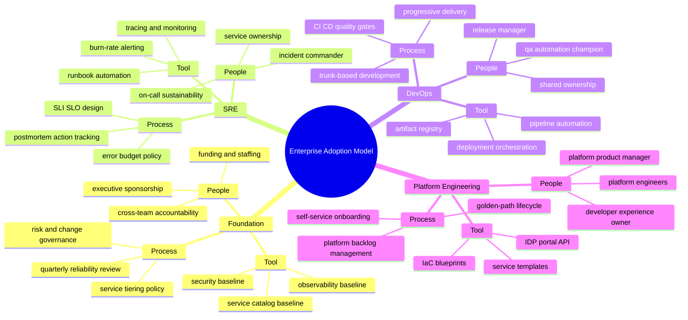
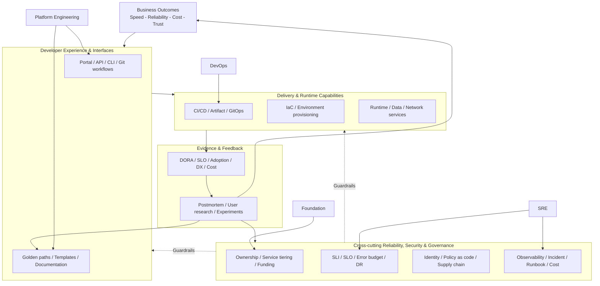
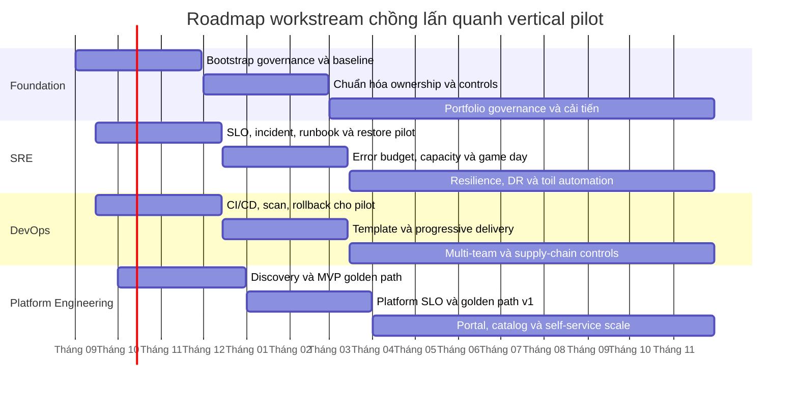
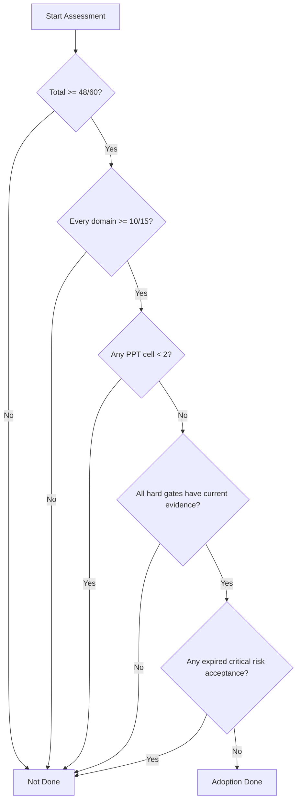

# Homecomer

## Enterprise Architecture Adoption Blueprint

Tài liệu này hệ thống hóa lộ trình theo bốn năng lực phát triển song hành:

1. Foundation thiết lập ownership, governance và tiêu chuẩn tối thiểu.
2. SRE bảo vệ critical user journey bằng SLO và recovery đã kiểm thử.
3. DevOps tạo luồng thay đổi nhỏ, an toàn và có khả năng rollback.
4. Platform Engineering đóng gói năng lực đã chứng minh thành golden path và self-service.

Đây là **thứ tự ưu tiên năng lực**, không phải bốn silo hay stage gate nối đuôi. Sau 2-4 tuần foundation ban đầu, các workstream SRE, DevOps và Platform Engineering phải chạy chồng lấn trên cùng một vertical pilot.

## Mục Lục

1. Tóm tắt điều hành
2. Cách tiếp cận (Approach) và nguyên tắc thiết kế
3. Bản đồ năng lực 3 tầng (mindmap)
4. Kiến trúc doanh nghiệp theo lớp
5. Lộ trình triển khai theo workstream
6. Success Picture (Definition of Done)
7. Maturity Rubric (thang trưởng thành)
8. KPI và cơ chế đo lường
9. Kế hoạch 90 ngày đầu
10. Rủi ro chính và biện pháp giảm thiểu
11. Q&A tổng hợp từ quá trình thảo luận
12. Nguồn tham chiếu chính thống

## 1) Tóm Tắt Điều Hành

- Kết luận chính: Foundation -> SRE -> DevOps -> Platform Engineering là thứ tự ưu tiên để xây năng lực, nhưng thực thi theo các workstream chồng lấn.
- Đơn vị triển khai là một **vertical pilot**: 1-2 critical user journey, 2-3 product team và một workload archetype phổ biến, đi xuyên suốt ownership, SLO, CI/CD, observability, runbook và golden path.
- Mục tiêu cuối: vận hành ổn định, thay đổi nhanh nhưng an toàn, và self-service có guardrail ở quy mô lớn.

## 2) Cách Tiếp Cận (Approach) Và Nguyên Tắc Thiết Kế

### 2.1 Mô hình triển khai

1. **Bootstrap Foundation** trong 2-4 tuần đầu: sponsor, funding, ownership, service tiering, baseline và guardrail tối thiểu.
2. **Chọn vertical pilot** dựa trên giá trị kinh doanh, tần suất thay đổi, pain point đo được và mức rủi ro có thể kiểm soát.
3. **Chạy SRE và DevOps đồng thời**: SLO/burn-rate alert cung cấp deployment guardrail; CI/CD, deployment marker và rollback làm SRE có thể vận hành.
4. **Khởi động Platform Engineering từ pilot**: product discovery và một minimum viable golden path, chưa xây IDP portal lớn.
5. **Scale sau khi có bằng chứng**: chuẩn hóa đa nhóm, bổ sung self-service/portal và mở rộng golden path chỉ khi pilot đạt exit criteria.

### 2.2 Nguyên tắc vận hành

- Measure-first: mọi cải tiến đều có số đo trước/sau.
- Reliability-first for critical services: dịch vụ trọng yếu phải có SLO và error budget.
- Automation-by-default: giảm toil, tăng tính lặp lại và tính kiểm soát.
- Platform-as-a-product: nền tảng nội bộ có backlog, roadmap, và KPI như sản phẩm thật.
- Blameless learning: sự cố được xử lý bằng học tập hệ thống, không đổ lỗi cá nhân.
- Evidence-gated: tài liệu hay công cụ được cài đặt không tự chứng minh năng lực; phải có kết quả test, metric hoặc workflow chạy thành công.
- Paved road with escape hatch: golden path là đường được hỗ trợ, có ngoại lệ minh bạch và có thời hạn, không phải khuôn bắt buộc cho mọi workload.

## 3) Bản Đồ Năng Lực 3 Tầng (Mindmap)

Quy ước:
- Level 1: Foundation, SRE, DevOps, Platform Engineering
- Level 2: People, Process, Tool (PPT)
- Level 3: keyword chi tiết

## 4) Kiến Trúc Doanh Nghiệp Theo Lớp

## 5) Lộ Trình Triển Khai Theo Workstream

### 5.1 Vertical pilot và workstream chồng lấn

| Workstream | 0-3 tháng: Pilot | 3-6 tháng: Chuẩn hóa | 6-15 tháng: Mở rộng |
| :--- | :--- | :--- | :--- |
| Foundation | Sponsor, funding, RACI, service tiering, baseline và exception policy | Governance cadence, competency matrix, control ownership | Portfolio review, funding theo outcome và continuous improvement |
| SRE | Critical journey, SLI/SLO, burn-rate alert, incident command, runbook, restore test | Error-budget policy, on-call, capacity/overload test, game day | Multi-service SLO, dependency resilience, DR exercise, toil automation |
| DevOps | Pipeline pilot, immutable artifact, deployment marker, security scan, rollback | Pipeline template, progressive delivery, DORA instrumentation | Multi-team rollout, policy enforcement và supply-chain provenance |
| Platform Engineering | Persona/JTBD, friction baseline, product charter, MVP golden path | Versioned golden path, platform SLO, support model, lifecycle/delete | Portal/catalog khi có nhu cầu, nhiều golden path và self-service scale |

Ngày trong sơ đồ là mốc minh họa để biểu diễn độ chồng lấn; khi phê duyệt chương trình phải thay bằng ngày khởi động thực tế.

### 5.2 Exit criteria theo chặng

| Chặng | Exit criteria bắt buộc |
| :--- | :--- |
| Pilot, 0-3 tháng | Critical journey có SLI/SLO computable; pipeline deploy và rollback thành công; alert tới đúng owner; restore đạt RTO/RPO pilot; một service được tạo qua MVP golden path; baseline KPI được lưu |
| Chuẩn hóa, 3-6 tháng | Error-budget policy được dùng trong quyết định release; progressive delivery chạy production; capacity/game-day có bằng chứng; golden path versioned có support SLO và workflow delete |
| Mở rộng, 6-15 tháng | Tier 0/1 đạt reliability gates; DORA/SLO cải thiện qua hai quý; nhiều team dùng self-service; DR được diễn tập; adoption và DX đạt target đã phê duyệt |

## 6) Success Picture (Definition Of Done)

Adoption chỉ được coi là hoàn tất khi đồng thời đạt outcome và có bằng chứng thực thi. Việc cài đặt công cụ hoặc xuất bản tài liệu không tự thỏa DoD.

### 6.1 Foundation

- Sponsor, ngân sách, platform product owner, service owner và RACI được phê duyệt.
- 100% service Tier 0/1 có owner, tier, dependency owner, support model và escalation path trong catalog.
- Governance review diễn ra đúng cadence trong ít nhất hai quý; ngoại lệ có owner, lý do, ngày hết hạn và phê duyệt.

**Bằng chứng:** quyết định funding, service catalog export, RACI, biên bản review và exception register.

### 6.2 SRE

- 100% critical user journey Tier 0/1 có SLI computable: good/valid event, cửa sổ, nguồn dữ liệu, exclusion và missing-data behavior.
- SLO và error-budget policy đã ảnh hưởng ít nhất một quyết định release hoặc reliability investment.
- Multi-window burn-rate alert gửi đúng owner, có runbook và đã được test end-to-end.
- Rollback, backup restore, dependency failure và DR/failover đạt RTO/RPO đã phê duyệt qua game day.
- Incident command, on-call và post-incident review vận hành; corrective action quan trọng có owner, deadline và test chống tái diễn.

**Bằng chứng:** SLO query/dashboard, alert test, incident timeline, game-day report, restore log và action tracker.

### 6.3 DevOps

- Pipeline chuẩn hóa tạo immutable artifact, chạy test/security gate và ghi deployment marker.
- Progressive delivery và automatic/manual rollback được chạy thành công trên production workload đại diện.
- DORA metrics cải thiện so với baseline trong ít nhất hai quý mà không làm xấu SLO hoặc tăng on-call load.
- Database/config change có chiến lược tương thích ngược và rollback/roll-forward đã kiểm thử.

**Bằng chứng:** pipeline runs, artifact provenance, deployment/rollback record, DORA dashboard và change review.

### 6.4 Platform Engineering

- Có platform product charter, persona/JTBD, eligible population, backlog, roadmap, owner và support SLO.
- Ít nhất một golden path end-to-end tạo được service secure, observable, owned và deploy được; có workflow nâng cấp, exception và xóa tài nguyên.
- Ít nhất 80% service mới **đủ điều kiện** dùng golden path; adoption không tính workload ngoài phạm vi hỗ trợ.
- Self-service giảm fulfillment lead time và ticket/toil so với baseline; developer task-success và satisfaction đạt target đã phê duyệt.
- Portal/catalog chỉ được coi là hoàn tất khi critical journey đạt platform SLO và metadata freshness target.

**Bằng chứng:** timed onboarding test, workflow logs, adoption denominator, platform SLO, ticket/toil report và developer research.

### 6.5 Governance và rủi ro

- Không còn hard control bị thiếu: ownership Tier 0/1, SLO data source, actionable paging, rollback, restore/DR test, security gate, platform support và break-glass.
- Rủi ro chấp nhận được ghi rõ owner, residual risk, control bù, ngày hết hạn và cấp phê duyệt.
- Cost allocation và báo cáo cost-per-service/team hoạt động; capacity và budget được review theo quý.

## 7) Maturity Rubric (Thang Trưởng Thành)

### 7.1 Quy tắc chấm điểm

- Chấm từng ô `Domain x People/Process/Tool` bằng bằng chứng của kỳ review; không có bằng chứng thì dùng mức thấp hơn.
- Điểm tổng dùng để theo dõi xu hướng, không cho phép điểm Tool bù cho hard control People/Process bị thiếu.
- Hai assessor độc lập chấm trước, đối chiếu chênh lệch lớn hơn 1 điểm và ghi rationale/evidence link.
- Chỉ tính phạm vi được định nghĩa: team/service đủ điều kiện, môi trường và kỳ đo.

### 7.2 Rubric đầy đủ theo People, Process và Tool

| Điểm | People | Process | Tool |
| ---: | :--- | :--- | :--- |
| **0** | Không có owner hoặc trách nhiệm | Không có quy trình; xử lý tùy hứng | Thủ công, không có toolchain kiểm soát |
| **1** | Cá nhân tự nguyện, phụ thuộc key person | Thử nghiệm cục bộ, không lặp lại ổn định | Script/tool rời rạc, không support chính thức |
| **2** | Có owner ở một số team, vai trò chưa nhất quán | Quy trình được ghi lại và áp dụng cho pilot | Tích hợp cơ bản cho một số team, còn nhiều bước ticket/manual |
| **3** | RACI và competency rõ cho các team trong phạm vi | Quy trình chuẩn, versioned, đo được và có exception flow | Capability chuẩn hóa đa nhóm, có monitoring và support |
| **4** | Ownership, on-call/support và đào tạo mở rộng toàn eligible population | Governance dựa trên outcome; audit và cải tiến theo cadence | Self-service với automated guardrail, SLO và lifecycle đầy đủ |
| **5** | Năng lực kế thừa, community of practice và staffing tối ưu theo dữ liệu | Tối ưu liên tục bằng experiment, benchmark và feedback định lượng | Platform thích nghi theo telemetry/user research, loại bỏ toil và capability ít giá trị |

### 7.3 Scorecard theo domain

| Domain | People | Process | Tool | Điểm tối đa |
| :--- | ---: | ---: | ---: | ---: |
| Foundation | 0-5 | 0-5 | 0-5 | 15 |
| SRE | 0-5 | 0-5 | 0-5 | 15 |
| DevOps | 0-5 | 0-5 | 0-5 | 15 |
| Platform Engineering | 0-5 | 0-5 | 0-5 | 15 |
| **Tổng** |  |  |  | **60** |

Mỗi điểm phải kèm `scope`, `evidence`, `owner`, `assessed_at` và `next gap`. Không dùng trung bình nhiều team nếu kết quả đó che khuất một Tier 0/1 chưa đạt hard gate.

### 7.4 Hard gates theo domain

| Domain | Hard gate không được bù điểm |
| :--- | :--- |
| Foundation | Tier 0/1 có owner/tier/escalation; sponsor/funding; exception có hạn |
| SRE | SLI computable; paging có runbook/owner; rollback và restore/DR đã test; RTO/RPO được phê duyệt |
| DevOps | Reproducible pipeline; immutable artifact; security gate; deployment verification và rollback |
| Platform Engineering | Product owner; một golden path end-to-end; platform SLO/support; break-glass; workflow delete/decommission |

### 7.5 Ngưỡng hoàn thành adoption

- Tổng điểm >= 48/60
- Mỗi domain >= 10/15
- Không domain nào có bất kỳ ô PPT < 2
- Tất cả hard gate tại mục 7.4 đạt và có evidence còn hiệu lực
- SRE Process >= 4, DevOps Tool >= 4 và Platform Engineering Tool >= 4
- Không có risk acceptance nghiêm trọng đã quá hạn

### 7.6 Cổng quyết định DoD

## 8) KPI Và Cơ Chế Đo Lường

### 8.1 Measurement contract

Mỗi KPI phải có định nghĩa versioned gồm: mục đích, công thức, scope/population, nguồn dữ liệu, owner, baseline, target, cadence và cách xử lý dữ liệu thiếu. Target được phê duyệt sau 4-6 tuần baseline; không tự đặt target thiếu dữ liệu.

| KPI | Công thức/định nghĩa | Nguồn | Owner | Cadence và target |
| :--- | :--- | :--- | :--- | :--- |
| Deployment Frequency | Số production deployment thành công trên mỗi service trong kỳ | CI/CD + deployment events | DevOps capability owner | Tuần; cải thiện theo service tier so với baseline |
| Lead Time for Changes | Median và P90 từ commit đầu tiên đến chạy thành công ở production | Git + CI/CD + deployment marker | Product team | Tuần; giảm median/P90, không làm xấu SLO |
| Change Failure Rate | Deployment gây rollback, hotfix hoặc incident / tổng production deployment | CI/CD + incident system | Product team + SRE | Tháng; giảm so với baseline |
| Failed Deployment Recovery Time | Median từ khi deployment failure được phát hiện đến khi service phục hồi | Deployment + SLI + incident timeline | Product team | Tháng; tách khỏi incident MTTR tổng quát |
| SLO compliance | Good events / valid events trong rolling window, theo critical journey | SLO platform/telemetry | Service owner + SRE | Hằng ngày/tháng; đạt target theo tier |
| Error-budget burn | Bad-event rate / allowed bad-event rate; theo short/long window | SLO platform | SRE | Liên tục; action theo error-budget policy |
| Incident recurrence | Incident lặp lại cùng failure mode / tổng incident Sev1/2 | Incident + postmortem tracker | SRE lead | Quý; giảm và đóng corrective action đúng hạn |
| Restore/DR attainment | Số exercise đạt RTO và RPO / tổng exercise đã lên lịch | Game-day/DR report | Service owner + SRE | Quý/nửa năm; 100% Tier 0/1 exercise đạt hoặc có risk acceptance |
| Golden-path adoption | Service mới đủ điều kiện tạo qua golden path / tổng service mới đủ điều kiện | Catalog + workflow logs | Platform product owner | Tháng; target >= 80% sau giai đoạn scale |
| Self-service success | Workflow self-service hoàn tất không cần platform ticket / tổng workflow hợp lệ | Portal/workflow + ticket system | Platform team | Tuần; tăng success, giảm P90 fulfillment time |
| Time to first deploy | Thời gian từ yêu cầu hợp lệ đến service healthy đầu tiên qua golden path | Workflow + CI/CD + health signal | Platform product owner | Theo cohort; giảm so với baseline thủ công |
| Developer task success | Người dùng hoàn thành journey không cần hỗ trợ / tổng người thử nghiệm | Usability test/survey | Developer Experience owner | Quý; target theo journey được phê duyệt |
| Toil ratio | Giờ toil / tổng giờ vận hành của team trong kỳ | Time study + toil register | Engineering manager | Tháng; giảm mà không chuyển toil sang product team |
| Cost per service/team | Chi phí phân bổ hợp lệ / active service hoặc team trong scope | Cloud billing + tags/catalog | FinOps + Platform | Tháng; nằm trong unit-cost guardrail |

### 8.2 Cơ chế review và quyết định

| Cadence | Nội dung | Quyết định đầu ra |
| :--- | :--- | :--- |
| Hằng tuần | SLO burn, incident, change failure, pipeline/platform workflow | Mitigation, release guardrail, toil/corrective action |
| Hằng tháng | DORA, SLO, platform adoption, fulfillment, support load và cost | Ưu tiên backlog, capacity và platform product investment |
| Hằng quý | Maturity rubric, developer research, risk acceptance, DR/capacity evidence | Tiếp tục scale, sửa control gap hoặc dừng capability ít giá trị |

Dashboard phải cho phép drill-down theo service tier, team, workload type và thời gian. Không dùng trung bình toàn doanh nghiệp nếu nó che khuất Tier 0/1 hoặc cohort không đạt.

## 9) Kế Hoạch 90 Ngày Đầu

### Tuần 1-2: Bootstrap và chọn pilot

- Chốt sponsor, funding, platform product owner, SRE/DevOps lead và RACI.
- Chọn 1-2 critical user journey, 2-3 product team và một workload archetype.
- Ghi baseline lead time, deployment frequency, incident, toil, fulfillment và developer task success.
- Phát hành service tiering, minimum controls và exception policy phiên bản 1.

### Tuần 3-4: Product discovery và reliability contract

- Phỏng vấn persona, quan sát workflow và ưu tiên pain point có tần suất/impact cao.
- Viết platform product charter, scope, support model và MVP golden-path contract.
- Định nghĩa SLI good/valid events, SLO window, error-budget policy và alert owner cho pilot.
- Lập failure-mode review, RTO/RPO pilot, rollback/restore test plan và dependency map.

### Tuần 5-8: Xây vertical pilot end-to-end

- DevOps: pipeline reproducible, immutable artifact, test/security scan, deployment marker và rollback.
- SRE: SLO dashboard, multi-window burn-rate alert, incident runbook và synthetic check.
- Platform: MVP golden path tạo repository, pipeline, environment, ownership metadata, dashboard, alert và runbook.
- Chạy timed onboarding với một team không tham gia xây platform; ghi friction và support ticket.

### Tuần 9-12: Chứng minh và quyết định scale

- Chạy progressive deployment và rollback trên production workload đại diện.
- Thực hiện load/overload test, dependency failure, alert delivery và backup restore theo RTO/RPO.
- Tổ chức game day và post-incident-style review; đóng hoặc nhận rủi ro cho finding quan trọng.
- So sánh KPI với baseline, chấm maturity bằng hai assessor và quyết định `scale`, `repair` hoặc `stop` cho từng capability.

### Exit criteria ngày 90

- Một service được onboard end-to-end qua golden path và có thể decommission sạch.
- SLO/burn-rate alert, pipeline, rollback và restore có evidence chạy thành công.
- Product team tự vận hành service; platform/SRE không trở thành đội làm thay.
- Có backlog 3-6 tháng được ưu tiên bằng dữ liệu, owner, funding và target.

## 10) Rủi Ro Chính Và Biện Pháp Giảm Thiểu

| Rủi ro | Dấu hiệu sớm | Biện pháp giảm thiểu | Owner |
| :--- | :--- | :--- | :--- |
| Tập trung tool, bỏ qua operating model | Tool được cài nhưng không có owner/SLO/adoption | Bắt buộc People -> Process -> Tool và evidence gate | Program sponsor |
| Bốn domain trở thành silo | Handoff, backlog riêng và mục tiêu xung đột | Một vertical pilot, shared outcome và review chéo | Program lead |
| Platform team thành helpdesk | Ticket tăng tuyến tính, self-service success thấp | Platform-as-a-product, workflow automation, support SLO và root-cause ticket review | Platform product owner |
| SRE làm thay product team | SRE nhận mọi alert/deploy, product team thiếu runbook | Shared ownership, service owner on-call và error-budget policy | Engineering leadership |
| Portal trước product discovery | Login cao nhưng task success/adoption thấp | MVP golden path trước portal; usability test và stop criterion | Platform product owner |
| Alert fatigue | Page không action, false positive và after-hours load cao | SLO/symptom paging, runbook, alert review và delete policy | SRE lead |
| Điểm maturity bị gaming | Điểm tăng nhưng hard control thiếu | Evidence link, hard gate, assessor độc lập và audit sample | Governance owner |
| Self-service tạo rủi ro/cost | Resource thiếu owner/tag, policy violation | Policy-as-code, quota, cost guardrail, expiry và workflow delete | Platform + Security + FinOps |

## 11) Q&A Từ Quá Trình Thảo Luận

### Q1: Nên ưu tiên keyword theo mô hình nào?

A: Dùng PPT (People, Process, Tool) để gom trọng tâm và dễ chấm maturity theo từng domain.

### Q2: Mindmap nên trình bày bao nhiêu tầng?

A: 3 tầng là đủ cho điều hành và triển khai:
1. Domain (Foundation, SRE, DevOps, Platform Engineering)
2. PPT
3. Main keywords

### Q3: Foundation nên đứng ở đâu?

A: Foundation đứng đầu để chuẩn bị nguồn lực và chuẩn dùng chung cấp enterprise trước khi mở rộng execution theo từng domain.

### Q4: Thứ tự Foundation -> SRE -> DevOps -> Platform Engineering có đúng không?

A: Đúng khi hiểu là thứ tự ưu tiên năng lực, không phải bốn giai đoạn bàn giao nối đuôi. Foundation bootstrap trước; SRE, DevOps và Platform Engineering sau đó chạy chồng lấn trên vertical pilot. Platform bắt đầu bằng product discovery/MVP golden path và chỉ scale portal/self-service sau khi có evidence.

### Q5: Tại sao cần rubric thay vì checklist thuần?

A: Checklist trả lời có/không; rubric cho biết mức trưởng thành và giúp ưu tiên đầu tư theo khoảng cách năng lực.

## 12) Nguồn Tham Chiếu Chính Thống

1. Google SRE Workbook - How SRE Relates to DevOps:
https://sre.google/workbook/how-sre-relates/

2. Google SRE Book (official, O'Reilly/Google):
https://sre.google/sre-book/table-of-contents/

3. Google Cloud Architecture - DevOps capabilities (DORA-aligned):
https://docs.cloud.google.com/architecture/devops

4. DORA research portal:
https://dora.dev/

5. CNCF Platform Engineering Whitepaper:
https://tag-app-delivery.cncf.io/whitepapers/platform-engineering-whitepaper/

6. PlatformEngineering.org - What is Platform Engineering:
https://platformengineering.org/blog/what-is-platform-engineering
