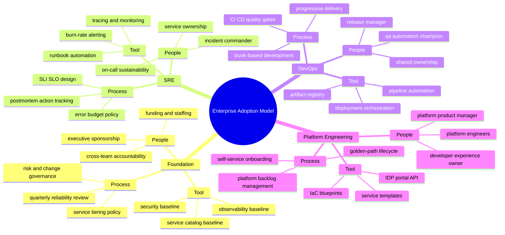
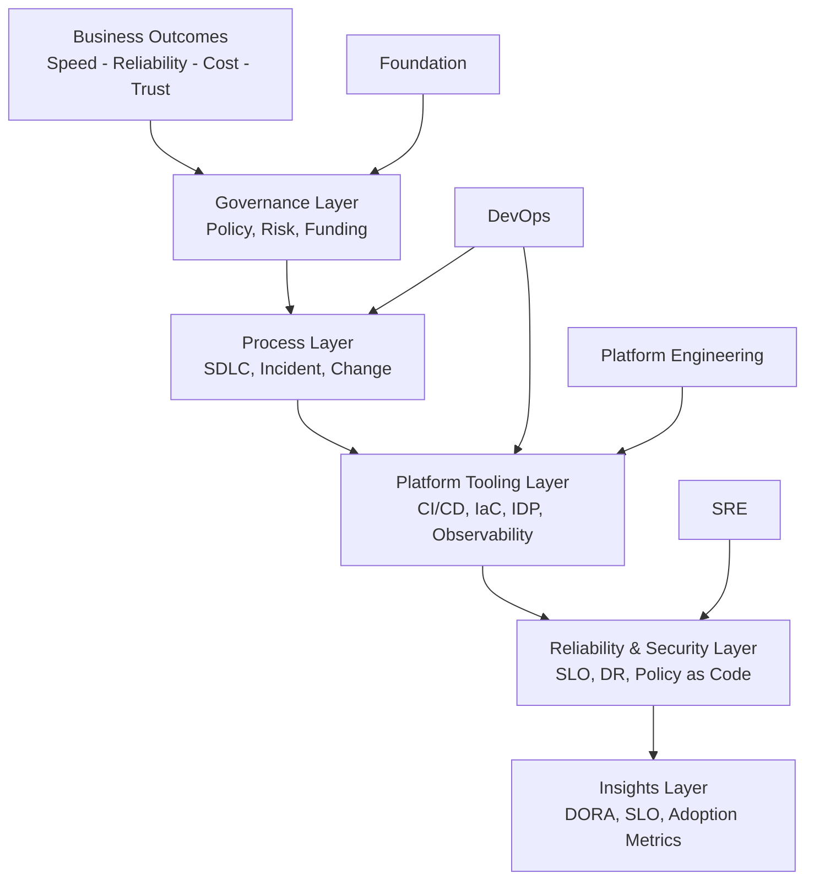
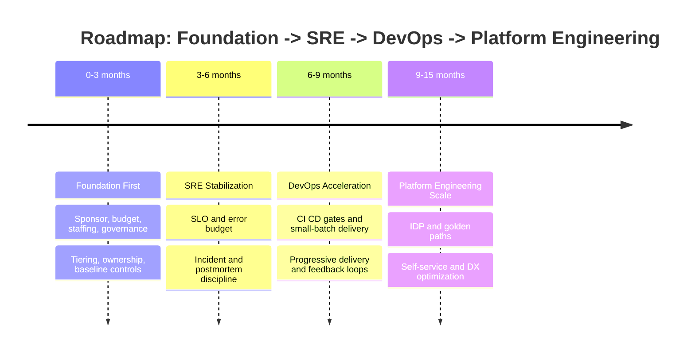
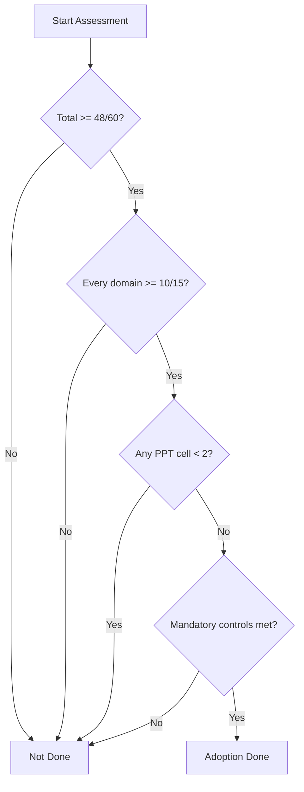

# Homecomer

## Enterprise Architecture Adoption Blueprint

Tài liệu này hệ thống hóa lộ trình áp dụng theo thứ tự:

1. Foundation (chuẩn bị năng lực cấp doanh nghiệp)
2. SRE (ổn định hệ thống)
3. DevOps (tăng tốc phát triển và triển khai)
4. Platform Engineering (mở rộng trải nghiệm lập trình viên)

## Mục Lục

1. Tóm tắt điều hành
2. Cách tiếp cận (Approach) và nguyên tắc thiết kế
3. Bản đồ năng lực 3 tầng (mindmap)
4. Kiến trúc doanh nghiệp theo lớp
5. Lộ trình triển khai 4 giai đoạn
6. Success Picture (Definition of Done)
7. Maturity Rubric (thang trưởng thành)
8. KPI và cơ chế đo lường
9. Kế hoạch 90 ngày đầu
10. Rủi ro chính và biện pháp giảm thiểu
11. Q&A tổng hợp từ quá trình thảo luận
12. Nguồn tham chiếu chính thống

## 1) Tóm Tắt Điều Hành

- Kết luận chính: hướng Foundation -> SRE -> DevOps -> Platform Engineering là hợp lý cho doanh nghiệp.
- Lưu ý quan trọng: SRE và DevOps có phần chồng lấn khi thực thi, không nên coi là hai silo tách rời.
- Mục tiêu cuối: đạt được vận hành ổn định, tốc độ giao hàng cao, và self-service ở quy mô lớn.

## 2) Cách Tiếp Cận (Approach) Và Nguyên Tắc Thiết Kế

### 2.1 Trình tự triển khai

1. Foundation trước để xây nền con người, quy trình, và công cụ dùng chung.
2. SRE tiếp theo để tạo reliability guardrails cho hệ thống quan trọng.
3. DevOps để tăng tốc luồng giao hàng bằng tự động hóa và thay đổi nhỏ, thường xuyên.
4. Platform Engineering để đóng gói năng lực thành sản phẩm nội bộ (IDP) và mở rộng self-service.

### 2.2 Nguyên tắc vận hành

- Measure-first: mọi cải tiến đều có số đo trước/sau.
- Reliability-first for critical services: dịch vụ trọng yếu phải có SLO và error budget.
- Automation-by-default: giảm toil, tăng tính lặp lại và tính kiểm soát.
- Platform-as-a-product: nền tảng nội bộ có backlog, roadmap, và KPI như sản phẩm thật.
- Blameless learning: sự cố được xử lý bằng học tập hệ thống, không đổ lỗi cá nhân.

## 3) Bản Đồ Năng Lực 3 Tầng (Mindmap)

Quy ước:
- Level 1: Foundation, SRE, DevOps, Platform Engineering
- Level 2: People, Process, Tool (PPT)
- Level 3: keyword chi tiết

## 4) Kiến Trúc Doanh Nghiệp Theo Lớp

## 5) Lộ Trình Triển Khai 4 Giai Đoạn

### Giai đoạn 1: Foundation First (0-3 tháng)
- Thiết lập sponsor, ngân sách, staffing model, governance cadence.
- Chuẩn hóa service ownership, tiering, tiêu chuẩn tối thiểu.
- Thiết lập baseline chung: observability, security scan, service catalog.

### Giai đoạn 2: SRE Stabilization (3-6 tháng)
- Áp dụng SLI/SLO/error budget cho dịch vụ Tier 0/1.
- Vận hành incident command, on-call chuẩn, postmortem không đổ lỗi.
- Tự động hóa các tác vụ vận hành lặp lại để giảm toil.

### Giai đoạn 3: DevOps Acceleration (6-9 tháng)
- Chuẩn hóa CI/CD, automated test/security gates.
- Áp dụng trunk-based development và small-batch changes.
- Triển khai progressive delivery để giảm rủi ro phát hành.

### Giai đoạn 4: Platform Engineering Scale (9-15 tháng)
- Xây/hoàn thiện IDP như sản phẩm nội bộ.
- Cung cấp golden paths cho stack chính.
- Chuyển từ ticket-driven sang self-service-first.

## 6) Success Picture (Definition Of Done)

Adoption được coi là hoàn tất khi đồng thời thỏa các điều kiện sau:

1. Foundation
- Có sponsor điều hành, ngân sách duy trì, và mô hình nhân sự rõ ràng.
- Có tiêu chuẩn ownership, service tiering, và governance định kỳ.

2. SRE
- 100% dịch vụ Tier 0/1 có SLI/SLO/error budget đã vận hành.
- Incident process và postmortem action closure chạy ổn định.

3. DevOps
- CI/CD chuẩn hóa, có quality/security gate bắt buộc.
- DORA metrics cải thiện bền vững qua ít nhất 2 quý.

4. Platform Engineering
- IDP hoạt động với self-service cho các use case trọng tâm.
- >= 80% service mới đi theo golden path.

5. Governance và rủi ro
- Không còn critical control nào ở mức 0.
- Chính sách ngoại lệ có thời hạn và được phê duyệt đúng quy trình.

## 7) Maturity Rubric (Thang Trưởng Thành)

### 7.1 Thang điểm

- 0: Chưa bắt đầu
- 1: Đang thử nghiệm cục bộ
- 2: Áp dụng một phần
- 3: Chuẩn hóa đa nhóm
- 4: Mở rộng toàn tổ chức
- 5: Tối ưu hóa liên tục, có bằng chứng định lượng

### 7.2 Rubric theo domain và PPT

| Domain | People | Process | Tool | Điểm tối đa |
|---|---|---|---|---|
| Foundation | 0-5 | 0-5 | 0-5 | 15 |
| SRE | 0-5 | 0-5 | 0-5 | 15 |
| DevOps | 0-5 | 0-5 | 0-5 | 15 |
| Platform Engineering | 0-5 | 0-5 | 0-5 | 15 |
| Tổng |  |  |  | 60 |

### 7.3 Tiêu chí chấm nhanh từng ô PPT

- People:
  - 0: vai trò không rõ
  - 3: vai trò rõ và có RACI
  - 5: vai trò rõ, có career path, có năng lực kế thừa

- Process:
  - 0: làm theo kinh nghiệm cá nhân
  - 3: quy trình chuẩn và đo được
  - 5: quy trình tối ưu bằng dữ liệu, cải tiến định kỳ

- Tool:
  - 0: thao tác thủ công là chủ đạo
  - 3: công cụ chuẩn hóa, tích hợp cơ bản
  - 5: self-service, policy-as-code, đo được hiệu quả sử dụng

### 7.4 Ngưỡng hoàn thành adoption

- Tổng điểm >= 48/60
- Mỗi domain >= 10/15
- Không domain nào có bất kỳ ô PPT < 2
- Bắt buộc:
  - SRE Process >= 4
  - DevOps Tool >= 4
  - Platform Engineering Tool >= 4

### 7.5 Cổng quyết định DoD

## 8) KPI Và Cơ Chế Đo Lường

### 8.1 KPI cốt lõi

- Delivery:
  - Deployment Frequency
  - Lead Time for Changes
  - Change Failure Rate
  - MTTR

- Reliability:
  - SLO compliance rate
  - Error budget burn rate
  - Incident recurrence rate

- Platform:
  - Golden path adoption rate
  - Self-service fulfillment rate
  - Developer satisfaction score

### 8.2 Cơ chế review

- Hàng tuần: vận hành và sự cố
- Hàng tháng: KPI delivery/reliability/platform
- Hàng quý: maturity rubric + quyết định đầu tư tiếp theo

## 9) Kế Hoạch 90 Ngày Đầu

- Tuần 1-2: chốt sponsor, ngân sách, staffing, baseline metrics.
- Tuần 3-4: phát hành chuẩn ownership/tiering/controls phiên bản 1.
- Tuần 5-8: triển khai pilot SRE cho dịch vụ quan trọng.
- Tuần 9-12: triển khai pilot DevOps acceleration cho 2-3 team.

## 10) Rủi Ro Chính Và Biện Pháp Giảm Thiểu

- Rủi ro: tập trung tool mà bỏ qua operating model.
- Giảm thiểu: bắt buộc đi theo People -> Process -> Tool trong mọi sáng kiến.

- Rủi ro: Platform team biến thành helpdesk ticket.
- Giảm thiểu: định vị platform như product team, có self-service SLO.

- Rủi ro: coi SRE là đội làm thay vận hành cho team sản phẩm.
- Giảm thiểu: shared ownership, error budget quyết định nhịp phát hành.

## 11) Q&A Từ Quá Trình Thảo Luận

### Q1: Nên ưu tiên keyword theo mô hình nào?

A: Dùng PPT (People, Process, Tool) để gom trọng tâm và dễ chấm maturity theo từng domain.

### Q2: Mindmap nên trình bày bao nhiêu tầng?

A: 3 tầng là đủ cho điều hành và triển khai:
1. Domain (Foundation, SRE, DevOps, Platform Engineering)
2. PPT
3. Main keywords

### Q3: Foundation nên đứng ở đâu?

A: Foundation đứng đầu để chuẩn bị nguồn lực và chuẩn dùng chung cấp enterprise trước khi mở rộng execution theo từng domain.

### Q4: Thứ tự Foundation -> SRE -> DevOps -> Platform Engineering có đúng không?

A: Đúng cho bối cảnh doanh nghiệp đang cần giảm rủi ro triển khai.
Lưu ý: SRE và DevOps có chồng lấn khi thực thi; PE là bước scale bằng self-service.

### Q5: Tại sao cần rubric thay vì checklist thuần?

A: Checklist trả lời có/không; rubric cho biết mức trưởng thành và giúp ưu tiên đầu tư theo khoảng cách năng lực.

## 12) Nguồn Tham Chiếu Chính Thống

1. Google SRE Workbook - How SRE Relates to DevOps:
https://sre.google/workbook/how-sre-relates/

2. Google SRE Book (official, O'Reilly/Google):
https://sre.google/sre-book/table-of-contents/

3. Google Cloud Architecture - DevOps capabilities (DORA-aligned):
https://docs.cloud.google.com/architecture/devops

4. DORA research portal:
https://dora.dev/

5. CNCF Platform Engineering Whitepaper:
https://tag-app-delivery.cncf.io/whitepapers/platform-engineering-whitepaper/

6. PlatformEngineering.org - What is Platform Engineering:
https://platformengineering.org/blog/what-is-platform-engineering
