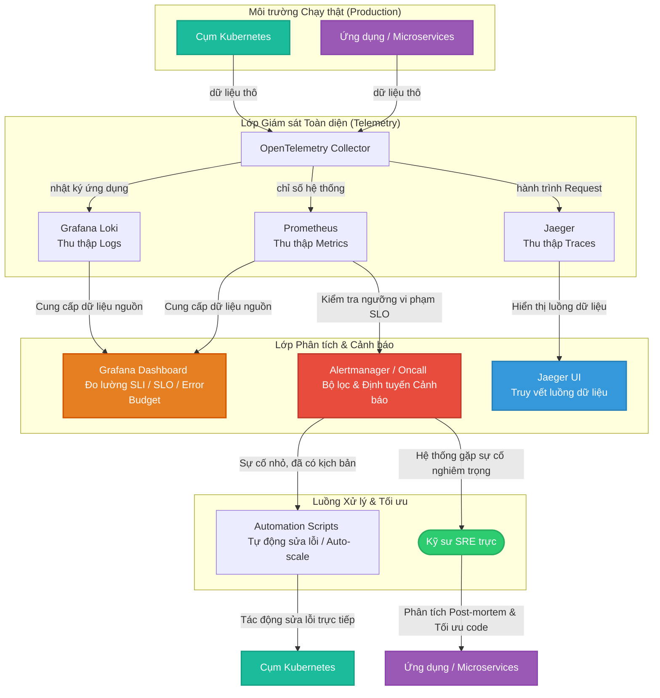
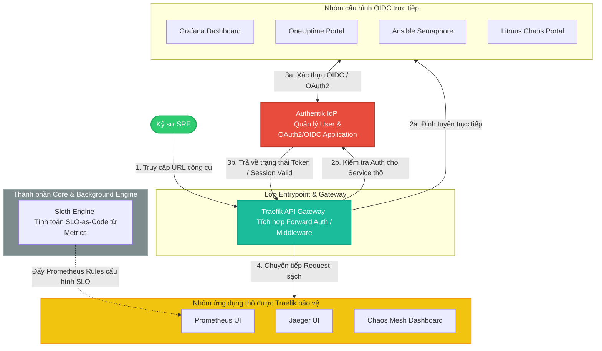
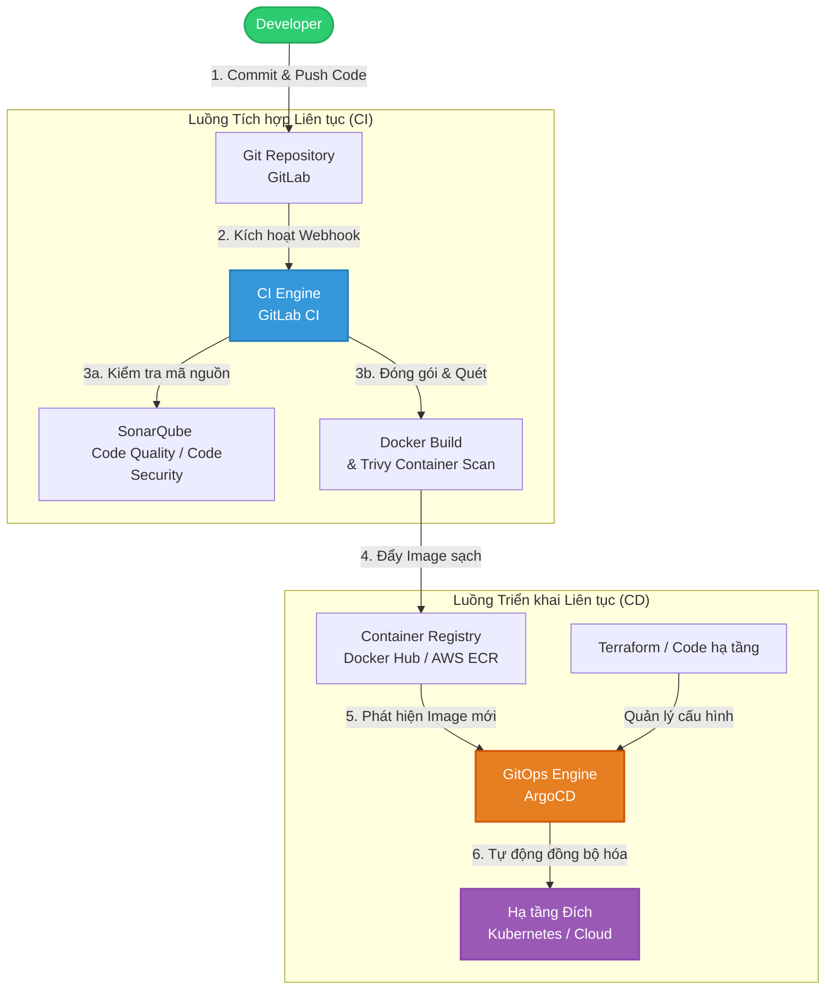
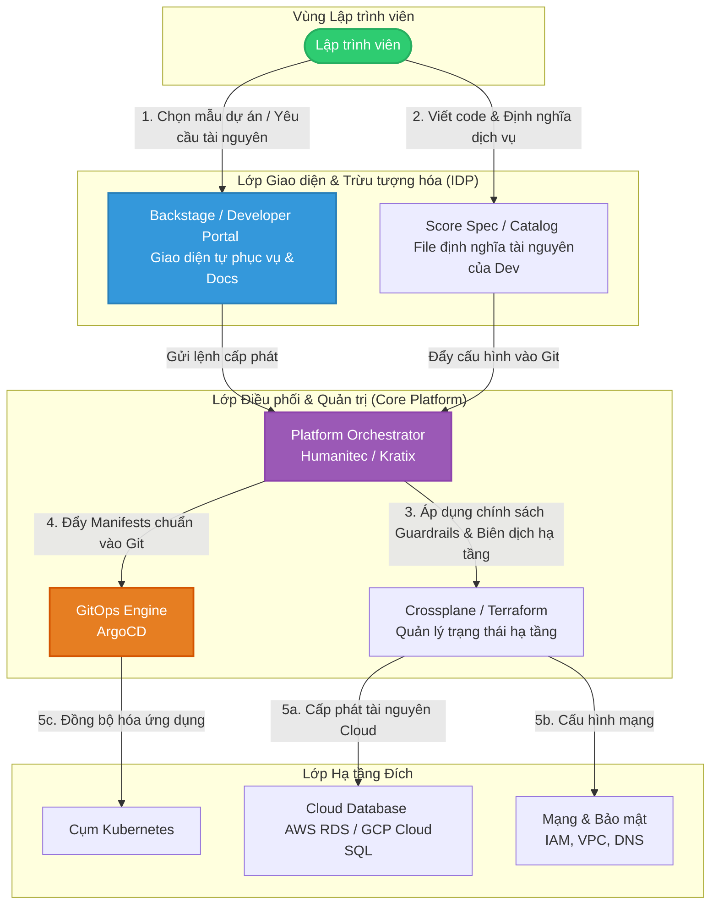

# SRE & DevOps & Platform Engineer

- **SRE**: **Availability/Reliability**: Đảm bảo hệ thống luôn sẵn sàng và chạy ổn định.
- **DevOps**: **Velocity** - Tăng tốc độ bàn giao phần mềm.
- **Platform**: **Developer Experience** - Giảm tải nhận thức, Dev tự phục vụ.

## I. SRE

Tập trung chủ yếu vào **độ tin cậy**, **hiệu năng**, **tính sẵn sàng** và khả năng vận hành bền vững của hệ thống production. SRE cân bằng reliability với tốc độ thay đổi bằng SLO, error budget, capacity planning và automation.

### 1. PPT

#### People

- **Blameless Culture**: Khi xảy ra sự cố, doanh nghiệp tập trung tìm nguyên nhân hệ thống thay vì quy trách nhiệm cá nhân.
- **Hybrid Engineers**: (Nôm na là SysOps xài dc tool) Có năng lực cả software engineering và systems engineering để thiết kế, vận hành, và tự động hóa hệ thống. Toil phải dưới 50% để tối thiểu một nửa thời gian dành cho engineering thực hiện cải tiến lâu dài.
- **Shared Responsibility**: SysOps và Dev cùng tham gia sửa lỗi, cùng chịu trách nhiệm về uptime, cùng tham gia thiết kế hệ thống chịu lỗi.
- **Service Owner**: Chịu trách nhiệm về SLO, production readiness, reliability backlog và các quyết định trade-off của dịch vụ.
- **Incident Commander**: Điều phối Sev1/Sev2, phân công vai trò, duy trì timeline và truyền thông; không nhất thiết là người trực tiếp debug.

#### Process

- **Định nghĩa độ tin cậy bằng số liệu**: Mọi dịch vụ phải được đo lường bằng ngôn ngữ của người dùng (_Hệ thống có chạy không? Chạy nhanh không?_).
- **Quy trình On-call rõ ràng**: Có lịch trực, phân cấp xử lý (Escalation) và quy định thời gian phản hồi sự cố cụ thể. Hướng tới quy trình Incident Response chuẩn mực.
- **Quản lý Ngân sách lỗi (Error Budget)**: Quy trình đưa ra quyết định dựa trên dữ liệu: Nếu còn ngân sách lỗi -> tiếp tục deploy tính năng mới; nếu hết ngân sách lỗi -> dừng deploy, tập trung sửa lỗi hệ thống.
- **Diễn tập sự cố (Chaos Engineering)**: Doanh nghiệp chủ động tổ chức các buổi diễn tập phá hoại hệ thống (GameDay) trên môi trường thử nghiệm hoặc chạy thử các kịch bản sập nguồn để kiểm tra độ bền bỉ của hệ thống. Một DR exercise hoặc chaos experiment cần có hypothesis, blast radius, success criteria, rollback plan và action items. Không áp dụng chaos engineering máy móc cho mọi service.

#### Technology

- **Hệ thống Quan sát toàn diện (Observability)**: Công cụ thu thập đủ 3 trụ cột: Metrics (Chỉ số), Logs (Nhật ký), và Traces (Dấu vết luồng dữ liệu), và dashboard theo four golden signals: latency, traffic, errors, saturation.
- **Hệ thống Cảnh báo chủ động (Alerting)**: Công cụ tự động phân loại cảnh báo. Chỉ gửi cảnh báo đến kỹ sư trực khi sự cố đó thực sự ảnh hưởng đến trải nghiệm khách hàng (*đã hoặc sắp vi phạm SLO*). Cần tránh tình trạng kỹ sư bị "ngập" trong các cảnh báo rác (_Alert Fatigue - cảnh báo lặp đi lặp lại nhưng không cần hành động ngay_).
- **Tự động hóa vận hành (có guardrail)**: Các công cụ tự động phát hiện, tự động mở rộng (Auto-scaling) hoặc tự phục hồi (Self-healing) khi có sự cố nhỏ. Tuy nhiên chỉ áp dụng cho tình huống lặp lại, xác định được và an toàn, yêu cầu có logging, giới hạn tác động và cơ chế rollback.

### 2. Checklist

Mỗi tiêu chí chỉ được đánh dấu **Đạt** khi có đủ:
- số đo đạt ngưỡng
- owner rõ ràng
- bằng chứng lưu trữ được

và được review theo chu kỳ.

Các ngưỡng bên dưới là điểm bắt đầu; cần hiệu chỉnh theo service tier, mức độ rủi ro và cam kết với khách hàng.

| Nhóm | Tiêu chí đo được | Ngưỡng Đạt đề xuất | Bằng chứng bắt buộc | Owner / chu kỳ review |
| :--- | :--- | :--- | :--- | :--- |
| SLO | **Coverage SLI/SLO** cho dịch vụ Tier 0/1 | 100% service có 1-3 SLI hướng người dùng, SLO, cửa sổ đo và truy vấn đo lường đã được Product, Dev, SRE phê duyệt | SLO spec-as-code; dashboard; link query; danh sách service catalog | Service Owner / hàng quý và khi thay đổi kiến trúc |
| SLO | **SLO compliance** | Tỷ lệ kỳ đo đạt SLO >= 95%; mọi breach có ticket hoặc postmortem theo ngưỡng severity | Báo cáo SLO theo tháng; ticket/postmortem liên kết | Service Owner + SRE / hàng tháng |
| Error budget | **Error budget policy** | 100% Tier 0/1 hiển thị budget còn lại; policy quy định rõ: budget khỏe, cảnh báo, cạn budget; cạn budget phải hạn chế thay đổi rủi ro và ưu tiên reliability work | Dashboard burn rate; policy versioned; quyết định release có dấu vết | Product + Engineering + SRE / hàng tuần |
| Alerting | **Page quality** | 100% paging alert có runbook, service owner, severity, escalation; trang pager chỉ dành cho sự kiện khẩn cấp và actionable | Alert inventory; runbook link; cấu hình routing/escalation | SRE / hàng tháng |
| Alerting | **Alert-to-incident ratio** | Mục tiêu <= 1.5 page cho 1 incident; alert lặp hoặc không actionable phải có ticket loại bỏ/tự động hóa | Báo cáo page, grouped incident, backlog alert hygiene | SRE / hàng tháng |
| Alerting | **Burn-rate protection** | Tier 0/1 dùng multiwindow multi-burn-rate hoặc chiến lược tương đương; có phân tách page và ticket | Alert rules-as-code; kết quả test alert; dashboard budget | SRE / hàng quý hoặc sau SLO thay đổi |
| Incident | **Incident response** | 100% Sev1/Sev2 có Incident Commander, timeline, kênh giao tiếp, và thời điểm acknowledge/mitigate được ghi nhận | Incident record; log paging/chat; timeline | Incident Commander / sau mỗi sự cố |
| Incident | **Response objectives** | Ack và mitigation target được định nghĩa theo tier; ví dụ Tier 0: acknowledge <= 5 phút, bắt đầu mitigation <= 15 phút | On-call policy; báo cáo percentile acknowledge/mitigate | SRE Manager / hàng tháng |
| Learning | **Blameless postmortem** | 100% Sev1/Sev2 có postmortem được review trong <= 3 ngày làm việc; action items có owner, due date và trạng thái | Postmortem repository; review record; action tracker | Service Owner / hàng tháng |
| Learning | **Action closure** | >= 90% action item quá hạn được xử lý hoặc có exception được phê duyệt; incident lặp phải có phân tích nguyên nhân hệ thống | Action dashboard; exception record; recurrence report | Engineering Manager / hàng quý |
| On-call | **On-call sustainability** | Mỗi shift có primary/secondary hoặc escalation tương đương; median incident <= 1/shift; không engineer nào on-call quá 25% thời gian trong một quý nếu mô hình staffing cho phép | Lịch trực; báo cáo incidents/shift; workload report | SRE Manager / hàng quý |
| Toil | **Toil ratio** | Toil trung bình < 50% thời gian SRE trong 2 quý liên tiếp; mọi nguồn toil lớn có backlog automation hoặc kế hoạch loại bỏ | Time survey; toil register; automation backlog | SRE Manager / hàng quý |
| Resilience | **Recovery automation** | Các lỗi lặp, xác định được và an toàn có runbook automation; tỷ lệ xử lý tự động được đo thay vì chỉ tuyên bố "self-healing" | Runbook-as-code; execution log; automation success rate | SRE + Platform / hàng quý |
| Resilience | **GameDay / DR exercise** | Tier 0: ít nhất 2 lần/năm; Tier 1: ít nhất 1 lần/năm; mỗi bài diễn tập có hypothesis, success criteria, kết quả và action items | Kịch bản; biên bản; action tracker; RTO/RPO result | Service Owner + SRE / theo lịch tier |

#### Công thức và dashboard tối thiểu

- **SLO compliance** = số cửa sổ đo đạt SLO / tổng số cửa sổ đo.
- **Error budget remaining** = $1 - \frac{bad\ events}{allowed\ bad\ events}$.
- **Alert-to-incident ratio** = tổng page / tổng incident đã nhóm theo nguyên nhân.
- **Toil ratio** = giờ toil / tổng giờ làm việc của SRE.
- **Postmortem action closure** = action item hoàn tất đúng hạn / tổng action item đến hạn.

#### Nguyên tắc áp dụng và nguồn

- **SLO trước, alert sau**: Google định nghĩa SLI là thước đo định lượng; SLO phải nêu rõ cách đo và điều kiện áp dụng. Error budget là cơ chế cân bằng reliability với tốc độ release. [Google SRE Book - Service Level Objectives](https://sre.google/sre-book/service-level-objectives/)
- **Pager chỉ dành cho triệu chứng khẩn cấp, actionable, ảnh hưởng người dùng**: Google khuyến nghị alert có tín hiệu cao, noise thấp; page cần hành động khẩn cấp, không phải chỉ vì "có gì đó bất thường". [Google SRE Book - Monitoring Distributed Systems](https://sre.google/sre-book/monitoring-distributed-systems/)
- **Burn-rate alerting thay vì alert theo ngưỡng thô**: Google SRE Workbook khuyến nghị multiwindow, multi-burn-rate; các điểm bắt đầu điển hình là page ở 2% budget/1 giờ và 5%/6 giờ, ticket ở 10%/3 ngày, nhưng phải tune theo service. [Google SRE Workbook - Alerting on SLOs](https://sre.google/workbook/alerting-on-slos/)
- **Postmortem là cơ chế học tập, không đổ lỗi**: postmortem cần trigger định nghĩa trước, được review, có action phòng ngừa và chia sẻ kiến thức. [Google SRE Book - Postmortem Culture](https://sre.google/sre-book/postmortem-culture/)
- **Giảm toil bằng engineering**: Google dùng mục tiêu toil dưới 50% để tối thiểu một nửa thời gian SRE dành cho engineering tạo giá trị lâu dài. [Google SRE Book - Eliminating Toil](https://sre.google/sre-book/eliminating-toil/)
- **Bảo vệ sức khỏe on-call**: Google đánh giá workload qua tỷ lệ thời gian on-call và số incident mỗi shift; đây là guardrail để tránh overload và burnout. [Google SRE Book - Being On-Call](https://sre.google/sre-book/being-on-call/)

### 3. Công cụ cốt lõi

Mục tiêu của SRE là thu thập mọi dữ liệu từ hệ thống (_hoặc chỉ cần đủ để đo đc SLO, capacity planning_), đưa ra cảnh báo chính xác để đảm bảo thời gian hoạt động (Uptime) cao nhất (_theo SLA/kỳ vọng của khách hàng_) và tự động hóa việc cứu hộ (_bôi đậm là recommended_):
 
- **Thu thập Metrics & Giám sát**: **Prometheus**, Datadog, VictoriaMetrics.
- **Quản lý Nhật ký (Logs)**: **EFK Stack** (Elasticsearch, Fluentd, Kibana), Grafana Loki.
- **Truy vết luồng dữ liệu (Tracing)**: **Jaeger**, **OpenTelemetry** (tiêu chuẩn chung để thu thập dữ liệu).
- **Hiển thị dữ liệu (Dashboard)**: **Grafana**, Kibana.
- **Định tuyến cảnh báo & Trực luân phiên (On-call)**: PagerDuty, Opsgenie, Better Stack, Grafana On-call, **OneUptime**.
- **Error Budget & SLO Management**: Sloth.
- **Tự động hóa vận hành (Self-healing)**: **Ansible**, OpenTofu, Rundeck, Semaphore, Rundeck.
- **Diễn tập phá hoại (Chaos Engineering)**: Gremlin, **Chaos Mesh**, **Chaos Monkey**.

**Technology Catalog**, kèm đánh giá chi tiết khả năng tích hợp SSO với **Authentik** làm IdP cho từng công cụ:

| STT | Phân nhóm công nghệ (Domain) | Công cụ (Tools) | Giao thức hỗ trợ Authentik | Cơ chế tích hợp & Đánh giá với Authentik/Traefik |
| :--- | :--- | :--- | :--- | :--- |
| **1** | **Thu thập Metrics & Giám sát** | **Prometheus** | Không hỗ trợ trực tiếp (Dùng Gateway) | **Bảo vệ qua Traefik.** Bản thân Prometheus không có Auth. Sử dụng **Traefik Forward Auth Middleware** kết nối với Authentik làm chốt chặn xác thực trước khi cho phép vào UI. |
| **2** | **Quản lý Nhật ký (Logs)** | **EFK Stack** *(Elasticsearch, Fluentd, Kibana)* | **OIDC / SAML** | **Dễ (Dùng OpenSearch) - Khó (Dùng Elastic thuần).** Kibana hỗ trợ OIDC với Authentik. Khuyến khích dùng nhánh mã nguồn mở **OpenSearch/OpenSearch Dashboards** để tích hợp OIDC hoàn toàn miễn phí. Fluentd chạy ngầm không cần UI. |
| **3** | **Dấu vết luồng dữ liệu (Tracing)** | **Jaeger** | Không hỗ trợ trực tiếp (Dùng Gateway) | **Bảo vệ qua Traefik.** Jaeger UI không có bộ máy xác thực riêng. Tương tự Prometheus, Jaeger UI được bọc an toàn phía sau **Traefik + Authentik Forward Auth**. |
| | | **OpenTelemetry (Collector)** | Không áp dụng (No UI) | **Không cần thiết.** Hoạt động hoàn toàn ở backend để thu thập và phân phối dữ liệu (Data ingestion), không có giao diện người dùng nên không cần SSO. |
| **4** | **Hiển thị dữ liệu (Dashboard)** | **Grafana** | **OAuth2 / OIDC** | **Rất dễ.** Tích hợp sẵn Generic OAuth. Cấu hình trực tiếp trong file `grafana.ini` kết nối tới Authentik Provider. Hỗ trợ tự động đồng bộ Nhóm/Vai trò (Group/Role mapping). |
| | | **Kibana** | OIDC / SAML | *(Giống phần ELK Stack ở trên)*. |
| | | **Jaeger UI** | Không hỗ trợ trực tiếp | *(Giống phần Jaeger ở trên)*. |
| **5** | **Định tuyến cảnh báo & On-call** | **OneUptime** | **OIDC / SAML** | **Dễ.** Hỗ trợ cấu hình tích hợp OIDC/SAML trực tiếp trong giao diện Enterprise Settings để kết nối thẳng tới Authentik làm nguồn xác thực tập trung. |
| **6** | **Quản lý Ngân sách lỗi (Error Budget)** | **Sloth** | Không áp dụng (No UI) | **Không cần thiết.** Hoạt động hoàn toàn theo mô hình **SLO-as-Code** qua file YAML. Chạy ngầm bằng CLI để sinh Prometheus Rules, không có giao diện tương tác nên không cần SSO. |
| **7** | **Tự động hóa vận hành** | **Rundeck** / **PagerDuty Runbook Automation** | **OIDC / SAML** | **Dễ đến Trung bình.** Bản Open Source được bảo vệ tối ưu nhất thông qua Traefik Forward Auth. Bản thương mại hỗ trợ native OIDC kết nối trực tiếp với Authentik. |
| | | **Ansible Semaphore** | **OIDC** | **Rất dễ.** Giao diện WebUI gọn nhẹ cho Ansible, tích hợp sẵn Generic OIDC Provider trong file cấu hình để map trực tiếp với Authentik chỉ với vài dòng khai báo. |
| **8** | **Diễn tập phá hoại (Chaos Engineering)**| **Chaos Mesh** | Không hỗ trợ trực tiếp (Dùng Gateway) | **Bảo vệ qua Traefik.** Do Chaos Mesh Dashboard sử dụng cơ chế Token của K8s, cách tối ưu và đồng bộ nhất là bọc trang quản trị này sau lớp **Traefik Forward Auth Middleware** của Authentik. |
| | | **Litmus (Chaos)** | **OAuth2 / OIDC** | **Dễ.** Từ phiên bản 2.0+ trở đi, kiến trúc Litmus Portal hỗ trợ cấu hình native OAuth2 để kết nối trực tiếp với hệ thống Authentik Provider trong phần Authentication. |

Phụ bản Technology Catalog, đi kèm đánh giá chi tiết khả năng tích hợp SSO với **Keycloak** cho từng công cụ:

| STT   | Phân nhóm công nghệ (Domain) | Công cụ (Tools) | Giao thức hỗ trợ Keycloak | Mức độ phức tạp & Đánh giá tích hợp Keycloak |
| :--- | :--- | :--- | :--- | :--- |
| **1** | **Thu thập Metrics & Giám sát** | **Prometheus** | Không hỗ trợ trực tiếp (Cần Proxy) | **Trung bình.** Không có sẵn cơ chế Auth. Cần bọc sau **OAuth2 Proxy** hoặc API Gateway/Ingress có Forward Auth để xác thực qua Keycloak trước khi vào UI. |
| **2** | **Quản lý Nhật ký (Logs)** | **EFK Stack** *(Elasticsearch, Fluentd, Kibana)* | **OIDC / SAML** | **Dễ đến Khó.** Kibana/Elasticsearch hỗ trợ native OIDC với Keycloak, nhưng yêu cầu bản thương mại (License) hoặc phải chuyển sang nhánh mã nguồn mở **OpenSearch**/**OpenSearch Dashboards**. |
| **3** | **Truy vết luồng dữ liệu (Tracing)** | **Jaeger** | Không hỗ trợ trực tiếp (Cần Proxy) | **Trung bình.** Jaeger UI không có bộ máy xác thực riêng. Giải pháp tốt nhất là đặt Jaeger UI phía sau một **OAuth2 Proxy** kết nối Keycloak. |
| | | **OpenTelemetry (Collector)** | Không áp dụng (No UI) | |
| **4** | **Hiển thị dữ liệu (Dashboard)** | **Grafana** | **OAuth2 / OIDC** | **Rất dễ.** Tích hợp sẵn Generic OAuth. Cấu hình nhanh qua file `grafana.ini`. Hỗ trợ tự động map Group/Role từ Keycloak sang Admin/Editor/Viewer. |
| | | **Kibana** | OIDC / SAML | *(Giống phần ELK Stack ở trên)*. |
| | | **Jaeger UI** | Không hỗ trợ trực tiếp | *(Giống phần Jaeger ở trên)*. |
| **5** | **Định tuyến cảnh báo & On-call** | **OneUptime** | **OIDC / SAML** | **Dễ.** Nền tảng All-in-one hiện đại, hỗ trợ cấu hình SSO trực tiếp trong phần Enterprise Settings để kỹ sư On-call đăng nhập tập trung. |
| **6** | **Quản lý Ngân sách lỗi (Error Budget)** | **Sloth** | Không áp dụng (No UI) | **Không cần thiết.** Định nghĩa SLO dưới dạng mã (SLO-as-Code) qua file YAML và chạy ngầm bằng CLI, xem qua Grafana. |
| **7** | **Tự động hóa vận hành** | **Rundeck** / **PagerDuty Runbook Automation** | **OIDC / SAML** | **Dễ đến Trung bình.** Bản Open Source của Rundeck cần bọc qua OAuth2 Proxy hoặc cấu hình Jaas Header. Bản thương mại hỗ trợ native OIDC/SAML rất mạnh. |
| | | **Ansible Semaphore** | **OIDC** | **Rất dễ.** Giao diện WebUI gọn nhẹ cho Ansible, hỗ trợ tích hợp sẵn Generic OIDC Provider trong file cấu hình để map với Keycloak. |
| **8** | **Diễn tập phá hoại (Chaos Engineering)**| **Chaos Mesh** | **OIDC / K8s OIDC** | **Trung bình.** Sử dụng cơ chế Token của Kubernetes. Có thể cấu hình cụm K8s dùng Keycloak làm OIDC Provider để đồng bộ, hoặc dùng OpenID Connect Proxy cho Chaos Mesh Dashboard. |
| | | **Litmus (Chaos)** | **OAuth2 / OIDC** | **Dễ.** Từ bản 2.0+ trở đi, kiến trúc Litmus Portal đã hỗ trợ tích hợp sẵn giao thức OAuth2 để kết nối trực tiếp với Keycloak trong phần Authentication. |

### 4. Kiến trúc đề xuất

#### Kiến trúc tích hợp quan sát

Sơ đồ này mô tả vòng lặp quan sát của kĩ sư SRE: Hệ thống chạy thật sinh ra dữ liệu -> Công cụ SRE thu thập và phân tích dựa trên SLO -> Gửi cảnh báo đúng người -> SRE viết mã tự động sửa lỗi để tối ưu hệ thống.

#### Kiến trúc tích hợp SSO

## II. DevOps

Kết hợp giữa Phát triển (Development) và Vận hành (Operations) nhằm **rút ngắn thời gian vòng đời phát triển phần mềm** (SDLC) nhưng vẫn đảm bảo **chất lượng giao phẩm cao**.

### 1. PPT

#### People

- **Văn hóa cộng tác (Collaboration)**: Phá bỏ tư duy "silo" (thân ai nấy lo). Dev và Ops cùng chia sẻ mục tiêu chung là sự thành công của sản phẩm, thay vì Dev chỉ muốn đẩy tính năng mới còn Ops chỉ muốn giữ hệ thống đứng yên để ổn định.
- **Tư duy sở hữu chung (Shared Ownership)**: Lập trình viên chịu trách nhiệm cho mã nguồn của mình ngay cả khi nó đã chạy trên Production. Áp dụng triệt để tư duy "Bạn viết ra nó, bạn vận hành nó" (You build it, you run it).
- **Học hỏi liên tục (Continuous Learning)**: Khuyến khích thử nghiệm, chấp nhận thất bại sớm (Fail fast, learn faster) để cải tiến liên tục quy trình triển khai.

#### Process

- **Chuyển dịch về bên trái (Shift-Left)**: Đưa các yếu tố như kiểm thử (Testing), bảo mật (Security) và kiểm tra cấu hình vào ngay từ những giai đoạn đầu tiên của quá trình viết code, thay vì đợi đến cuối quy trình.
- **Chia nhỏ gói phát hành (Small Releases)**: Thay vì gom tính năng thành các bản cập nhật lớn vài tháng một lần, quy trình DevOps chia nhỏ các tính năng để release hàng ngày hoặc hàng tuần, giảm thiểu rủi ro lỗi diện rộng.
- **Phản hồi nhanh (Feedback Loops)**: Thiết lập các kênh phản hồi tự động từ hệ thống giám sát quay ngược lại cho đội ngũ phát triển ngay khi có lỗi xảy ra ở bất kỳ công đoạn nào.

#### Technology

- **Tự động hóa tối đa (Automation)**: Loại bỏ hầu hết các thao tác thủ công từ build, test, đóng gói cho đến triển khai.
- **Hạ tầng dạng mã (Infrastructure as Code - IaC)**: Toàn bộ tài nguyên mạng, server, database phải được định nghĩa bằng mã nguồn và quản lý phiên bản qua Git.
- **Tính đồng nhất môi trường**: Đảm bảo môi trường Local (máy của Dev), Staging (thử nghiệm) và Production (chạy thật) phải giống hệt nhau về mặt cấu hình nhờ công nghệ Container.

### 2. Checklist

Mỗi tiêu chí chỉ được đánh dấu **Đạt** khi có đủ:
- số đo đạt ngưỡng hoặc cải thiện bền vững so với baseline
- owner rõ ràng
- bằng chứng lưu trữ được

và được review theo chu kỳ.

Không đặt một ngưỡng DORA giống nhau cho mọi team. DORA khuyến nghị đo theo từng ứng dụng/dịch vụ, dùng xu hướng để cải tiến, không dùng để xếp hạng hay tạo động lực "chạy số" giữa các team.

| Nhóm | Tiêu chí đo được | Ngưỡng Đạt đề xuất | Bằng chứng bắt buộc | Owner / chu kỳ review |
| :--- | :--- | :--- | :--- | :--- |
| Version control | **Coverage as code** | 100% mã nguồn, pipeline, cấu hình deploy và IaC của production được version control; thay đổi production có pull request/commit truy vết được | Repository inventory; branch protection; audit sample change-to-deploy | Tech Lead + Platform / hàng quý |
| CI | **CI trigger và canonical artifact** | 100% pull request/main commit kích hoạt pipeline; artifact có version bất biến, SBOM/provenance theo chính sách công ty | Pipeline definition; build history; artifact registry; release metadata | Tech Lead / hàng tháng |
| CI | **Build health và feedback time** | Main branch xanh >= 95% thời gian; P50 feedback cho test nhanh <= 10 phút; build lỗi được fix hoặc revert ưu tiên cao | CI dashboard; build failure log; revert history | Delivery Team / hàng tuần |
| Development flow | **Trunk-based development** | <= 3 active branch/repository; >= 90% branch merge trong <= 1 ngày; không có code freeze định kỳ | SCM analytics; branch age report; release calendar | Tech Lead / hàng tháng |
| Testing | **Automated quality gates** | 100% thay đổi production chạy unit + test phù hợp theo rủi ro; test failure phải actionable; flaky-test rate được theo dõi và có backlog xử lý | Pipeline gate; test report; flaky-test register | Dev + QA / hàng tháng |
| Testing | **Test feedback and defect escape** | P50 test feedback <= 10 phút với test nhanh; tỷ lệ lỗi phát hiện sau production giảm theo quý hoặc có kế hoạch khắc phục rõ ràng | Test dashboard; defect source report; quality backlog | Tech Lead + QA / hàng quý |
| Security | **Shift-left security** | 100% pipeline production có secret scan, SCA, SAST và image/IaC scan khi phù hợp; critical finding phải block hoặc có exception hết hạn | Scan configuration; policy-as-code; exception register | Security Champion + DevOps / hàng tháng |
| CD | **Deployment automation** | >= 95% production deployment đi qua pipeline/GitOps; không dùng SSH/manual command trừ emergency procedure có log | CD/GitOps history; change record; break-glass log | DevOps + Service Owner / hàng tháng |
| CD | **Safe release and rollback** | Tier 0/1 có rollback đã kiểm thử; thay đổi rủi ro cao có canary/blue-green hoặc equivalent; rollback/forward-fix path được diễn tập ít nhất 2 lần/năm | Deployment definition; release strategy; drill evidence | Service Owner + SRE / theo release và hàng quý |
| Configuration | **Secrets and environment configuration** | 0 secret xác nhận còn hiệu lực trong source control; secret/config được inject qua hệ thống quản lý tập trung; access dùng least privilege | Secret scan report; vault/IAM policy; rotation evidence | Security + Platform / hàng tháng |
| IaC | **Infrastructure delivery** | 100% thay đổi hạ tầng production đi qua IaC review + plan; drift được phát hiện và xử lý/ngoại lệ hóa có thời hạn | IaC repository; plan/apply log; drift report | Platform + Service Owner / hàng tháng |
| Database | **Database change safety** | Schema/data migration versioned, reviewable, có rollback/forward-compatible strategy; migration rủi ro được kiểm thử trước production | Migration repository; pipeline stage; rollout plan | Tech Lead + DBA/Platform / mỗi release |
| Flow | **Value-stream visibility** | Có dashboard từ commit đến production, thể hiện queue time và handoff; top bottleneck có improvement item được review | Value-stream map; delivery dashboard; improvement backlog | Engineering Manager / hàng quý |
| DORA | **Deployment frequency** | Đo theo service; mục tiêu là cadence phù hợp nhu cầu sản phẩm và cải thiện so với baseline, không áp KPI chung theo ngày/tuần | Deployment history; service-level trend | Delivery Team / hàng tháng |
| DORA | **Change lead time** | Đo commit-to-production theo percentile (P50/P90); P90 giảm hoặc ổn định trong ngưỡng SLO delivery đã thống nhất | SCM + CD analytics; trend dashboard | Delivery Team / hàng tháng |
| DORA | **Change fail rate** | Tỷ lệ deployment cần rollback/hotfix/khắc phục ngay được đo; giảm theo quý hoặc có reliability backlog được ưu tiên | Deployment-to-incident correlation; rollback/hotfix log | Delivery Team + SRE / hàng tháng |
| DORA | **Failed deployment recovery time** | Đo thời gian từ deployment thất bại đến khi service hoạt động bình thường; theo dõi P50/P90 và cải thiện qua các quý | Incident record; deploy metadata; recovery dashboard | Delivery Team + SRE / hàng tháng |
| DORA | **Deployment rework rate** | Đo tỷ lệ deploy ngoài kế hoạch do incident production; có review nguyên nhân và action giảm rework | Release calendar; incident tags; postmortem action log | Engineering Manager / hàng quý |

#### Công thức và dashboard tối thiểu

- **Deployment frequency** = số deployment production thành công / khoảng thời gian, theo từng service.
- **Change lead time** = thời điểm deployment production - thời điểm commit được đưa vào deployment; báo cáo P50 và P90.
- **Change fail rate** = deployment cần rollback, hotfix hoặc can thiệp khẩn cấp / tổng deployment.
- **Failed deployment recovery time** = thời điểm service phục hồi - thời điểm deployment lỗi được phát hiện; báo cáo P50 và P90.
- **Deployment rework rate** = deployment ngoài kế hoạch do incident / tổng deployment.
- **Flaky-test rate** = test fail nhưng pass khi chạy lại không đổi code / tổng lần chạy test.
- Dashboard tối thiểu phải drill-down được từ metric -> deployment -> commit/PR -> pipeline -> incident hoặc rollback liên quan.

#### Nguyên tắc áp dụng và nguồn

- **Đo outcome theo service, không dùng DORA để xếp hạng con người/team**: DORA hiện dùng 5 metrics gồm change lead time, deployment frequency, failed deployment recovery time, change fail rate và deployment rework rate. Metrics được dùng để nhìn xu hướng cải tiến ở cấp ứng dụng/dịch vụ; so sánh các hệ thống khác bối cảnh có thể gây hiểu sai. [DORA - Software delivery performance metrics](https://dora.dev/guides/dora-metrics-four-keys/)
- **Continuous delivery là phát hành on-demand, an toàn và bền vững**: không đồng nghĩa chỉ tăng tần suất deploy. Cần kết hợp test automation, deployment automation, trunk-based development, security, observability và thay đổi kiến trúc/quy trình khi có bottleneck. [DORA - Continuous delivery](https://dora.dev/capabilities/continuous-delivery/)
- **Trunk-based development giảm chi phí integration**: DORA đề xuất <= 3 branch active, merge ít nhất mỗi ngày, tránh code freeze; build hỏng cần được fix hoặc revert ngay để giữ main xanh. [DORA - Trunk-based development](https://dora.dev/capabilities/trunk-based-development/)
- **Test automation phải nhanh và đáng tin**: DORA đề xuất feedback test nhanh trong dưới 10 phút; test failure nên thể hiện lỗi thật, không dung thứ flaky test, và developer là người chịu trách nhiệm chính với test suite. [DORA - Test automation](https://dora.dev/capabilities/test-automation/)
- **DevOps là tập năng lực kỹ thuật, quy trình và văn hóa**: Google Cloud tổng hợp các capability DORA gồm CI/CD, deployment automation, observability, security shift-left, value-stream visibility và learning culture. [Google Cloud - DevOps capabilities](https://docs.cloud.google.com/architecture/devops)

### 3. Công cụ cốt lõi

Các công cụ cốt lõi của DevOps:

- **Mã nguồn & Quản lý phiên bản (Git)**: GitHub, **GitLab**, Bitbucket.
- **Tích hợp & Triển khai liên tục (CI/CD)**: Jenkins, **GitLab CI**, GitHub Actions, **ArgoCD** (GitOps).
- **Đóng gói (Containerization)**: **Docker**, Podman.
- **Hạ tầng dạng mã (IaC) & Cấu hình**: Terraform, OpenTofu, Ansible, **CloudFormation**.
- **Quản lý Artifact & Kho thư viện (Repository)**: **Sonatype Nexus OSS**, **Harbor Registry**, JFrog Artifactory.
- **Quản lý bảo mật & An toàn thư viện (DevSecOps/SCA)**: **SonarQube** (Quét code), **OWASP Dependency-Check** (Quét thư viện/License), Snyk, **Trivy** (Quét lỗ hổng container).
- **Quản lý lỗ hổng tập trung (Vulnerability Management)**: **DefectDojo**, Kenna Security.
- **Quản lý cấu hình & Bí mật (Secret Management)**: **HashiCorp Vault**, AWS Secrets Manager.

**Technology Catalog**:

| STT | Phân nhóm công nghệ (Domain) | Công cụ (Tools) | Giao thức hỗ trợ Authentik | Cơ chế tích hợp & Đánh giá với Authentik/Traefik |
| :--- | :--- | :--- | :--- | :--- |
| **1** | **Quản lý mã nguồn & CI Pipeline** | **GitLab (Self-hosted)** | **OIDC / OAuth2** | **Rất dễ.** GitLab hỗ trợ cấu hình mã nguồn mở kết nối trực tiếp với Authentik qua OIDC. Giúp quản lý code và chạy CI runner an toàn. |
| **2** | **Quản lý Kho mã nguồn và Thư viện** | **Sonatype Nexus OSS** | **SAML / OIDC / Proxy Auth** | **Trung bình.** Phiên bản Nexus OSS (Miễn phí) hỗ trợ native xác thực SAML hoặc qua Header-based Auth. Bạn có thể dùng **Traefik Forward Auth** để bọc giao diện quản trị của Nexus, hoặc cấu hình SAML trực tiếp với Authentik. |
| **3** | **Quản lý An toàn Thư viện (SCA)** | **OWASP Dependency-Check** | Không áp dụng (No UI) | **Không cần thiết.** Đây là công cụ dạng CLI / Plugin chạy trực tiếp trong CI pipeline của GitLab để quét các file định nghĩa dependency (như `pom.xml`, `package.json`). Nó không có UI độc lập nên không cần cấu hình SSO. |
| **4** | **Quản lý Lỗ hổng tập trung** | **DefectDojo** | **OIDC / Social Auth** | **Dễ.** Nhằm mục đích hứng và hiển thị tập trung các file báo cáo (JSON/XML) xuất ra từ **Dependency-Check**. Hỗ trợ native OIDC kết nối thẳng với Authentik để kỹ sư DevOps/Security đăng nhập theo dõi. |
| **5** | **Quản lý chất lượng & Bảo mật** | **SonarQube** | **OIDC / SAML** | **Dễ đến Trung bình.** Bản Community cần cấu hình qua plugin hoặc bọc Traefik Proxy. Các phiên bản cao hơn hỗ trợ cấu hình OIDC trực tiếp với Authentik rất mượt mà. |
| **6** | **Quản lý Artifact & Image** | **Harbor Registry** | **OIDC** | **Dễ.** Harbor là nơi lưu trữ Docker Image tập trung, hỗ trợ native OIDC với Authentik. Có tính năng quét mã độc tự động (Trivy). |
| **7** | **Triển khai tự động (CD Engine)** | **ArgoCD** | **OIDC / OAuth2** | **Rất dễ.** ArgoCD hỗ trợ tích hợp sâu với Authentik OIDC. Cho phép ánh xạ (map) Group từ Authentik vào phân quyền RBAC (Admin/Viewer) của từng dự án trong ArgoCD. |
| **8** | **Hạ tầng dạng mã (IaC)** | **Terraform** / **OpenTofu** | Không áp dụng (No UI) | **Không cần thiết.** Hoạt động hoàn toàn dưới dạng CLI hoặc chạy ngầm trong CI pipeline để khởi tạo tài nguyên hạ tầng. |
| **9** | **Quản lý cấu hình & Bí mật** | **HashiCorp Vault** | **OIDC / JWT** | **Dễ.** Vault hỗ trợ phương thức xác thực OIDC. Kỹ sư DevOps có thể đăng nhập vào giao diện Vault UI thông qua Authentik để quản lý mật mã, API Key. |

### 4. Kiến trúc tổng thể đề xuất

#### Kiến trúc luồng CI/CD

Sơ đồ này mô tả tóm tắt luồng tự động hóa khép kín từ máy của lập trình viên qua các bước kiểm thử, bảo mật cho đến khi triển khai lên môi trường chạy thật.

## III. Platform Engineer

Chuyển dịch từ tư duy "hỗ trợ kỹ thuật" sang tư duy "cung cấp sản phẩm" (**Platform-as-a-Product**). Sản phẩm ở đây chính là **nền tảng công cụ nội bộ**, phục vụ khách hàng chính là đội ngũ lập trình viên của công ty.

### 1. PPT

#### People

- **Tư duy Quản lý Sản phẩm (Product Mindset)**: Đội ngũ Platform phải coi nền tảng mình làm ra là một sản phẩm thương mại. Họ cần khảo sát nhu cầu, làm tài liệu (Docs), định nghĩa lộ trình (Roadmap) và "bán" nó cho lập trình viên trong công ty.
- **Kỹ sư Nền tảng (Platform Engineers)**: Có năng lực kết hợp giữa lập trình hệ thống (Go, Python), hạ tầng (Kubernetes, Cloud) và thiết kế giao diện (UI/UX) cho cổng thông tin nội bộ (_có thể tận dụng AI_).
- **Khách hàng nội bộ (Developers)**: Sẵn sàng chuyển sang mô hình tự phục vụ, chủ động thu nhận ý kiến để cải tiến nền tảng thay vì chỉ đạo đội vận hành làm hộ.

#### Process

- **Tự phục vụ hoàn toàn (Self-Service)**: Lập trình viên có thể tự tạo mới một service, cấp phát database, hoặc cấu hình domain qua giao diện/API mà không cần tạo ticket chờ duyệt.
- **Con đường vàng (Golden Paths)**: Định nghĩa sẵn các quy trình chuẩn, an toàn và tối ưu nhất cho từng loại dự án. Lập trình viên chỉ cần đi theo con đường này là tự động đạt chuẩn bảo mật và vận hành của công ty.
- **Giảm tải nhận thức (Cognitive Load Reduction)**: Quy trình phải giấu đi sự phức tạp của hạ tầng (như cấu hình mạng, bảo mật chuyên sâu) để lập trình viên chỉ tập trung vào việc viết code logic.

#### Technology

- **Nền tảng Phát triển Nội bộ (IDP - Internal Developer Platform)**: Một hệ thống trung tâm kết nối mọi công cụ hạ tầng phía sau thành một giao diện duy nhất.
- **Trừu tượng hóa Hạ tầng (Infrastructure Abstraction)**: Đóng gói các tài nguyên hạ tầng phức tạp thành các khối (Modules) dễ sử dụng.
- **Quản lý cấu hình tự động**: Tự động đồng bộ hóa trạng thái mong muốn từ IDP xuống các môi trường thực tế thông qua GitOps.

### 2. Checklist

#### Trải nghiệm Lập trình viên (Developer Experience - DevEx)

- **Thời gian Onboarding cực ngắn**: Một lập trình viên mới vào công ty có thể tự cấp phát môi trường, clone dự án mẫu và chạy được bản "Hello World" trên môi trường thử nghiệm trong vòng dưới 1 giờ.
- **Cổng thông tin tập trung (Developer Portal)**: Công ty có một trang web duy nhất chứa toàn bộ catalog dịch vụ, tài liệu API, trạng thái hệ thống và danh mục tự phục vụ.
- **Không còn hiện tượng "Chờ Ticket"**: Lập trình viên không phải tạo ticket trên Jira/ServiceNow rồi ngồi chờ đội Infra tạo hộ database hay cấp quyền truy cập.

#### Tính Chuẩn hóa & Quản trị (Standardization & Governance)

- **Golden Paths rõ ràng**: Có sẵn các bộ khung (Templates) chuẩn cho các ngôn ngữ lập trình phổ biến trong công ty (Java, Node.js, Go) tích hợp sẵn CI/CD và Security Scan.
- **Bảo mật và Tuân thủ mặc định (Guardrails)**: Hệ thống tự động chặn các hành vi vi phạm chính sách (_ví dụ: tạo database công khai ra internet_) ngay từ lúc lập trình viên yêu cầu cấp phát tài nguyên trên IDP.
- **Quản lý chi phí (FinOps) minh bạch**: IDP có thể hiển thị rõ ràng chi phí hạ tầng của từng đội nhóm/dự án để lập trình viên tự nhận thức và tối ưu hóa tài nguyên mình đang dùng.

#### Đo lường hiệu quả (Platform Metrics)

- **Tỷ lệ áp dụng (Adoption Rate)**: Trên 80% các dự án mới trong công ty tự nguyện sử dụng IDP và đi theo Golden Paths thay vì tự dựng hạ tầng riêng.
- **Thời gian hoàn thành tác vụ (Lead Time for Infrastructure)**: Thời gian từ lúc Dev yêu cầu một tài nguyên hạ tầng mới (như cụm Redis) đến khi nó sẵn sàng sử dụng chỉ tính bằng phút.

### 3. Công cụ cốt lõi

Để xây dựng một IDP hoàn chỉnh, các công cụ thường được chia theo các lớp chức năng:
- **Lớp Giao diện (Developer Portal)**: **Backstage** (mã nguồn mở của Spotify), Port, hoặc Mia-Platform.
- **Lớp Điều phối và Khung Nền tảng (Platform Orchestrator)**: **Humanitec**, Kratix, hoặc Score (dùng để định nghĩa tài nguyên độc lập với môi trường).
- **Lớp Đóng gói Hạ tầng (IaC/Control Plane)**: Terraform, **OpenTofu**, **Crossplane** (biến Kubernetes thành Control Plane để quản lý mọi tài nguyên Cloud).
- **Lớp Triển khai tự động (GitOps)**: **ArgoCD** hoặc FluxCD

### 4. Kiến trúc tổng thể đề xuất

Sơ đồ dưới đây thể hiện luồng tương tác từ lập trình viên qua lớp IDP đến hạ tầng thực tế:

## X. Glossary

### toil

Công việc thủ công, lặp lại (repetitive, manual, and low-value operational work).

Nhận biết Toil (Identifying Toil):
- **Thủ công**: Làm bằng tay thay vì dùng mã lệnh.
- **Lặp đi lặp lại**: Việc lặp lại ngày này qua ngày khác.
- **Không có giá trị lâu dài**: Không tạo ra cải tiến hệ thống bền vững.
- **Tăng theo quy mô**: Khối lượng việc tăng theo lượng người dùng.

Cách kiểm soát và giảm thiểu (Control Strategies):
- **Đo lường thời gian**: Theo dõi chính xác số giờ đội ngũ dành cho các tác vụ thủ công.
- **Tự động hóa**: Viết script hoặc xây dựng công cụ tự động hóa cho các việc lặp lại.
- **Đưa giới hạn**: Giữ tỷ lệ toil dưới 50% (lý tưởng là dưới 30%) để nhường chỗ cho việc phát triển tính năng.
- **Loại bỏ sự cố gốc**: Cải tiến kiến trúc để triệt tiêu nguyên nhân gây ra việc vận hành thủ công.

Refer:
- https://oneuptime.com/blog/post/2025-10-01-what-is-toil-and-how-to-eliminate-it/view
- https://sre.google/sre-book/eliminating-toil/

### oncall

cần:
- **Alert Management**: phân loại, gán nhãn alert
- **On-Call Scheduling**: lịch trực
- **Escalation Policies**
- **Chat Integration**: tích hợp với các công cụ chat (Slack, Teams, Telegram...)

### IdP

Bảng so sánh 1 số Identity Provider (IdP) phổ biến, ưu tiên **Authentik** vì đầy đủ tính năng, cân bằng, dễ triển khai và tích hợp với các công cụ DevOps/Platform Engineer:

| Feature / Protocol | Authentik | Keycloak | Authelia | Pocket ID |
| :--- | :--- | :--- | :--- | :--- |
| **OIDC / OAuth2** | Full Support | Full Support | Full Support | OIDC Certified |
| **SAML 2.0** | Supported | Supported | Supported | No |
| **LDAP / SCIM** | Yes (Inbound/Outbound) | Yes (Deep Federation) | LDAP (Inbound only) | No |
| **MFA Support** | TOTP, WebAuthn, SMS, Duo, Push | TOTP, WebAuthn, OTP via SMS/Email | TOTP, WebAuthn (Passkeys), Duo | Native Passkeys (Phishing-Resistant) |
| **API Access & Scopes** | Full REST API, Custom Scopes | High-granularity Token & Resource APIs | Configuration-driven Scopes | OAuth 2.0 Scopes & Resource Servers |
| **Supported OIDC Flows** | Auth Code + PKCE, Implicit, Client Creds, Device | Auth Code + PKCE, Implicit, Client Creds, Direct Access | Auth Code + PKCE | Auth Code + PKCE, Refresh Token, Client Creds |
| **Core Architecture** | Python / Go | Java (JVM) | Go | Go / Passkey-first |
| **Resource Footprint** | Moderate | High (JVM tuning needed) | Very Lightweight | Ultra-lightweight |
| **Đánh giá chung** | Dễ triển khai, dễ tích hợp, nhẹ nhàng, hỗ trợ nhiều giao thức, phù hợp doanh nghiệp nhỏ | Đầy đủ tính năng, mạnh mẽ nhưng nặng nề, cần tuning JVM | Nhẹ nhàng, dễ triển khai, nhưng hạn chế tính năng nâng cao, phù hợp home lab | Siêu nhẹ, tập trung vào Passkey-first, nhưng ít tính năng nâng cao |

### Auth proxy with Forward Auth

**Traefik** and **Nginx** natively support forward/external authentication via specific built-in configurations, whereas **Kong** does not have a native, out-of-the-box forward auth handler and requires a custom or community plugin.

| Giải pháp | Tính khả dụng OIDC / OAuth2 (Open-source) | Khả năng Forward Auth (Open-source) | Load Balancing & HTTPS (Open-source) | Điểm trừ về mặt Enterprise ⚠️ | Đánh giá chung cho Open-source |
| :--- | :--- | :--- | :--- | :--- | :--- |
| **Apache APISIX** | **Xuất sắc** (Sẵn plugin `openid-connect`) | **Có sẵn** (Plugin `forward-auth`) | Rất mạnh, thuật toán EWMA thông minh, SSL động qua API | 🎉 **Không có** (Full tính năng ở bản Free) | 👑 **Khuyên dùng nhất** |
| **Envoy Proxy** | **Có sẵn** (Bộ lọc mã hóa gốc) | **Có sẵn** (Bộ lọc `ext_authz`) | Đầy đủ thuật toán nâng cao, mTLS mạnh mẽ | 🎉 **Không có** (Dự án thuộc CNCF) | **Rất tốt** (Nhưng cấu hình rất khó) |
| **Istio** | **Có sẵn** (`RequestAuthentication`) | **Có sẵn** (`MeshConfig.ExtensionProvider`) | Kế thừa Envoy, tự động mã hóa mTLS nội bộ mesh | 🎉 **Không có** (Dự án thuộc CNCF) | **Tốt** (Chuyên dụng cho Kubernetes) |
| **Traefik** | ⚠️ **Điểm trừ** (Chỉ có ở bản Enterprise, bản Free phải dùng plugin ngoài) | **Có sẵn** (`ForwardAuth` Middleware) | Tự động phát hiện Service, tự động cấp SSL Let's Encrypt | Khóa tính năng OIDC gốc ở bản trả phí. | **Khá** (Phù hợp nếu dùng Forward Auth thay vì OIDC trực tiếp) |
| **Caddy** | ⚠️ **Hạn chế** (Phải tự build thêm plugin ngoài `caddy-security`) | ⚠️ **Hạn chế** (Phải tự build thêm plugin ngoài) | Thuật toán cơ bản, tự động cấp SSL tốt nhất | Không ép mua Enterprise nhưng hệ sinh thái plugin bị phân mảnh. | **Trung bình - Khá** (Hợp cho dự án nhỏ) |
| **Nginx** | ❌ **Điểm trừ nặng** (Không có, bản Free phải đổi sang OpenResty + Lua) | **Có sẵn** (`ngx_http_auth_request_module`) | Thiếu Active Health Check (tính năng này bị khóa ở bản Plus) | Khóa OIDC và Active Health Check vào bản **Nginx Plus** đắt đỏ. | 📉 **Kém** (Bản Free bị cắt giảm tính năng cốt lõi) |
| **Kong Gateway**| ❌ **Điểm trừ nặng** (Không có, phải dùng plugin cộng đồng bên thứ 3) | ❌ **Không có** (Phải tự viết Lua script hoặc plugin ngoài) | Cân bằng tải tốt, hỗ trợ Active Health Check ở bản Free | Khóa chặt OIDC và các plugin bảo mật chính chủ vào bản **Enterprise**. | 📉 **Kém** (Phụ thuộc lớn vào plugin ngoài để bảo mật) |
| **HAProxy** | ❌ **Không có** (Phải tự viết kịch bản Lua phức tạp) | **Có sẵn** (Cấu hình qua SPOE rất phức tạp) | **Vua hiệu năng**, thuật toán chuyên sâu, Health Check chi tiết | Bản Free đầy đủ hiệu năng nhưng thiếu công cụ quản trị (bản Enterprise có GUI). | **Trung bình** (Chỉ mạnh về hạ tầng, kém về tiện ích Auth) |

🔍 Lựa chọn:
- Nếu bạn muốn một **API Gateway truyền thống** chạy trên Docker/VM, đầy đủ tính năng Auth/OIDC/Forward Auth mà không tốn một xu: Chọn **Apache APISIX**.
- Nếu bạn đang chạy hệ thống **Kubernetes microservices**: Chọn **Istio** hoặc **Envoy**.
- Nếu bạn chỉ cần cơ chế **Forward Auth** (ủy quyền xác thực hoàn toàn cho một con Auth proxy khác như Authentik, Authelia) và muốn tự động cấu hình SSL nhanh: Chọn **Traefik**.

🎯 Chọn **Traefik** kết hợp với **Authentik** là một giải pháp cân bằng giữa **tính năng, hiệu năng và chi phí** cho doanh nghiệp vừa và nhỏ.
