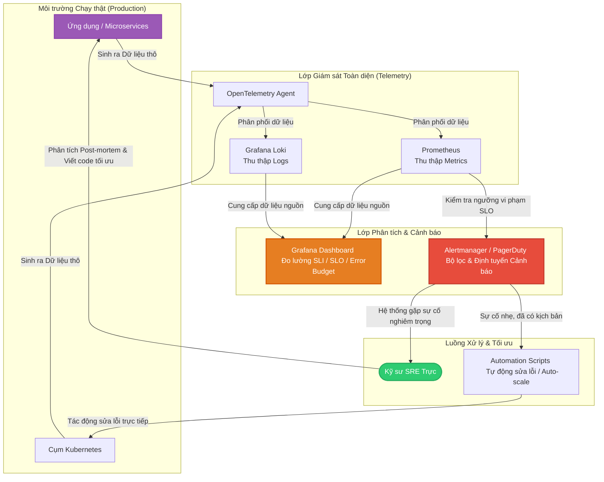
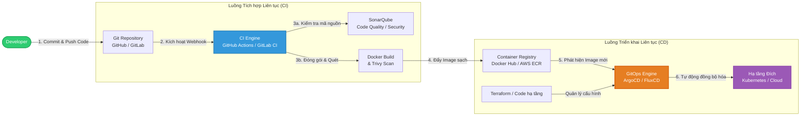

# SRE & DevOps & Platform Engineer

- **DevOps**: **Velocity** - Tăng tốc độ bàn giao phần mềm.
- **Platform**: **Developer Experience** - Giảm tải nhận thức, Dev tự phục vụ.
- **SRE**: **Availability/Reliability**: Đảm bảo hệ thống luôn sẵn sàng và chạy ổn định.

## I. SRE

Tập trung hoàn toàn vào **độ tin cậy**, **hiệu năng** và **tính sẵn sàng** của hệ thống production.

### 1. PPT

#### People

- **Blameless Culture**: Khi xảy ra sự cố, doanh nghiệp tập trung tìm nguyên nhân hệ thống thay vì quy trách nhiệm cá nhân.
- **Hybrid Engineers**: SysOps xài dc tool và code dc, 50% thủ công, 50% tự động hóa.
- **Shared Responsibility**: SysOps và Dev cùng tham gia sửa lỗi, cùng chịu trách nhiệm về uptime, cùng tham gia thiết kế hệ thống chịu lỗi.

#### Process

- **Định nghĩa độ tin cậy bằng số liệu**: Mọi dịch vụ phải được đo lường bằng ngôn ngữ của người dùng (_Hệ thống có chạy không? Chạy nhanh không?_).
- **Quy trình On-call rõ ràng**: Có lịch trực, phân cấp xử lý (Escalation) và quy định thời gian phản hồi sự cố cụ thể. Hướng tới quy trình Incident Response chuẩn mực.
- **Quản lý Ngân sách lỗi (Error Budget)**: Quy trình đưa ra quyết định dựa trên dữ liệu: Nếu còn ngân sách lỗi -> tiếp tục deploy tính năng mới; nếu hết ngân sách lỗi -> dừng deploy, tập trung sửa lỗi hệ thống.

#### Technology

- **Hệ thống Giám sát toàn diện (Observability)**: Công cụ thu thập đủ 3 trụ cột: Metrics (Chỉ số), Logs (Nhật ký), và Traces (Dấu vết luồng dữ liệu).
- **Hệ thống Cảnh báo chủ động (Alerting)**: Công cụ tự động phân loại cảnh báo. Chỉ gửi cảnh báo đến kỹ sư trực khi sự cố đó thực sự ảnh hưởng đến trải nghiệm khách hàng (đã hoặc sắp vi phạm SLO).
- **Tự động hóa vận hành**: Các công cụ tự động phát hiện, tự động mở rộng (Auto-scaling) hoặc tự phục hồi (Self-healing) khi có sự cố nhỏ.

### 2. Checklist

#### Nhóm chỉ số đo lường (Metrics & Goals)

- **Đã xác định SLI (Service Level Indicators)**: Có các chỉ số đo lường cụ thể cho từng dịch vụ quan trọng (_ví dụ: Tỷ lệ request thành công, thời gian phản hồi phản hồi dưới 200ms_).
- **Đã cam kết SLO (Service Level Objectives)**: Có mục tiêu cụ thể bằng số cho SLI (_ví dụ: Độ khả dụng đạt 99.9% trong tháng_) và được các bên (Dev, SRE, Product) đồng thuận.
- **Đã áp dụng Error Budget (Ngân sách lỗi)**: Có cơ chế tự động theo dõi lượng ngân sách lỗi còn lại và có chính sách hành động rõ ràng khi hết ngân sách.

#### Nhóm quản lý sự cố (Incident Management)

- **Quy trình On-call minh bạch**: Có lịch trực tự động (qua PagerDuty, Opsgenie, v.v.), kỹ sư trực có toàn quyền xử lý để giảm thiểu thời gian gián đoạn hệ thống (MTTR).
- **Họp rút kinh nghiệm không đổ lỗi (Blameless Post-mortem)**: 100% các sự cố nghiêm trọng (Severity 1, 2) đều có tài liệu phân tích nguyên nhân gốc rễ (RCA), hành động khắc phục và KHÔNG quy trách nhiệm cá nhân.
- **Làm sạch Cảnh báo (Alert Fatigue Prevention)**: Không còn tình trạng kỹ sư bị "ngập" trong các cảnh báo rác (_cảnh báo lặp đi lặp lại nhưng không cần hành động ngay_).

#### Nhóm vận hành & Kỹ thuật (Engineering & Operations)

- **Kiểm soát Toil (Công việc thủ công, lặp lại)**: Thời gian làm các việc thủ công (_như tạo tài khoản, restart server bằng tay_) của đội SRE chiếm **dưới 50%**. Thời gian còn lại dùng để viết code tự động hóa.
- **Hạ tầng tự phục hồi (Self-healing)**: Hệ thống có khả năng tự động cách ly lỗi, tự động restart hoặc tăng quy mô tài nguyên khi tải cao mà không cần con người can thiệp.
- **Diễn tập sự cố (Chaos Engineering)**: Doanh nghiệp chủ động tổ chức các buổi diễn tập phá hoại hệ thống (GameDay) trên môi trường thử nghiệm hoặc chạy thử các kịch bản sập nguồn để kiểm tra độ bền bỉ của hệ thống.

### 3. Công cụ cốt lõi

Mục tiêu của SRE là thu thập mọi dữ liệu từ hệ thống, đưa ra cảnh báo chính xác để đảm bảo thời gian hoạt động (Uptime) cao nhất và tự động hóa việc cứu hộ:

- **Thu thập Metrics & Giám sát**: **Prometheus**, Datadog, VictoriaMetrics.
- **Quản lý Nhật ký (Logs)**: **ELK Stack** (Elasticsearch, Logstash, Kibana), Grafana Loki.
- **Dấu vết luồng dữ liệu (Tracing)**: Jaeger, **OpenTelemetry** (tiêu chuẩn chung để thu thập dữ liệu).
- **Hiển thị dữ liệu (Dashboard)**: **Grafana**.
- **Định tuyến cảnh báo & Trực luân phiên (On-call)**: PagerDuty, Opsgenie, Better Stack, **Grafana On-call**.
- **Diễn tập phá hoại (Chaos Engineering)**: Gremlin, Chaos Mesh, **Chaos Monkey**.

### 4. Kiến trúc tổng thể đề xuất

Sơ đồ này mô tả vòng lặp giám sát: Hệ thống chạy thật sinh ra dữ liệu -> Công cụ SRE thu thập và phân tích dựa trên SLO -> Gửi cảnh báo đúng người -> SRE viết mã tự động sửa lỗi để tối ưu hệ thống.

## II. DevOps

Kết hợp giữa Phát triển (Development) và Vận hành (Operations) nhằm **rút ngắn thời gian vòng đời phát triển phần mềm** (SDLC) nhưng vẫn đảm bảo **chất lượng giao phẩm cao**.

### 1. PPT

#### People

- **Văn hóa cộng tác (Collaboration)**: Phá bỏ tư duy "silo" (thân ai nấy lo). Dev và Ops cùng chia sẻ mục tiêu chung là sự thành công của sản phẩm, thay vì Dev chỉ muốn đẩy tính năng mới còn Ops chỉ muốn giữ hệ thống đứng yên để ổn định.
- **Tư duy sở hữu chung (Shared Ownership)**: Lập trình viên chịu trách nhiệm cho mã nguồn của mình ngay cả khi nó đã chạy trên Production. Áp dụng triệt để tư duy "Bạn viết ra nó, bạn vận hành nó" (You build it, you run it).
- **Học hỏi liên tục (Continuous Learning)**: Khuyến khích thử nghiệm, chấp nhận thất bại sớm (Fail fast, learn faster) để cải tiến liên tục quy trình triển khai.

#### Process

- **Chuyển dịch về bên trái (Shift-Left)**: Đưa các yếu tố như kiểm thử (Testing), bảo mật (Security) và kiểm tra cấu hình vào ngay từ những giai đoạn đầu tiên của quá trình viết code, thay vì đợi đến cuối quy trình.
- **Chia nhỏ gói phát hành (Small Releases)**: Thay vì gom tính năng thành các bản cập nhật lớn vài tháng một lần, quy trình DevOps chia nhỏ các tính năng để release hàng ngày hoặc hàng tuần, giảm thiểu rủi ro lỗi diện rộng.
- **Phản hồi nhanh (Feedback Loops)**: Thiết lập các kênh phản hồi tự động từ hệ thống giám sát quay ngược lại cho đội ngũ phát triển ngay khi có lỗi xảy ra ở bất kỳ công đoạn nào.

#### Technology

- **Tự động hóa tối đa (Automation)**: Loại bỏ hầu hết các thao tác thủ công từ build, test, đóng gói cho đến triển khai.
- **Hạ tầng dạng mã (Infrastructure as Code - IaC)**: Toàn bộ tài nguyên mạng, server, database phải được định nghĩa bằng mã nguồn và quản lý phiên bản qua Git.
- **Tính đồng nhất môi trường**: Đảm bảo môi trường Local (máy của Dev), Staging (thử nghiệm) và Production (chạy thật) phải giống hệt nhau về mặt cấu hình nhờ công nghệ Container.

### 2. Checklist

#### Nhóm Phát triển & Tích hợp (Continuous Integration - CI)

- **Quản lý phiên bản tập trung**: 100% mã nguồn, cấu hình hệ thống và script hạ tầng được quản lý trên Git (GitLab, GitHub, Bitbucket).
- **Nhánh code ngắn hạn (Trunk-Based Development)**: Lập trình viên merge code vào nhánh chính thường xuyên (ít nhất một lần mỗi ngày), tránh việc ôm nhánh riêng quá lâu gây xung đột (Merge Hell).
- **Build và Test tự động**: Mỗi khi có mã nguồn mới được đẩy lên Git, hệ thống CI tự động kích hoạt quá trình build và chạy bộ kiểm thử tự động (Unit test, Integration test) mà không cần con người bấm nút.

#### Nhóm Triển khai & Vận hành (Continuous Delivery/Deployment - CD)

- **Triển khai bằng một nút bấm (hoặc hoàn toàn tự động)**: Việc đẩy sản phẩm lên môi trường Staging hoặc Production được thực hiện tự động qua pipeline, không có ai gõ lệnh deploy thủ công trên server.
- **Chiến lược deploy không gián đoạn**: Doanh nghiệp áp dụng thành thạo các kỹ thuật triển khai như Blue-Green hoặc Canary Deployment giúp người dùng không cảm thấy hệ thống bị downtime khi cập nhật phiên bản mới.
- **Quản lý cấu hình tập trung**: Các thông tin nhạy cảm (Secret, API Key) và cấu hình môi trường được tách biệt hoàn toàn khỏi mã nguồn, quản lý tự động qua Vault, Consul hoặc Config Map.

#### Nhóm Chỉ số hiệu năng (DORA Metrics)

Doanh nghiệp đạt chuẩn DevOps thành công phải đo lường và tối ưu được 4 chỉ số DORA cốt lõi sau:
- **Tần suất triển khai (Deployment Frequency)**: Doanh nghiệp có khả năng deploy code mới lên Production định kỳ theo ngày hoặc theo tuần (thay vì theo quý/năm).
- **Thời gian hoàn thành thay đổi (Lead Time for Changes)**: Thời gian từ lúc code được commit thành công cho đến khi nó chạy trên Production chỉ mất vài giờ hoặc dưới một ngày.
- **Tỷ lệ thất bại khi thay đổi (Change Failure Rate)**: Tỷ lệ các bản deploy gây ra lỗi trên Production phải ở mức thấp (dưới 15%).
- **Thời gian phục hồi dịch vụ (Time to Restore Service - MTTR)**: Khi có sự cố xảy ra do deploy bản mới, hệ thống có thể rollback (quay về phiên bản cũ) hoặc fix lỗi chỉ trong vòng vài phút.

### 3. Công cụ cốt lõi

Các công cụ cốt lõi của DevOps:

- **Mã nguồn & Quản lý phiên bản (Git)**: GitHub, **GitLab**, Bitbucket.
- **Tích hợp & Triển khai liên tục (CI/CD)**: Jenkins, **GitLab CI**, GitHub Actions, **ArgoCD** (GitOps).
- **Đóng gói (Containerization)**: **Docker**, Podman.
- **Hạ tầng dạng mã (IaC) & Cấu hình**: Terraform, OpenTofu, Ansible, **CloudFormation**.
- **Quản lý bảo mật (DevSecOps)**: **SonarQube** (Quét code), Snyk, **Trivy** (Quét lỗ hổng container).

### 4. Kiến trúc tổng thể đề xuất

Sơ đồ này mô tả luồng tự động hóa khép kín từ máy của lập trình viên qua các bước kiểm thử, bảo mật cho đến khi triển khai lên môi trường chạy thật.

## III. Platform Engineer

Chuyển dịch từ tư duy "hỗ trợ kỹ thuật" sang tư duy "cung cấp sản phẩm" (**Platform-as-a-Product**). Sản phẩm ở đây chính là **nền tảng công cụ nội bộ**, phục vụ khách hàng chính là đội ngũ lập trình viên của công ty.

### 1. PPT

#### People

- **Tư duy Quản lý Sản phẩm (Product Mindset)**: Đội ngũ Platform phải coi nền tảng mình làm ra là một sản phẩm thương mại. Họ cần khảo sát nhu cầu, làm tài liệu (Docs), định nghĩa lộ trình (Roadmap) và "bán" nó cho lập trình viên trong công ty.
- **Kỹ sư Nền tảng (Platform Engineers)**: Có năng lực kết hợp giữa lập trình hệ thống (Go, Python), hạ tầng (Kubernetes, Cloud) và thiết kế giao diện (UI/UX) cho cổng thông tin nội bộ (_có thể tận dụng AI_).
- **Khách hàng nội bộ (Developers)**: Sẵn sàng chuyển sang mô hình tự phục vụ, chủ động thu nhận ý kiến để cải tiến nền tảng thay vì chỉ đạo đội vận hành làm hộ.

#### Process

- **Tự phục vụ hoàn toàn (Self-Service)**: Lập trình viên có thể tự tạo mới một service, cấp phát database, hoặc cấu hình domain qua giao diện/API mà không cần tạo ticket chờ duyệt.
- **Con đường vàng (Golden Paths)**: Định nghĩa sẵn các quy trình chuẩn, an toàn và tối ưu nhất cho từng loại dự án. Lập trình viên chỉ cần đi theo con đường này là tự động đạt chuẩn bảo mật và vận hành của công ty.
- **Giảm tải nhận thức (Cognitive Load Reduction)**: Quy trình phải giấu đi sự phức tạp của hạ tầng (như cấu hình mạng, bảo mật chuyên sâu) để lập trình viên chỉ tập trung vào việc viết code logic.

#### Technology

- **Nền tảng Phát triển Nội bộ (IDP - Internal Developer Platform)**: Một hệ thống trung tâm kết nối mọi công cụ hạ tầng phía sau thành một giao diện duy nhất.
- **Trừu tượng hóa Hạ tầng (Infrastructure Abstraction)**: Đóng gói các tài nguyên hạ tầng phức tạp thành các khối (Modules) dễ sử dụng.
- **Quản lý cấu hình tự động**: Tự động đồng bộ hóa trạng thái mong muốn từ IDP xuống các môi trường thực tế thông qua GitOps.

### 2. Checklist

#### Trải nghiệm Lập trình viên (Developer Experience - DevEx)

- **Thời gian Onboarding cực ngắn**: Một lập trình viên mới vào công ty có thể tự cấp phát môi trường, clone dự án mẫu và chạy được bản "Hello World" trên môi trường thử nghiệm trong vòng dưới 1 giờ.
- **Cổng thông tin tập trung (Developer Portal)**: Công ty có một trang web duy nhất chứa toàn bộ catalog dịch vụ, tài liệu API, trạng thái hệ thống và danh mục tự phục vụ.
- **Không còn hiện tượng "Chờ Ticket"**: Lập trình viên không phải tạo ticket trên Jira/ServiceNow rồi ngồi chờ đội Infra tạo hộ database hay cấp quyền truy cập.

#### Tính Chuẩn hóa & Quản trị (Standardization & Governance)

- **Golden Paths rõ ràng**: Có sẵn các bộ khung (Templates) chuẩn cho các ngôn ngữ lập trình phổ biến trong công ty (Java, Node.js, Go) tích hợp sẵn CI/CD và Security Scan.
- **Bảo mật và Tuân thủ mặc định (Guardrails)**: Hệ thống tự động chặn các hành vi vi phạm chính sách (_ví dụ: tạo database công khai ra internet_) ngay từ lúc lập trình viên yêu cầu cấp phát tài nguyên trên IDP.
- **Quản lý chi phí (FinOps) minh bạch**: IDP có thể hiển thị rõ ràng chi phí hạ tầng của từng đội nhóm/dự án để lập trình viên tự nhận thức và tối ưu hóa tài nguyên mình đang dùng.

#### Đo lường hiệu quả (Platform Metrics)

- **Tỷ lệ áp dụng (Adoption Rate)**: Trên 80% các dự án mới trong công ty tự nguyện sử dụng IDP và đi theo Golden Paths thay vì tự dựng hạ tầng riêng.
- **Thời gian hoàn thành tác vụ (Lead Time for Infrastructure)**: Thời gian từ lúc Dev yêu cầu một tài nguyên hạ tầng mới (như cụm Redis) đến khi nó sẵn sàng sử dụng chỉ tính bằng phút.

### 3. Công cụ cốt lõi

Để xây dựng một IDP hoàn chỉnh, các công cụ thường được chia theo các lớp chức năng:
- **Lớp Giao diện (Developer Portal)**: **Backstage** (mã nguồn mở của Spotify), Port, hoặc Mia-Platform.
- **Lớp Điều phối và Khung Nền tảng (Platform Orchestrator)**: **Humanitec**, Kratix, hoặc Score (dùng để định nghĩa tài nguyên độc lập với môi trường).
- **Lớp Đóng gói Hạ tầng (IaC/Control Plane)**: Terraform, **OpenTofu**, **Crossplane** (biến Kubernetes thành Control Plane để quản lý mọi tài nguyên Cloud).
- **Lớp Triển khai tự động (GitOps)**: **ArgoCD** hoặc FluxCD

### 4. Kiến trúc tổng thể đề xuất

Sơ đồ dưới đây thể hiện luồng tương tác từ lập trình viên qua lớp IDP đến hạ tầng thực tế:

## X. Glossary

### toil

Công việc thủ công, lặp lại (repetitive, manual, and low-value operational work).

Nhận biết Toil (Identifying Toil):
- **Thủ công**: Làm bằng tay thay vì dùng mã lệnh.
- **Lặp đi lặp lại**: Việc lặp lại ngày này qua ngày khác.
- **Không có giá trị lâu dài**: Không tạo ra cải tiến hệ thống bền vững.
- **Tăng theo quy mô**: Khối lượng việc tăng theo lượng người dùng.

Cách kiểm soát và giảm thiểu (Control Strategies):
- **Đo lường thời gian**: Theo dõi chính xác số giờ đội ngũ dành cho các tác vụ thủ công.
- **Tự động hóa**: Viết script hoặc xây dựng công cụ tự động hóa cho các việc lặp lại.
- **Đưa giới hạn**: Giữ tỷ lệ toil dưới 50% (lý tưởng là dưới 30%) để nhường chỗ cho việc phát triển tính năng.
- **Loại bỏ sự cố gốc**: Cải tiến kiến trúc để triệt tiêu nguyên nhân gây ra việc vận hành thủ công.

Refer:
- https://oneuptime.com/blog/post/2025-10-01-what-is-toil-and-how-to-eliminate-it/view
- https://sre.google/sre-book/eliminating-toil/